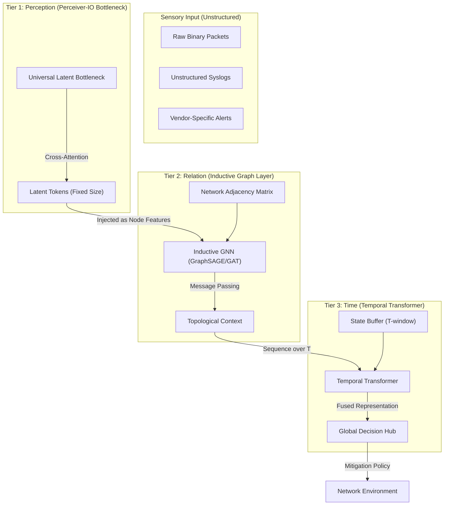
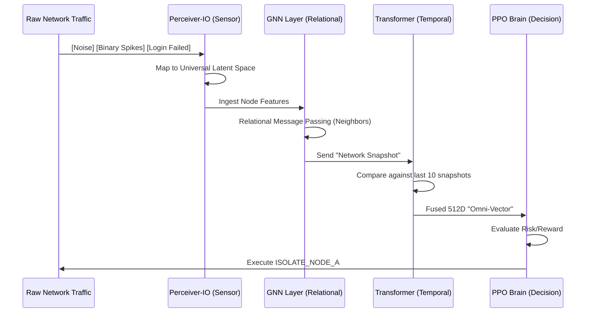

# Omni-Graph Transformer (OGT-SOAR): The Universal Cyber-Brain 🕸️⚡

## 1. Problem Statement: The Dimensionality & Relation Crisis 🚩
Modern cyber-defense faces two insurmountable walls:
1.  **The Modality Wall**: Security data is "Messy"—raw binary packets, unstructured syslog strings, and JSON alerts. Traditional models require manual, brittle parser-engineering for every new technology.
2.  **The Relation Wall**: Attacks are not isolated events; they are **Graphs**. Lateral movement, privilege escalation, and exfiltration are relational "hops." Standard models see the "dots" but are blind to the "lines" (topology).

---

## 2. The Solution: Omni-Graph Transformer (OGT) 🛡️
The OGT-SOAR architecture provides a three-tiered "Vision" system that fuses Perception, Relation, and Time into a single neural representation.

### The OGT Pillar Hierarchy:
1.  **Perceiver-IO (Universal Ingestion)**: Ingests any raw byte-stream or log without pre-parsing.
2.  **Inductive GNN (Relational Mapping)**: Models the network as a dynamic graph to track lateral movement.
3.  **Temporal Transformer (Sequential Awareness)**: Remembers the "History" of the network to catch slow-burning APTs.

---

## 3. High-Level Technical Architecture

---

## 4. Operational Flow: The Perception-to-Logic Loop

### 4.1 Sequence Diagram of an Incident Response

---

## 5. Architectural Advantages & Trade-offs

| Feature | Legacy SOAR | V6 Deep Eyes | **OGT-SOAR (The Vision)** |
| :--- | :--- | :--- | :--- |
| **Parsing** | Manual RegEx | Fixed Encoders | **Zero-Shot Perceiver** |
| **Context** | Single Device | Multi-Modal Fused | **Global Network Topology** |
| **Memory** | None | Limited RNN | **Unlimited Long-range Attention** |
| **Latency** | Low (ms) | Fast (1-2ms) | **Medium (100-200ms)** |
| **Compute** | CPU | Single GPU | **Multi-GPU Cluster** |

### 5.1 Why the Transformer + GNN Hybrid?
An attack might look like this:
*   **Time=0**: Node A scans Node B (GNN sees the edge).
*   **Time=10m**: Node A logs into Node B (Transformer remembers the scan).
*   **Time=2h**: Node B starts encrypted egress (Fusion sees the Causal Chain).

By combining **GNNs (Space)** and **Transformers (Time)**, OGT-SOAR makes it mathematically impossible for an attacker to hide in the noise.

---

## 6. Real-World Feasibility & Deployment
The path to deploying OGT-SOAR involves:
1.  **Inductive Knowledge Transfer**: Using models that learn rules like "Aggregating Neighbor Signal" rather than memorizing IP addresses.
2.  **Mamba SSN Integration**: Using Mamba for the temporal layer to achieve near-real-time speed on the Transformer tasks.
3.  **The Cognitive Split**: Deploying the Perceiver-Sensors on the Edge while the Graph-Transformer Core runs in a secure central datacenter.

---

> [!IMPORTANT]
> **OGT-SOAR represents the transition from "Assisting Humans" to "Autonomous Stewardship" of the network.**
