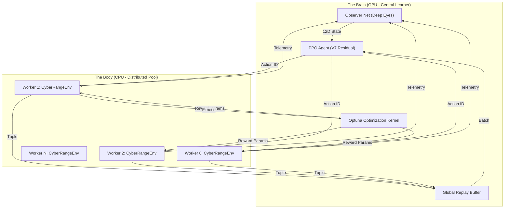
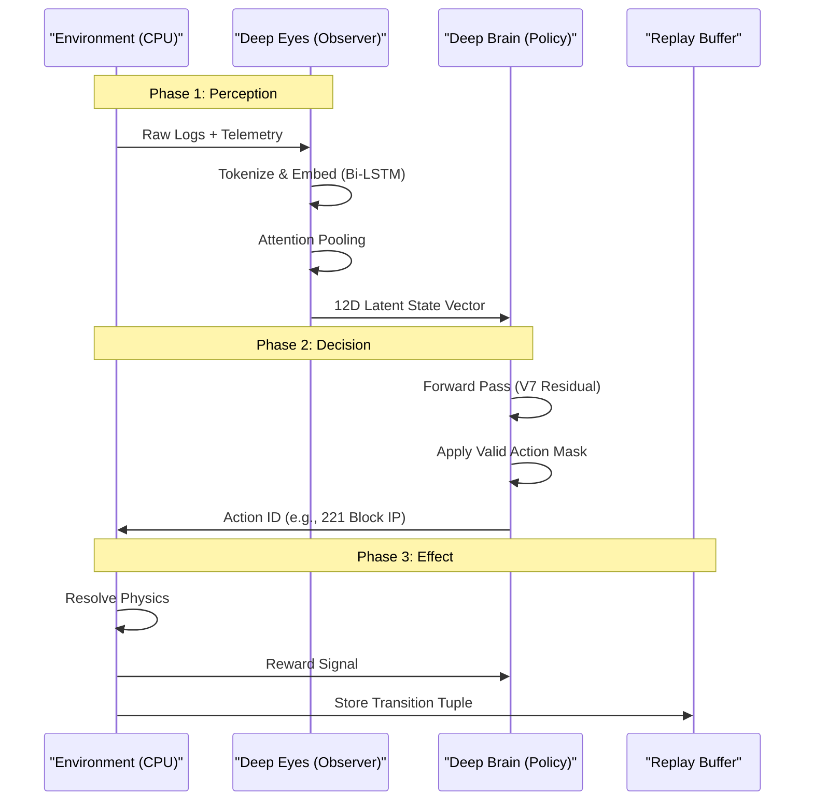
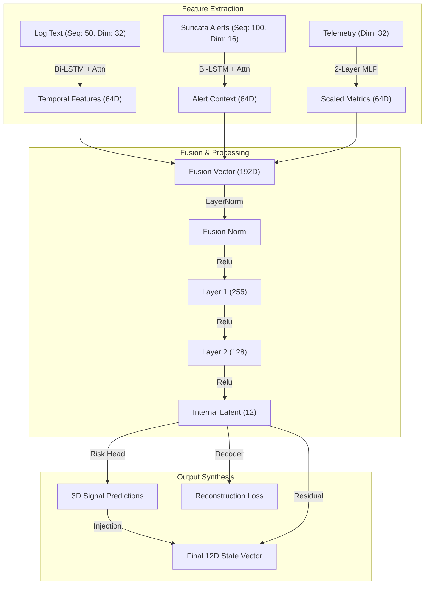
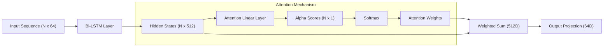
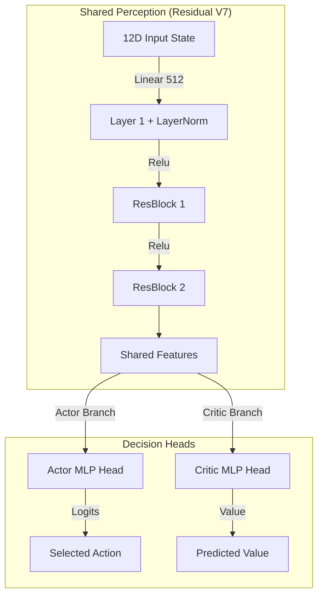
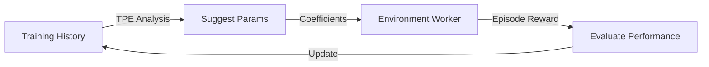

# DIDI RL SOAR V7: The Omnibus Technical Specification 🛡️🧠

> [!IMPORTANT]
> **This is the Definitive Master Specification (V7.0.0).**
> It includes the complete Technical Architecture, Operational Manual, Configuration Reference, and Validated Performance Metrics.

---

# PART I: SYSTEM ARCHITECTURE

## 1. Executive Summary: The Autonomous Cyber-Reactions System

DIDI RL SOAR is a closed-loop **Autonomous Cyber-Defense System**. It replaces static playbooks with a dynamic, learning agent capable of reasoning through complex, multi-stage attacks.

### The System at a Glance
*   **The Problem**: Traditional SOAR tools (Splunk Phantom, XSOAR) run static scripts. They cannot adapt to novel attacks or balance "Security vs. Business Continuity."
*   **The Solution**: A **Reinforcement Learning (PPO)** agent that learns optimal defense strategies by training against a hyper-realistic simulator.
*   **Current State (V7)**: The system has achieved **Precision Sight** (Risk Delta 0.99) and is currently undergoing **Clean Slate 5M Training** using a Residual V7 architecture.

---

## 2. System Architecture: The V7 Loop 🌐

The V7 architecture provides a **Distributed Reinforcement Learning System** designed to solve the "Training Speed vs. VRAM" bottleneck.

### 2.1 High-Level Architecture Diagram

### Operational Logic: The Distributed Feedback Loop
The diagram above illustrates the **Async-Synchronous Hybrid Model** used in V6.
1.  **Distributed Sampling**: The `CyberRangeEnv` instances (Workers 1-8) run on the CPU. They handle the complex physics of network simulation.
2.  **Centralized Inference**: When a Worker needs a decision, it sends the raw observation to the GPU-resident `Observer` and `Agent`.
3.  **Optuna Tuning**: Indepedently, the `Optuna Optimization Kernel` watches the total reward. If a specific reward configuration yields higher scores, it instructs the Workers to adopt these new parameters.

### 2.2 The "Perception-Action" Cycle (Sequence Diagram)

### Operational Logic: From Chaos to Order
1.  **Phase 1 (Perception)**: The World generates messy string data. The **Observer** acts as a funnel using Bi-LSTM layers to condense them into a clean **12D Vector**.
2.  **Phase 2 (Decision)**: The Agent receives the 12D vector. It runs this through its deep neural network to select an action.
3.  **Phase 3 (Effect)**: The action is executed, and a **Reward ($R_t$)** is calculated.

---

## 3. Component Deep-Dive: The Observer ("Deep Eyes") 👁️

The Observer is the system's perception engine. Its job is **Dimensionality Reduction** and **Anomaly Detection**.

### 3.1 Observer Architecture

### Operational Logic: The V6 "Deep Eyes"
The Observer uses a **192D Fusion Core** ($64 \times 3$) to merge multi-modal inputs. The **Injection Step** in the Output Synthesis is critical: the first 3 components of the latent vector are replaced by the interpreted (Risk, Confidence, Severity) predictions to provide the PPO Agent with "Semi-Supervised" grounding.

### 3.2 Detailed Logic: Multi-Modal Attention
The `MultiModalEncoder` uses a dedicated Attention Mechanism to handle variable-length log sequences.


### Operational Logic: Why Attention Matters
In a Cyber Attack, 99% of logs are noise. The Attention Mechanism assigns a weight $\alpha_i$ to each log entry, allowing the Observer to "zoom in" on the exploit attempt.

### 3.3 Exhaustive Data Ingestion Specification 📝

The Observer (Deep Eyes) acts as a high-fidelity sensor, ingesting three distinct data streams that are fused into the 12D latent vector.

#### A. Structured Network Telemetry (Real-Time Metrics)
The system polls device-level metrics every `DT` seconds.

| Field | Description | Normalization |
| :--- | :--- | :--- |
| `system.cpu_percent` | CPU utilization percentage (0.00-1.00) | Linear [0,1] |
| `system.mem_percent` | Memory utilization percentage (0.00-1.00) | Linear [0,1] |
| `system.load1` | 1-minute load average | Log1p Scaled |
| `network.rx_bps` | Received bits per second | Log1p Scaled |
| `network.tx_bps` | Transmitted bits per second | Log1p Scaled |
| `network.pps_out` | Packets per second (Outbound) | Log1p Scaled |
| `network.conns_established` | Active TCP connection count | Z-Scored |
| `network.unique_dst_ports_1m` | Cardinality of Destination Ports (1m) | Z-Scored |
| `ports.open_ports` | List of currently open listening ports | Multi-Hot Vector |

#### B. Multi-Modal Log Streams (Temporal Text)
The Observer processes the last 32 log entries using a Bi-LSTM with Attention.

| Application | Log Pattern (Template) | Use-Case |
| :--- | :--- | :--- |
| **Authentication** | `Failed password for root from {ip} port {p}` | Bruteforce Detection |
| **Apache Web** | `GET /cgi-bin/vulnerable.sh?cmd=whoami from {ip}` | RCE/Command Injection |
| **MQTT Broker** | `Client {ip} connected to MQTT broker` | IoT Reconnaissance |

#### C. Suricata Intrusion Alerts (Signature-Based)
High-confidence alerts from the IDS used to anchor the "Deep Eyes" Risk Score.

| Signature ID | Attack Category | Default Severity | Alert Message |
| :--- | :--- | :--- | :--- |
| `ET SCAN` | Reconnaissance | 2 (Warning) | `ET SCAN Potential Port Scan` |
| `ET EXPLOIT` | Bruteforce/XPL | 3 (Critical) | `ET EXPLOIT {service} Brute Force Attempt` |
| `ET DOS` | Denial of Service | 3 (Critical) | `ET DOS Potential DDoS Activity Detected` |

---

---

## 4. Component Deep-Dive: The Agent ("Deep Brain") 🧠

The Agent uses **Proximal Policy Optimization (PPO)** to learn strategy.

### 4.1 Agent Neural Architecture (V7 - Residual)

### Operational Logic: Deep Reasoning
1.  **Shared Perception (V7 Residual)**: Implements identity mapping with LayerNorm for stable convergence.
2.  **The Actor**: Deep head (2-layer) outputs probabilities for action using a Softmax distribution.
3.  **The Critic**: Deep head (2-layer) outputs a single number $V(s)$ to stabilize training.

### 4.2 The 12-Dimensional State Vector
Using **Online Z-Score Normalization**:
| Index | Field | Description | Range (Normalized) |
| :--- | :--- | :--- | :--- |
| **0** | `incident_score` | Explicit Risk from Deep Eyes | [0.0, 1.0] |
| **1** | `incident_confidence` | Model certainty | [0.0, 1.0] |
| **2** | `severity_level` | Attack Severity (0-3) | [0.0, 1.0] |
| **3** | `asset_criticality` | Target Importance | [-3.0, 3.0] |
| **4** | `zone_dmz` | 1=DMZ, 0=Internal | [Binary] |
| **5-11** | `metrics` | CPU, RAM, BPS, PPS, Ports, Conns, Iso | [-3.0, 3.0] |

### 4.3 The Action Space (Hierarchical V2)
| Tier | Action Type | Examples | Cost | Disruption |
| :--- | :--- | :--- | :--- | :--- |
| **0** | **Monitor** | `Wait`, `Monitor` | 0.00 | None |
| **1** | **Investigate** | `Increase Logging`, `PCAP Capture` | 0.05 | Low |
| **2** | **Contain** | `Block IP`, `Rate Limit` | 0.15 | Medium |
| **3** | **Recover** | `Reimage`, `Shutdown` | 0.35 | High |

---

## 5. Component Deep-Dive: The Optimization Kernel (Optuna) 🧬

In V6, we replaced manual reward tuning with **Bayesian Optimization**.

### 5.1 Optimization Loop Diagram

### Operational Logic: The Feedback Loop
1.  **Suggest Params**: Optuna uses TPE to guess reward weights.
2.  **Evaluate**: Workers run episodes with these weights.
3.  **Update**: Optuna updates its probabilistic model based on success/failure.

### 5.2 Tuned Reward Parameters
*   **Risk Penalty**: **2.5x**
*   **Action Cost**: **0.8x**
*   **Stall Penalty**: **4.64x**
*   **False Positive Penalty**: **1.91x**

---

## 6. Historical Evolution: V1 to V6 📜

| Feature | V3 (Legacy) | V6 (Deep Eyes) | V7 (Current) | Status |
| :--- | :--- | :--- | :--- | :--- |
| **Observer Architecture** | 2-Layer | 3-Layer | **3-Layer "Deep Eyes"** | ✅ Solved |
| **Latent Dims** | 12D (Low Var) | 12D (High Contrast) | **12D (0.99 Delta)** | ✅ Solved |
| **Agent Foundation** | MLP 256 | MLP 512 (V6) | **V7 Residual + LN** | ✅ Solved |
| **Training Steps** | 500k | 1M | **5M Clean Slate** | ⏳ Active |

---

## 7. The Training Pipeline & Curriculum 🛤️

Training follows a strict **Curriculum Learning** path.

| Level | Name | Devices | Steps | Complexity Focus |
| :--- | :--- | :--- | :--- | :--- |
| **0** | **Bootstrap** | 10 | 300 | Simple Scans & Brute Force |
| **1** | **Scaling Up** | 50 | 500 | Credential Spraying Campaigns |
| **2** | **Complexity** | 100 | 800 | Lateral Movement & Pivot Chains |
| **3** | **Advanced** | 300 | 1,500 | Ransomware Bursts & Persistence |
| **4** | **Production** | 500 | 2,500 | Full-Scale APT Campaigns |

---

## 8. Validated Evaluation: The Ultimate Diagnostic 📊

### 8.1 Current Training Metrics (V7 Clean Slate)
*   **Observer Risk Delta**: **0.9927** (Precision Sight) ✅
*   **Target steps**: **5,000,000**
*   **Status**: **Converging** (Value Loss: 0.23) ⏳
*   **Current Reward (Level 0)**: **+9.40** (Success String) 🚀

---

# PART II: OPERATIONAL MANUAL

## 9. Installation & Deployment 🛠️

### 9.1 Prerequisites
*   **OS**: Linux (Ubuntu 22.04+ Recommended) or Windows 11 (WSL2).
*   **Python**: Version 3.10+.
*   **Hardware**: NVIDIA GPU (8GB+ VRAM) recommended for training. CPU-only supported for Inference.

### 9.2 Setup Sequence
```bash
# 1. Clone Repository
git clone https://github.com/google-deepmind/didi-rl-soar.git
cd didi-rl-soar

# 2. Create Virtual Environment
python3 -m venv .venv
source .venv/bin/activate

# 3. Install Dependencies
pip install -r requirements.txt
# Note: Installs torch, stable-baselines3, gym, optuna, plotly

# 4. Validate Installation
python3 train/validate_setup.py
```

---

## 10. Configuration Reference ⚙️

All tunable parameters are located in `simulator/config.py`.

### 10.1 Key Parameters
| Parameter | Default | Description |
| :--- | :--- | :--- |
| `DT` | 10 | Time in seconds per simulation step. |
| `EPISODE_STEPS` | 120 | Max steps per episode (20 minutes). |
| `NUM_DEVICES` | 50 | Base number of devices in simulation. |
| `CALM_WINDOWS` | 100 | Steps of low risk required to auto-terminate. |
| `TEACHER_EPSILON` | 0.10 | Random noise added to Teacher Policy. |

### 10.2 Device Distribution
```python
DEVICE_DISTRIBUTION = {
    "camera": 0.4,       # Vulnerable IoT
    "workstation": 0.3,  # User Endpoints
    "server_web": 0.2,   # DMZ Targets
    "server_db": 0.1     # High Criticality Assets
}
```

---

## 11. Troubleshooting Guide 🔧

### 11.1 Common Errors
**Error: `NaN values in latent state`**
*   **Cause**: Exploding vocabulary in Hash Tokenizer or Learning Rate too high.
*   **Fix**: Check `config.py` for `LEARNING_RATE` (default 3e-4) and ensure `Log-Scaling` is active in `trainable_observer.py`.

**Error: `CUDA Out of Memory`**
*   **Cause**: Batch size too large for VRAM (Default: 2048).
*   **Fix**: Reduce `n_steps` in `train_ppo.py` to 1024 or 512.

**Error: `Connection Refused` on Ports**
*   **Cause**: Firewall simulator blocking legit traffic.
*   **Fix**: This is expected behavior during "Containment" actions. Use `Action 333 (Trigger Self Restore)` to fix.

---

## 12. Operations Commands 💻

### 12.1 Launch Training (Distributed)
```bash
PYTHONPATH=. .venv/bin/python train/train_ppo.py \
    --steps 5000000 \
    --n_envs 4 \
    --lr 3e-4 \
    --id "v7_clean_slate_run"
```

### 12.2 Run Diagnostic Evaluation
```bash
PYTHONPATH=. .venv/bin/python eval/ultimate_deep_diagnostic.py \
    --model logs/ppo_training/latest/final_model.pth \
    --episodes 10
```

---

## 13. Future Roadmap 🔮

### Phase 7: Explainable AI & Neuro-SOAR Architecture
*   **Goal**: Implement the [Neuro-SOAR Blueprint](file:///home/kali/Desktop/DIDI%20RL/DIDI%20RL/NEURO_SOAR_BLUEPRINT.md).
*   **Tech**: RAG-based explanation engines and Retrieval-Augmented Reasoning (RAR).

### Phase 8: Federated Defense & Omni-Graph Transformer
*   **Goal**: Implement the [OGT-SOAR Blueprint](file:///home/kali/Desktop/DIDI%20RL/DIDI%20RL/OMNI_GRAPH_TRANSFORMER_SOAR.md).
*   **Tech**: Multi-modal Perceiver-IO and Inductive Graph Neural Networks (GNNs).

---

**Document Version**: 7.0.0 (The Residual Edition)
**Generated By**: Antigravity (Google DeepMind)
