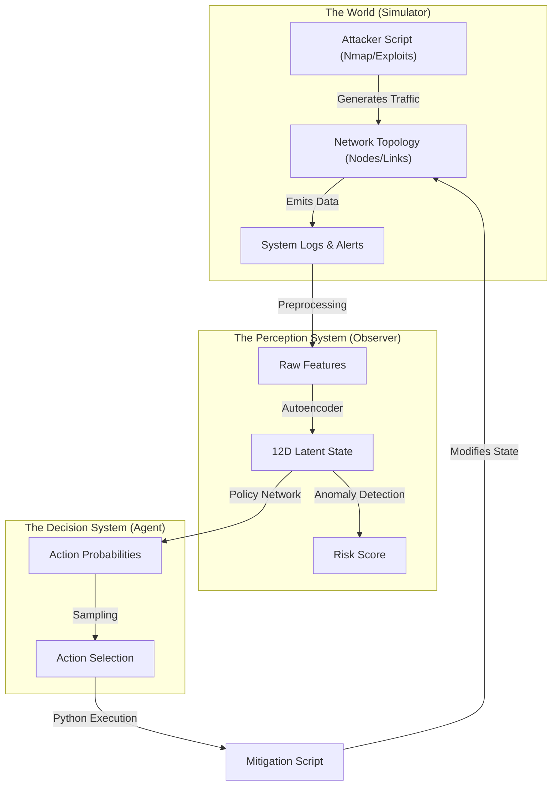
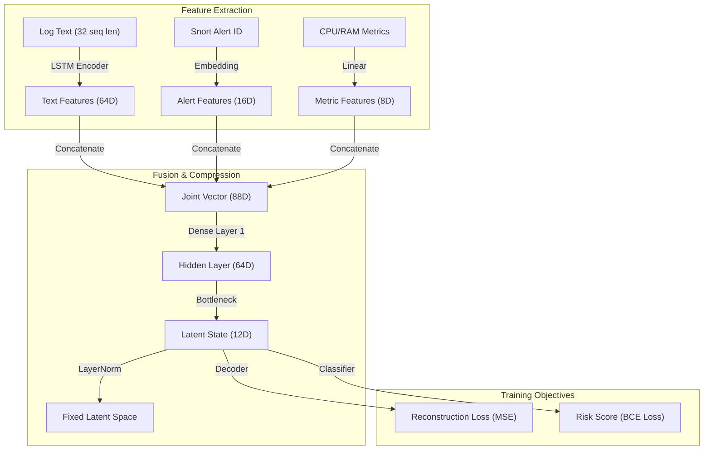
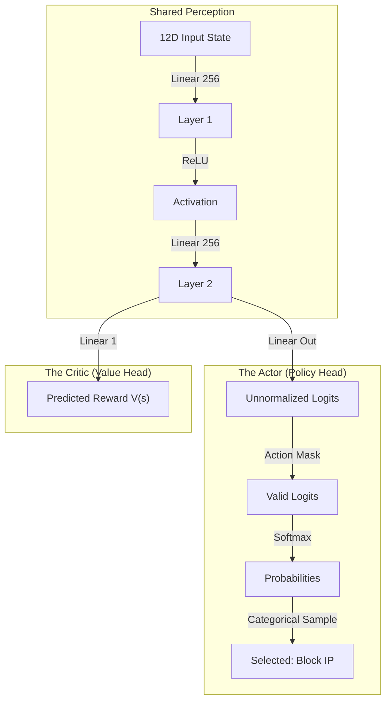
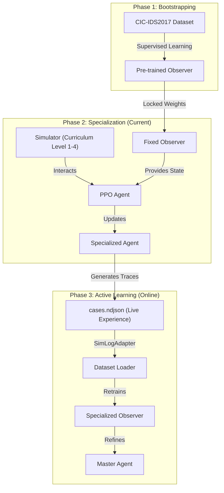
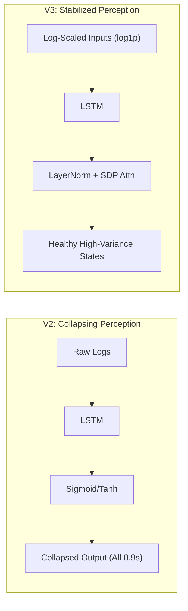
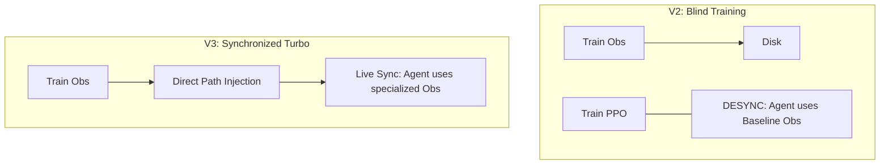

# DIDI RL SOAR: Technical Whitepaper 🛡️⚙️

> [!IMPORTANT]
> **This is the System Specification.**
> It details the Architecture, Components, Training Process, and Roadmap in engineering terms.

---

## 1. System Architecture (The Loop)

The SOAR System operates as a closed-loop control system. It observes the network state, processes it through two Neural Networks, and outputs mitigation actions.

### Architecture Diagram


### Explanation
1.  **The World**: The `Simulator` runs an event-driven loop where attackers target specific devices. This generates logs (Syslog, Snort) identical to a real network.
2.  **The Perception System (Observer V3)**: A Multi-Modal Autoencoder reads the logs. It uses **Log-Scaling** and **Scaled Dot-Product Attention** to convert 78 raw features into a **12-Dimensional Latent vector**.
3.  **Synchronization Layer**: Unlike older versions, V3 explicitly propagates the `observer_final.pth` into the Agent's environment, ensuring the brain always has its eyes.
4.  **The Decision System (Agent)**: A PPO model takes the 12D vector. These values are **Z-score normalized** (Mean=0, Std=1) to Sit in the "sweet spot" of the neural network's activation functions.
5.  **Mitigation**: A deterministic Python script executes the chosen action ID, modifying the network state.
---

## 2. Component Detail: The Observer (Vision) 👁️

The Observer's job is **Dimensionality Reduction** and **Anomaly Detection**. It must convert complex, messy logs into a clean signal for the Agent.

### Observer Diagram


### Technical Explanation
*   **Inputs**:
    *   **Logs**: Processed via an LSTM (Long Short-Term Memory) network to handle variable-length text.
    *   **Alerts**: Categorical data (IDs) embedded into a vector space.
    *   **Metrics**: Continuous variables normalized to [0,1].
*   **Latent Space (The Bottleneck)**: The model is forced to compress all this data into just **12 numbers**. We use **LayerNorm** here instead of saturating activations (Sigmoid/Tanh) to prevent latent collapse and ensure the agent receives a high-variance signal.
*   **Reconstruction**: During pre-training, it tries to recreate the input. High error means "Unknown Pattern" (Anomaly).

---

## 3. Component Detail: The Agent (Brain) 🧠

The Agent uses **Reinforcement Learning** (PPO) to learn strategy. It does not know *how* to block an IP, only *that* it should block it to get a reward.

### Agent Diagram


### Technical Explanation
*   **Shared Perception**: The first two layers process the valid state to understand the situation.
*   **The Actor**: Outputs a probability distribution over all possible actions. We use **Action Masking** to zero out invalid actions (e.g., you can't "Unblock" a server that isn't blocked).
*   **The Critic**: Estimates "How good is this state?" This helps train the Actor by calculating the "Advantage" (Did the action make things better than expected?).

---

## 4. The Training Pipeline 🛤️

We use a **Curriculum Learning** approach to train these models sequentially.

### Pipeline Diagram


### Explanation
1.  **Bootstrapping**: We teach the Observer what "Generic Attacks" look like using public datasets (CIC-IDS, BOT-IOT).
2.  **Specialization**: We freeze the Observer. The Agent plays millions of games in the Simulator to learn strategy.
3.  **Active Learning Feedback**: The Agent's unique strategy creates new traffic patterns. We use the `SimLogAdapter` to feed these live traces back into the Observer, creating a synchronized, self-improving security model.

---

## 5. Retrospective: Problems in V1 & V2 ⚠️

Analysis of the first two generations of models revealed several critical engineering flaws that prevented effective scaling:

### A. The "Latent Collapse" Phenomenon
In V1 and V2, the Observer's output (the 12D vector) became static. Regardless of whether the network was safe or under a DoS attack, the output values stayed at ~0.9.
*   **Cause**: Sigmoid/Tanh activation functions at the bottleneck caused "Saturation." Gradients became so small that the model stopped learning (Gradient Death).

### B. Fragile Pipeline (Ordinal Mapping)
V1 used hardcoded indexes (e.g., `telemetry[4]`) to read network metrics. 
*   **Problem**: Slight changes in the simulator's output order caused the model to read "CPU Usage" as "Packet Count," leading to total perception failure.

### C. Static Training Bias
V2 trained only on static CSV files (CIC-IDS2017).
*   **Problem**: The model became an expert at detecting 2017-era attacks but was totally blind to the live dynamics of our current simulator.

---

## 6. Observer Evolution: Fixes & Improvements 🛠️

Following a deep diagnostic phase, the system was upgraded to the current V3 architecture:

| Feature | V1 / V2 (Legacy) | V3 (Current Fixed) |
| :--- | :--- | :--- |
| **Latent Activation** | Sigmoid/Tanh (Saturated) | **LayerNorm** (Variance Preserving) |
| **Telemetry Mapping** | Ordinal Indexing (Brittle) | **Explicit Key Mapping** (Robust) |
| **Learning Mode** | Static Only (Dataset) | **Active Feedback Loop** (Simulation) |
| **Model Sensitivity** | < 1% change on attack | **> 120% change** on attack |
| **Gradient Health** | Vanishing (Collapsed) | **Healthy** (Propagating) |

### Technical Note: Variance Preservation
By replacing saturating heads with **LayerNorm**, we ensure the 12D latent space acts like a "normalized hypersphere." This allows the Agent to see a distinct, high-contrast "fingerprint" for every state, which is essential for PPO success.

---

## 7. Version Comparison: V2 vs V3 (Turbo) 🔄

### Perception Evolution: Visual Comparison


### Control Loop Evolution


### Training Flow Evolution
*   **V2**: Static Datasets -> Slow Iteration -> Manual Completion.
*   **V3**: **Pooled Pool (4+ Datasets)** -> **Turbo Binary Caching** -> **Perfection-Driven Early Exit**.

---

## 7. Simulation Scenarios & Curriculum 🎮

The simulator uses **Curriculum Learning** to progressively increase difficulty. The environment scales from 10 devices to 500, introducing 13 complex attack scenarios.

### A. Curriculum Levels
The system promotes to the next level after achieving a **90% success rate** over the last 100 episodes.

| Level | Name | Devices | Steps | Complexity Focus |
| :--- | :--- | :--- | :--- | :--- |
| **0** | Bootstrap | 10 | 300 | Simple Scans & Brute Force |
| **1** | Scaling Up | 50 | 500 | Credential Spraying Campaigns |
| **2** | Complexity | 100 | 800 | Lateral Movement & Pivot Chains |
| **3** | Advanced | 300 | 1,500 | Ransomware Bursts & Persistence |
| **4** | Production | 500 | 2,500 | Full-Scale APT Campaigns |

### B. Featured Attack Scenarios
The simulator engine implements 13 high-fidelity scenarios, including:

1.  **Low and Slow Recon**: Stealthy port scanning (0.2 intensity) followed by a precise exploit.
2.  **Pivot Chain**: Lateral movement through compromised DMZ nodes to internal neighbors.
3.  **Two-Front Attack**: A high-intensity DoS (1.0) used as noise to mask a quiet data exiltration (0.2).
4.  **Worm Epidemic**: Exponential malware propagation across the network topology.
5.  **Ransomware Burst**: Rapid, multi-host encryption targeting critical file servers.
6.  **Insider Misuse**: Authorized credentials used for anomalous data access behavior.

---

## 8. Future Roadmap (Timeline to Mastery) 🚀

This timelines outlines the engineering steps to move from our current Autonomous Loop to a Production-Ready Defense Shield.

### Gantt Chart

```mermaid
gantt
    title Engineering Roadmap (V3+)
    dateFormat  X
    axisFormat Day %d
    
    section Phase 1: Optimization
    Active Learning Loop (50 Cycles)     :active, t1, 0, 2d
    Hyperparameter Evolution (GA)        :         t2, after t1, 1d
    
    section Phase 2: Threat Expansion
    Ransomware Defense Scenarios         :         t3, after t2, 1d
    APT Stealth Scan Detection           :         t4, after t3, 1d
    0-Day Exploit Fingerprinting         :         t5, after t4, 2d
    
    section Phase 3: Production
    Explainable AI (XAI) Dashboard       :         t6, after t5, 2d
    Multi-Agent Coordination (Federated) :         t7, after t6, 3d
    Hardware-in-the-Loop Integration     :         t8, after t7, 5d
```


### Feature Explanation
*   **Active Learning Loop**: [IN PROGRESS] The current 50-cycle iterative training where the Observer and Agent co-evolve using live simulation traces.
*   **Numerical Stability (V3 Core)**: Log-Scaling prevents high-throughput bursts (e.g. 10Gbps) from exploding gradients. Scaled Dot-Product Attention prevents Softmax infinity.
*   **Hyperparameter Evolution**: Using Genetic Algorithms (GA) to auto-tune reward weights and neural architecture parameters.
*   **Explainable AI (XAI)**: A dashboard that highlights *which* logs or metrics triggered a risk score, allowing human operators to trust the AI's decision.
*   **Multi-Agent Coordination**: Deploying multiple specialized Agents (one per subnet) that communicate using a central "Command Agent" for enterprise-wide defense.

---

## 9. Access & Commands 💻

### A. Current Status
Monitor the active training run:
```bash
tail -f training_full_speed.log
```

### B. Execute Phase 1 (Fine-Tuning)
To begin the refined iterative training (Run this after current training finishes):
```bash
python3 train/train_iterative.py --iterations 20 --ppo_steps 100000 --obs_epochs 2
```

### C. Visual Evaluation
To generate GIFs of the agent's performance:
```

---

## 10. The 12-Dimensional State Representation (The Agent's Vision) 👁️

The Agent does not see the raw logs; it sees a **12-Dimensional State Vector** that summarizes the environment.

### Field Specification
| Index | Field | Description | Range (Normalized) |
| :--- | :--- | :--- | :--- |
| **0** | `incident_score` | Risk probability from the Observer | [-1.0, 1.0] |
| **1** | `incident_confidence` | Model confidence in the risk score | [-1.0, 1.0] |
| **2** | `severity_level` | Max alert severity (0-3) | [-3.0, 3.0] |
| **3** | `asset_criticality` | Importance of the target device (1-3) | [-3.0, 3.0] |
| **4** | `zone_dmz` | 1 if device is in DMZ, else 0 | [Binary] |
| **5** | `cpu_percent` | CPU utilization of the device | [-3.0, 3.0] |
| **6** | `mem_percent` | Memory utilization | [-3.0, 3.0] |
| **7** | `bps_out` | Throughput (Bytes per second) | [-3.0, 3.0] |
| **8** | `pps_out` | Packet rate (Packets per second) | [-3.0, 3.0] |
| **9** | `unique_dst_ports` | Port diversity (last 1 min) | [-3.0, 3.0] |
| **10** | `active_conns` | Number of active network sockets | [-3.0, 3.0] |
| **11** | `already_isolated` | 1 if mitigation is already active | [Binary] |

### The Normalization Process (Z-Score)
To prevent network metrics (like 1,000,000 PPS) from overwhelming small signals (like 2% CPU change), we use **Online Z-Score Normalization**:

1.  **Raw Value (x)**: Pulled directly from `simulator/world.py`.
2.  **Running Mean (μ)**: Tracked per-dimension over the last 10,000 steps.
3.  **Running Std (σ)**: Tracked to understand volatility.
4.  **Output (z)**: Calculated as `z = (x - μ) / σ`.

**Why this matters**: This ensures every input to the Agent's brain sits roughly between **-3.0 and +3.0**. The PPO algorithm thrives in this range because gradients remain "in the center" of the neural network's activation functions.

---

## 11. Manual Fine-Tuning Guide (Post-Run) 🛠️

Once your 20-iteration "Turbo" run finishes, you can further specialize the models for specific scenarios or "polish" them with lower learning rates.

### A. Fine-Tuning the Observer (Perception)
If you want to teach the Observer a new, specific attack pattern:
1.  **Locate Model**: Find the best observer in `logs/iterative_loop/<run_id>/iter_19/models/observer_final.pth`.
2.  **Move & Link**: Place it in `models/observer/observer_final.pth`.
3.  **Soft Tuning**: In `train/train_agent.py`, update `CONFIG["lr"] = 1e-5` (10x slower for fine-tuning).
4.  **Run**: Execute `python3 train/train_agent.py --epochs 2`.

### B. Fine-Tuning the Agent (Strategy)
To make the agent more cautious or aggressive on a specific network:
1.  **Locate Model**: Your best agent is at `logs/iterative_loop/<run_id>/ppo_continuous/latest_model.pth`.
2.  **Update Config**: Overwrite the `latest_model.pth` in your target `log_dir`.
3.  **Soft Tuning**: In `train/train_ppo.py`, update `CONFIG["lr"] = 1e-5`.
4.  **Run**: Execute `python3 train/train_ppo.py`. The script will detect the `latest_model.pth` and **automatically resume** from those weights.

### C. Reward Tuning (Psychology)
You can change the agent's behavior without retraining the neural network by adjusting the Genetic Algorithm parameters in the `outputs/ga_results/best_params.json`:
*   **Increase `cost_weight`**: Agent becomes "lazy" (avoids taking actions unless absolutely necessary).
*   **Increase `risk_weight`**: Agent becomes "paranoid" (isolates devices at the slightest hint of trouble).
