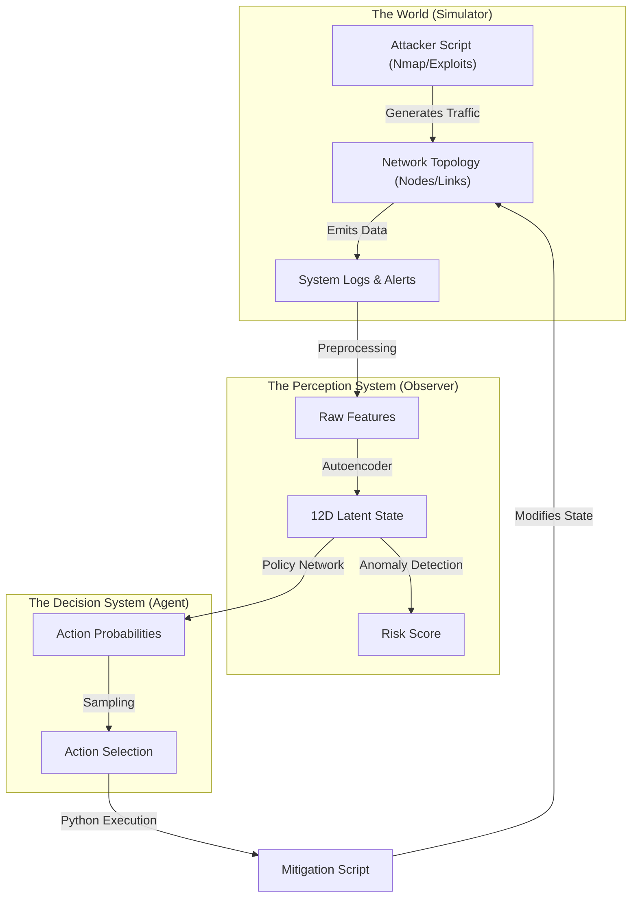
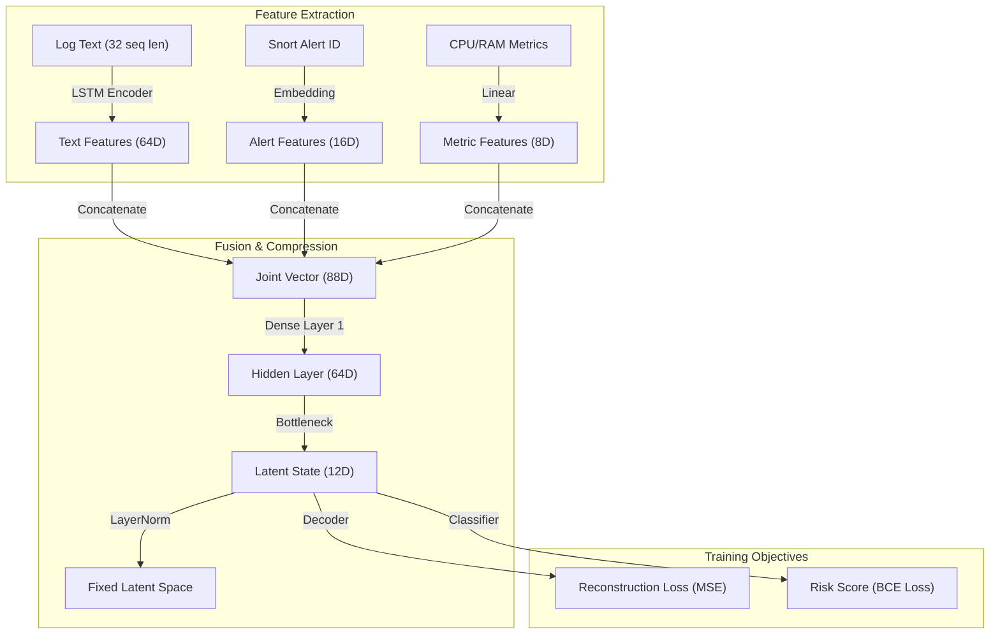
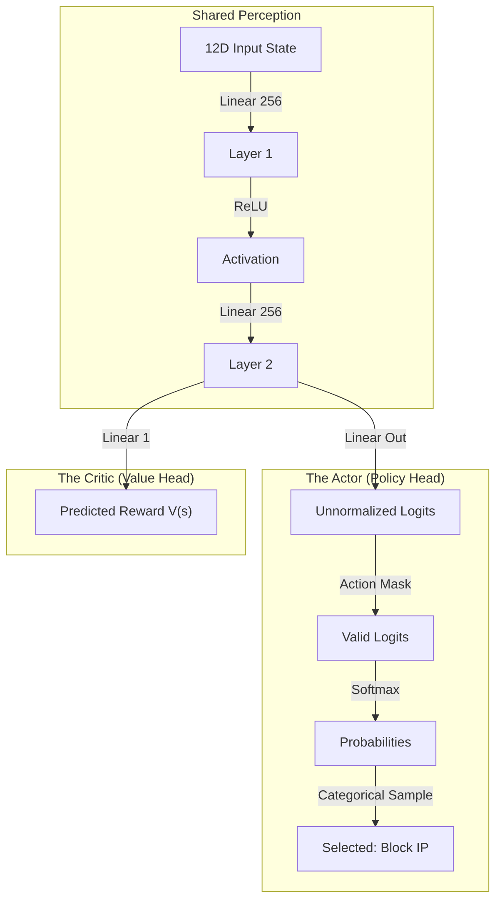
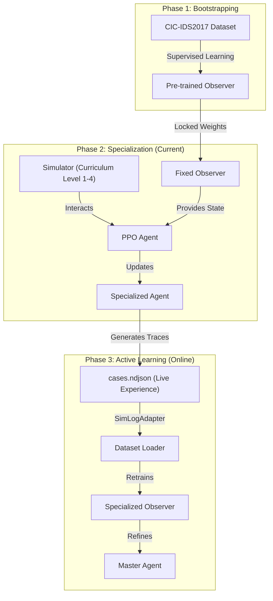

# DIDI RL SOAR: Technical Whitepaper 🛡️⚙️

> [!IMPORTANT]
> **This is the System Specification.**
> It details the Architecture, Components, Training Process, and Roadmap in engineering terms.

---

## 1. System Architecture (The Loop)

The SOAR System operates as a closed-loop control system. It observes the network state, processes it through two Neural Networks, and outputs mitigation actions.

### Architecture Diagram


### Explanation
1.  **The World**: The `Simulator` runs an event-driven loop where attackers target specific devices. This generates logs (Syslog, Snort) identical to a real network.
2.  **The Perception System (Observer)**: A Multi-Modal Autoencoder reads the logs. It compresses 78 raw features into a **12-Dimensional Latent vector**. This vector represents the "essence" of the network state (e.g., "Under Attack", "Safe", "Confusing").
3.  **The Decision System (Agent)**: A PPO (Proximal Policy Optimization) model takes the 12D vector. It outputs a discrete action ID (0-35) representing a command (e.g., "Isolate Server 3").
4.  **Mitigation**: A deterministic Python script executes the chosen action ID, modifying the network (e.g., changing firewall rules), creating a feedback loop.

---

## 2. Component Detail: The Observer (Vision) �️

The Observer's job is **Dimensionality Reduction** and **Anomaly Detection**. It must convert complex, messy logs into a clean signal for the Agent.

### Observer Diagram


### Technical Explanation
*   **Inputs**:
    *   **Logs**: Processed via an LSTM (Long Short-Term Memory) network to handle variable-length text.
    *   **Alerts**: Categorical data (IDs) embedded into a vector space.
    *   **Metrics**: Continuous variables normalized to [0,1].
*   **Latent Space (The Bottleneck)**: The model is forced to compress all this data into just **12 numbers**. We use **LayerNorm** here instead of saturating activations (Sigmoid/Tanh) to prevent latent collapse and ensure the agent receives a high-variance signal.
*   **Reconstruction**: During pre-training, it tries to recreate the input. High error means "Unknown Pattern" (Anomaly).

---

## 3. Component Detail: The Agent (Brain) 🧠

The Agent uses **Reinforcement Learning** (PPO) to learn strategy. It does not know *how* to block an IP, only *that* it should block it to get a reward.

### Agent Diagram


### Technical Explanation
*   **Shared Perception**: The first two layers process the valid state to understand the situation.
*   **The Actor**: Outputs a probability distribution over all possible actions. We use **Action Masking** to zero out invalid actions (e.g., you can't "Unblock" a server that isn't blocked).
*   **The Critic**: Estimates "How good is this state?" This helps train the Actor by calculating the "Advantage" (Did the action make things better than expected?).

---

## 4. The Training Pipeline 🛤️

We use a **Curriculum Learning** approach to train these models sequentially.

### Pipeline Diagram


### Explanation
1.  **Bootstrapping**: We teach the Observer what "Generic Attacks" look like using public datasets (CIC-IDS, BOT-IOT).
2.  **Specialization**: We freeze the Observer. The Agent plays millions of games in the Simulator to learn strategy.
3.  **Active Learning Feedback**: The Agent's unique strategy creates new traffic patterns. We use the `SimLogAdapter` to feed these live traces back into the Observer, creating a synchronized, self-improving security model.

---

## 5. Future Roadmap (Timeline to Mastery) �

This timelines outlines the engineering tasks required to move from "Prototype" to "Production".

### Gantt Chart

```mermaid
gantt
    title Engineering Roadmap
    dateFormat  X
    axisFormat Day %d
    
    section Optimization
    Current Training Run (5M Steps)      :active, t1, 0, 1d
    
    section Phase 1: Tuning
    Config Optimization (100 Devices)    :done,   t2, 0, 0
    Iterative Fine-Tuning (50 Cycles)    :         t3, after t1, 1d
    
    section Phase 2: Features
    Impl. Ransomware Scenario            :         t4, after t3, 4h
    Impl. Stealth Scan Scenario          :         t5, after t3, 4h
    Train on New Scenarios               :         t6, after t5, 12h
    
    section Phase 3: Deployment
    Reward Shaping (Surgical)            :         t7, after t6, 2h
    Active Learning Pipeline Setup       :         t8, after t7, 6h
```


### Feature Explanation
*   **Iterative Fine-Tuning**: A 50-epoch loop where the Observer and Agent train alternately. This synchronizes their latent space representations.
*   **Ransomware Scenario**: A new attack type where time is critical. Agent receives -100 reward if infection persists > 30s.
*   **Stealth Scan**: Attacks with low-frequency polling (1 packet/min). Models need longer context windows (LSTMs) to detect this.
*   **Reward Shaping**: Modifying `reward.py` to penalize `Isolate` actions (-0.9) more than `Block Port` (-0.1), forcing the agent to be precise.

---

## 6. Access & Commands 💻

### A. Current Status
Monitor the active training run:
```bash
tail -f training_full_speed.log
```

### B. Execute Phase 1 (Fine-Tuning)
To begin the 50-cycle refinement (Run this after current training finishes):
```bash
python3 train/train_iterative.py --iterations 50
```

### C. Visual Evaluation
To generate GIFs of the agent's performance:
```bash
python3 eval/animate_eval.py --scenarios all
```
