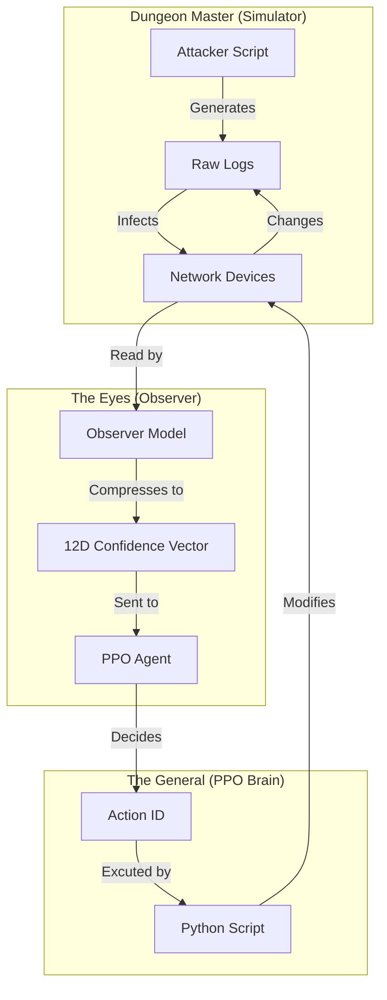
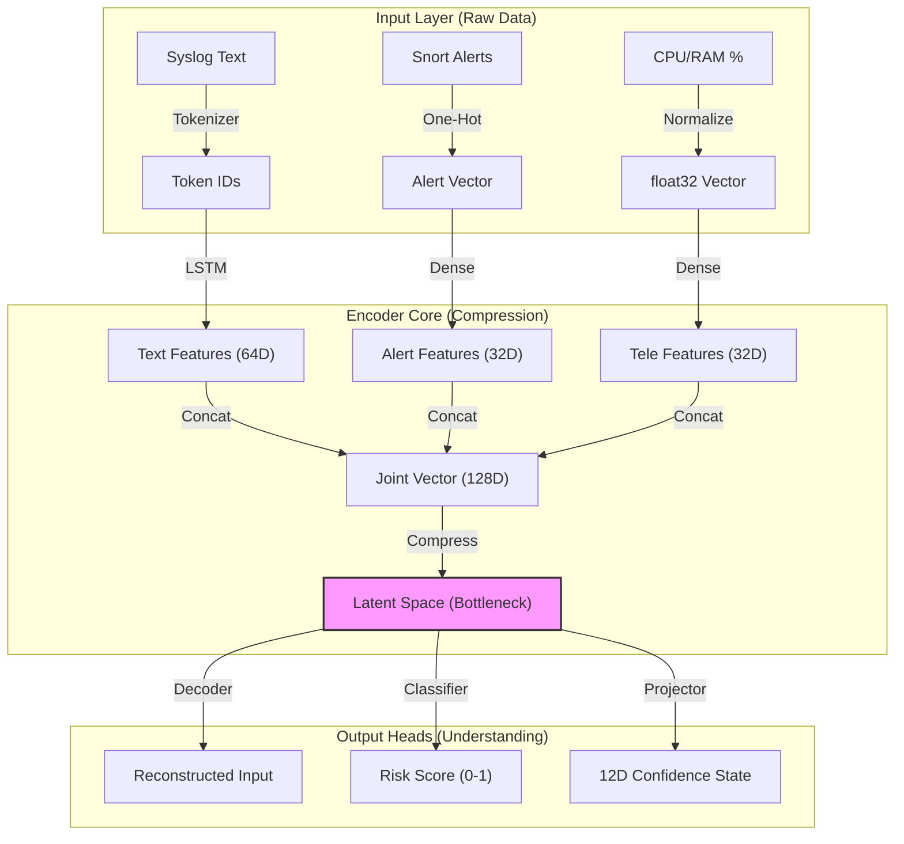
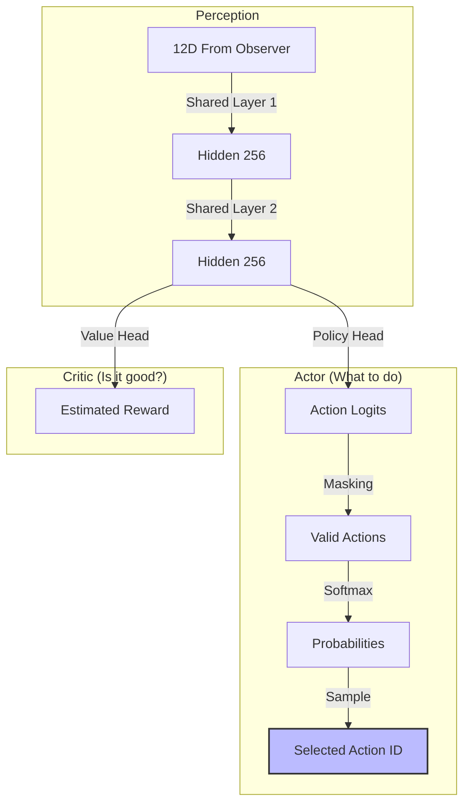
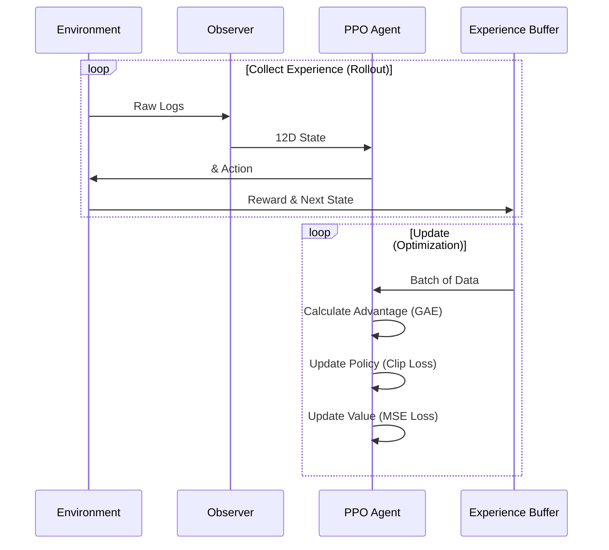

# DIDI RL SOAR: The Complete Documentation 🛡️🧠

> [!IMPORTANT]
> **THIS IS THE MASTER DOCUMENT.**
> It contains **EVERYTHING**: The Theory, The Architecture Diagrams, The Installation Guide, The Usage Manual, and The Future Roadmap.
> Ignore all other `.md` files. This is the only one you need.

---

## Part 1: The Philosophy ("The Infinite Game") ♾️

We do not write scripts for every attack. We create an **Interaction** that generates its own curriculum.

### The Problem with Traditional SOAR
*   **Old Way**: Writing `if (alert == "Brute Force") then (block_ip)`.
*   **Problem**: You need a new script for every new attack. You are always chasing the hackers.

### The New Way (AI SOAR)
*   **Dungeon Master (Simulator)**: Generates attacks (Nmap, Brute Force, Ransomware) based on rules.
*   **Warrior (Agent)**: Improvises defense strategies.
*   **Student (Observer)**: Watches the unique timeline created by their interaction and learns to understand it.
*   **Result**: The Agent's actions warp the reality of the simulation, creating millions of unique situations for the Observer to learn from. This is why we don't need petabytes of external data.

---

## Part 2: The Architecture (The Blueprint) 🗺️

### A. The Full Workflow (The Infinite Loop)


### B. The Components (Deep Dive)

#### 1. The Observer (Vision System) 👁️
How it turns "Raw Logs" into "Understanding" without human labels.




#### 2. The Agent (Decision Brain) 🧠
How it decides to "Isolate" or "Ignore" using Reinforcement Learning.



#### 3. The Training Loop (How it Learns) 🏋️
The cycle of experience gathering and optimization.



---

## Part 3: Installation & Quick Start 🚀

### A. Setup
```bash
# 1. Create venv
python3 -m venv .venv
source .venv/bin/activate

# 2. Install dependencies
pip install gym torch numpy networkx pandas matplotlib pyyaml
```

### B. Dataset Setup
1.  Ensure downloaded datasets are in `../Dataset/`.
2.  Manifest is located at `datasets/manifest.yaml`.
3.  Adapters (`datasets/adapters/`) handle parsing.

### C. Running the Pipeline (The Path to Mastery)

#### Phase 1: Specialization (Current / "Pro" Mode)
**Status**: Currently Running.
Trains the PPO Agent for 5 Million steps with the Observer Locked.
*   **Optimization**: GPU Turbo (Batch 4096) + Silent Mode (No Disk I/O).
```bash
python3 train/run_continuous_ppo.py
```

#### Phase 2: Intensive Fine-Tuning (Next Step)
**Status**: Ready to Run.
After Phase 1 finishes, run this to perfect the "Brain + Eyes" coordination.
*   **Action**: Runs 50 iterations of alternating training.
*   **Speed**: **5x Faster** using the optimized `configs/curriculum.yaml` (Max 100 Devices).
```bash
python3 train/train_iterative.py --iterations 50
```

#### Phase 3: Final Evaluation
Generate GIF visualizations of the agent defending against 13 complex scenarios:
```bash
python3 eval/animate_eval.py --model_path logs/iterative_loop/ppo_continuous/latest_model.pth --scenarios all
```

---

## Part 4: Deployment Strategy (The Flywheel) 🎡

You asked: *"How do we make it perfect forever?"*

The answer is **Human-in-the-Loop Active Learning**.

### The Circle of Life 🦁🔁

1.  **Deployment (Monday - Saturday)**:
    *   The Agent defends the network 24/7.
    *   It handles 99.9% of alerts automatically.
    *   **The Filter**: If it sees something weird (Confidence < 90%), it **Does Not Act**. It sends it to the "Review Pile".

2.  **Human Review (Sunday Morning)**:
    *   You drink your coffee and look at the "Review Pile" (maybe 10-20 confusing events).
    *   You label them: *"This wasn't a hack, it was the new printer."*

3.  **Retraining (Sunday Afternoon)**:
    *   The system takes these 20 new examples.
    *   It runs a quick **1-Hour Fine-Tuning Session**.
    *   The Brain learns: *"Ah, Printers are friends, not food."*

4.  **Redeployment (Sunday Night)**:
    *   **Agent v2.0** goes live.
    *   It will **never** make that mistake again.

**Verdict**: This turns your security system into a living organism that gets smarter every single week.

---

## Part 5: Deployment Reality (The Limits) 🌍

You asked: *"Is it ready to be deployed in ANY new architecture?"*

The answer is **Yes for the Brain**, but **Maybe for the Eyes**.

### A. The Brain (Universal Strategy) 🧠✅
*   **What it knows**: "If I see a Brute Force attack on a Critical Server, I should Block the IP."
*   **Transferability**: **100%**. This strategy works in a Bank, a Hospital, or a Cloud Server. The logic of defense is universal.

### B. The Eyes (Specific Vision) 👁️⚠️
*   **What is knows**: "I know that `log_type=3` means an FTP login."
*   **The Catch**: If you move to a new network that uses **completely different logs** (e.g., moving from Linux to Windows), the Eyes might get confused.
*   **The Fix**: You don't need to retrain the Brain. You just need to give the Eyes a quick "Language Course" (Train the Observer on 5,000 samples of the new logs).

---

## Part 6: Future Roadmap (The Path to Mastery) 🛤️

| Phase | Action | Goal | Estimated Time |
| :--- | :--- | :--- | :--- |
| **1** | **Intensive Fine-Tuning** | Run 50 Iterations (Brain + Eyes) | ~8 Hours |
| **2** | **New Enemies** | Add Ransomware & Stealth Attacks | ~16 Hours |
| **3** | **Reward Shaping** | Increase Penalty for "Nuclear Options" | N/A |
| **4** | **Mastery** | Continuous Active Learning | Forever |

---

## Part 7: Configuration Reference

*   **Curriculum**: `configs/curriculum.yaml` (The Key Speed Optimization file).
*   **Scenarios**: `simulator/scenarios/complex_scenarios.yaml` (Edit attack phases).
*   **PPO Params**: `train/train_ppo.py` (Edit `CONFIG` dict).
*   **Reward Function**: `simulator/config.py` (Edit penalties/rewards).
