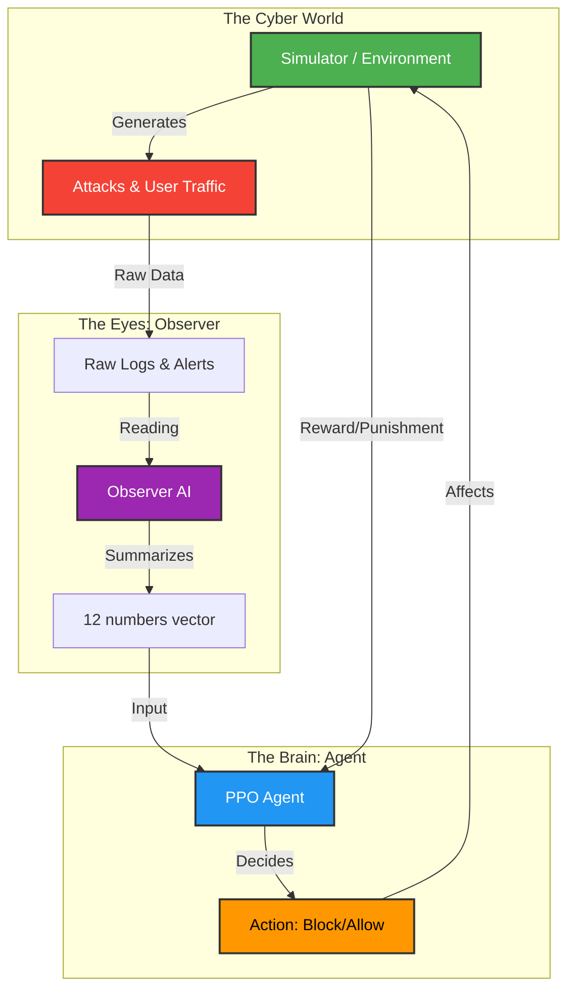

# AI SOAR Pipeline: A Simple Guide

This document explains exactly how the system works without using complex jargon.

---

## 1. The Big Picture: "The Cyber Guardian"

Imagine you are hiring a security guard for a bank. This guard needs two skills:
1.  **Observation**: The ability to look at security cameras and spot a robber in a crowd (Detection).
2.  **Action**: The ability to decide *what to do* when they see a robber (e.g., lock the doors, call police, or just watch closely).

Our AI System works exactly the same way. It is split into **two distinct brains**:

| Concept | Component Name | What it does |
| :--- | :--- | :--- |
| **"The Eyes"** | **Observer (Stage 1)** | Reads messy logs (cameras) and summarizes them into a simple report. |
| **"The Brain"** | **PPO Agent (Stage 2)** | Reads the report and decides which button to press (Block IP, Isolate, etc.). |

### System Diagram

---

## 2. Component Breakdown

### A. The Simulator (The Video Game)
*   **File**: `simulator/`
*   **What it is**: A realistic "Cyber Range" that mimics a corporate network.
*   **The Cast**: It simulates 50+ devices:
    *   **Web Servers**: Handling user traffic (HTTP).
    *   **Databases**: Storing sensitive data (SQL).
    *   **Workstations**: Employees checking email.
*   ** The Drama**:
    *   **Background Noise**: Normal employees working (Generating safe logs).
    *   **The Attackers**: Automated hackers running scripts (Nmap Scans, Brute Force, DDoS).
*   **Goal**: The game runs indefinitely. The Agent wins points for stopping attacks and loses points for breaking things.

### B. The Observer ("The Eyes")
*   **File**: `train/train_agent.py`
*   **The Problem**: Computer logs are messy text (e.g., `192.168.1.5 - - [10/Oct/2023] "GET /admin"`). The AI Brain cannot read text; it only understands math.
*   **The Solution**: The Observer reads thousands of these lines and converts them into **12 Key Indicators** (The State Vector).
*   **The 12 Indicators (The Full List)**:
    1.  **Incident Score**: The AI's gut feeling on how bad it is (0-100%).
    2.  **Confidence**: "How sure am I?" (Avoids panic if unsure).
    3.  **Severity Level**: Is this a Low, Medium, or High priority event?
    4.  **Asset Criticality**: Is this a CEO's laptop (High) or a Cafe TV (Low)?
    5.  **Zone**: Is this device exposed to the Internet (DMZ) or safe inside?
    6.  **CPU Usage**: Is the processor working too hard? (Sign of crypto-mining).
    7.  **Memory Usage**: Is it running out of RAM? (Sign of efficient malware).
    8.  **Bytes Out**: How much data is leaving the device? (Data Theft).
    9.  **Packets Out**: How fast are packets flying out? (DDoS Attack).
    10. **Unique Ports**: Is it talking to 1000 different servers? (Scanning).
    11. **Active Connections**: How many people are connected to it?
    12. **Already Isolated**: Did we already block this device? (Don't block twice).
*   **Output**: It hands this exact list of 12 numbers to the Brain.

### C. The Agent ("The Brain")
*   **File**: `train/train_ppo.py`
*   **The Input**: It receives the 12 numbers from the Observer.
*   **The Decision**: It uses a **Policy Network** to calculate probabilities.
    *   *Example*: "If Risk is 90% and CPU is 100%, there is a 95% chance I should Isolate."
*   **The Action Menu (The Complete List)**:
    *   **Tier 0: Monitor**
        1.  **Monitor Only**: Do nothing, just keep watching.
        2.  **Wait 1 Window**: Wait 10 seconds to see if it fixes itself.
    *   **Tier 1: Evidence (Investigate)**
        3.  **Increase Logging**: Turn on "Debug Mode" for 5 minutes.
        4.  **PCAP Capture**: Record full network traffic for 60 seconds.
    *   **Tier 2: Containment (Stop the bleeding)**
        5.  **Rate Limit**: Slow down traffic (if they are stealing data).
        6.  **Block Top IP**: Block the IP address sending the most traffic.
        7.  **Isolate Device**: Cut off network access entirely (The "Kill Switch").
        8.  **Block Port**: Close the specific port (e.g., Block Port 80).
        9.  **Drop New Connections**: Stop accepting *new* visitors.
        10. **Quarantine VLAN**: Move device to a "Jail" network.
    *   **Tier 3: Recovery (Fix the problem)**
        11. **Restart Container**: Reboot the server.
        12. **Stop Telnet**: Turn off the vulnerable service.
        13. **Rotate Credentials**: Change the passwords immediately.
        14. **Trigger Self-Restore**: Wipe the device and restore from backup.
*   **The Goal**: It wants to maximize its **Reward Score**.

### D. The Reward System ("The Scoreboard")
*   **How does it learn?**: Like training a dog with treats.
*   **Good Dog (+ Points)**:
    *   Stopping an attack early.
    *   Keeping the web server online.
*   **Bad Dog (- Points)**:
    *   Blocking the CEO (False Positive).
    *   Letting data get stolen.
    *   Crashing the server by panicking.
*   **Result**: Over millions of tries, the Agent learns the perfect balance between "Safety" and "Usability".

---

## 3. The Training Loop (The "School")

The file `train/train_iterative.py` is the **School Schedule**. It manages the training in cycles (Iterations).

**Step 1: Study Theory (Observer Training)**
*   The Observer reads "textbooks" (The Static Datasets in `datasets/`).
*   It learns what attacks look like by analyzing historical data.
*   *Analogy*: A student reading case files in the library.

**Step 2: Practice Simulation (PPO Training)**
*   The Agent enters the Simulator.
*   It faces live, simulated attacks.
*   It tries different strategies and gets graded (Rewards).
*   *Analogy*: The student playing a realistic training simulation.

**Step 3: Evolution (Curriculum)**
*   If the Agent passes the test (High Score), the Simulator gets harder (More complex attacks).
*   We repeat this 50 times until the Agent is a master.

---

## 4. Key Files Cheat Sheet

| I want to change... | File to Edit |
| :--- | :--- |
| **How long training takes** | `train/train_iterative.py` (Edit `ITERATIVE_CONFIG`) |
| **What attacks happen** | `simulator/scenarios/complex_scenarios.yaml` |
| **The available actions** | `simulator/config.py` (Look for `ACTIONS` list) |
| **The Rewards/Penalties** | `simulator/config.py` (Look for `REWARD_...`) |
| **The "simple summary"** | `agent/trainable_observer.py` (Look for `FEATURE_DIM`) |

---

---

## 6. Understanding the Dashboard (TensorBoard)

When you open the dashboard, you are looking at the "Vitals" of the AI. Here is a simple guide to what the graphs mean:

### A. Stage 1: The Observer (The "Vision" Test)
*   **`train/total_loss`**: 
    *   *What it is*: The "Inaccuracy" of the Eyes.
    *   *Goal*: **Down is Good**. If this drops to near zero, it means the Observer has perfectly learned to translate complex logs into the 12-number report.

### B. Stage 2: The Agent (The "Strategy" Test)
*   **`charts/episodic_return`**: 
    *   *What it is*: The "Total Score" for a full simulation round.
    *   *Goal*: **Up is Good**. A positive score means the Agent is successfully stopping attacks without breaking the server.
*   **`charts/entropy`**: 
    *   *What it is*: The "Curiosity" level.
    *   *Goal*: **Should start High and end Low**. 
        *   High Entropy = "I'm trying random things to see what happens."
        *   Low Entropy = "I know exactly what to do, I've stopped guessing."
*   **`charts/policy_loss`**: 
    *   *What it is*: The "Confusion" of the Brain during learning.
    *   *Trend*: This will jump around a lot! Don't worry about the spikes; as long as the "Episodic Return" is going up, the Agent is learning.

### C. The Curriculum (The "Level" System)
*   **`charts/curriculum_level`**: 
    *   *What it is*: Which "Grade" the AI is in (0 to 10).
    *   *Goal*: **Should Step Upwards**. If it stays at 0 for too long, the Agent is failing the "Easy Mode" tests and needs more training.

---

## 7. Summary
1.  **Simulator** creates a virtual world.
2.  **Observer** watches the world and translates logs to numbers.
3.  **Agent** watches the numbers and presses buttons to stop attacks.
4.  **Training** makes them both better over time by repeating the process 50 times.

---

## 8. Latest Upgrades (The "Pro" Mode)

We recently upgraded the system from a "Student" to a "Professional". Here is what changed:

### A. Continuous PPO (No More Recess)
*   **Old Way (Iterative)**: Train for 10 minutes, stop, test, repeat.
    *   *Problem*: The AI would sometimes "forget" what it learned during the break.
*   **New Way (Continuous)**: Train for **5 Million Steps** without stopping.
    *   *Benefit*: The AI learns strictly from experience, building deep intuition (Mastery).

### B. Locked Observer ("Trusted Eyes")
*   **Concept**: We successfully trained the Observer to 95% accuracy.
*   **Change**: We **Locked** the Observer model. It is no longer learning; it is just *working*.
*   **Why?**: If the Eyes keep changing how they see the world, the Brain gets confused. By locking the Eyes, the Brain can focus 100% on strategy.

### C. GPU Turbo Mode (Batching)
*   **The Bottleneck**: The simulation (CPU) is slow, but the learning (GPU) is fast.
*   **The Fix**:
    1.  **Rollout Length (8192)**: The CPU plays the game for 8,000 steps to gather a huge pile of data.
    2.  **Batch Size (4096)**: The GPU takes that huge pile and learns from it all at once.
*   **Result**: We utilize the hardware efficiently. The CPU works hard to feed the hungry GPU.

### D. Silent Running (Disk Optimization)
*   **Problem**: Writing every single decision to a text file (`experiences.ndjson`) created 17GB of data in minutes, slowing everything down.
*   **Fix**: We disabled the logs (`disable_logging=True`).
*   **Result**: The system runs at **Full Speed** (~130 steps/second) because it's not waiting for the hard drive to write "I blocked an IP" 5 million times.
