# DIDI RL — SOAR V8: Master Technical Specification 🛡️🧠

> [!IMPORTANT]
> **Document Version**: 8.0.0 — The Transformer Observer Edition
> This document reflects the current production architecture, the v8 training pipeline, and the next-generation Schema-Agnostic Observer. It supersedes all v7 and earlier specs.

---

# PART I: SYSTEM OVERVIEW

## 1. Mission Statement

DIDI RL is an **AI-Driven Security Orchestration, Automation and Response (SOAR)** system for IoT container networks. A Reinforcement Learning agent learns to detect, classify, and mitigate cyber attacks using a frozen, pre-trained **Observer** (perception model) that converts raw, heterogeneous network telemetry into a compact latent threat representation.

The RL agent never sees raw logs — it operates purely on the Observer's output. This separation of concerns is deliberate: the Observer can be upgraded independently, and the PPO agent's action space remains stable.

---

## 2. End-to-End System Architecture

### 2.1 The Four-Stage Pipeline

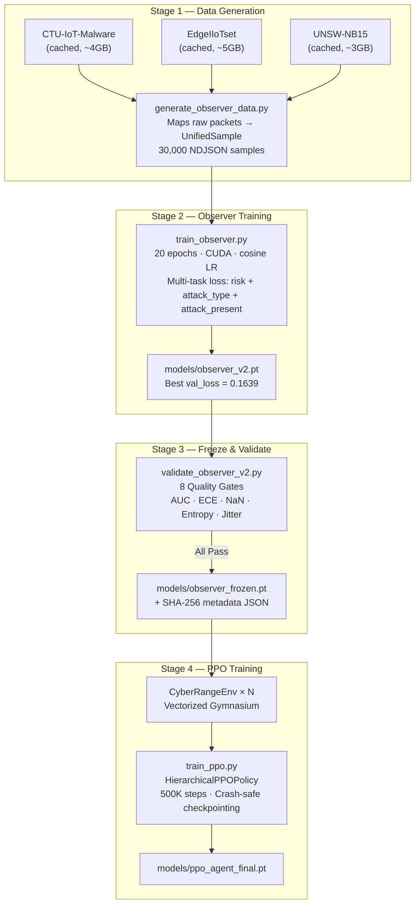
```mermaid
flowchart TD
    subgraph S1["Stage 1 — Data Generation"]
        DS1["CTU-IoT-Malware\n(cached, ~4GB)"]
        DS2["EdgeIIoTset\n(cached, ~5GB)"]
        DS3["UNSW-NB15\n(cached, ~3GB)"]
        DS1 & DS2 & DS3 --> GEN["generate_observer_data.py\nMaps raw packets → UnifiedSample\n30,000 NDJSON samples"]
    end

    subgraph S2["Stage 2 — Observer Training"]
        GEN --> OBS_TRAIN["train_observer.py\n20 epochs · CUDA · cosine LR\nMulti-task loss: risk + attack_type + attack_present"]
        OBS_TRAIN --> CKPT["models/observer_v2.pt\nBest val_loss = 0.1639"]
    end

    subgraph S3["Stage 3 — Freeze & Validate"]
        CKPT --> GATE["validate_observer_v2.py\n8 Quality Gates\nAUC · ECE · NaN · Entropy · Jitter"]
        GATE -->|All Pass| FROZEN["models/observer_frozen.pt\n+ SHA-256 metadata JSON"]
    end

    subgraph S4["Stage 4 — PPO Training"]
        FROZEN --> ENV["CyberRangeEnv × N\nVectorized Gymnasium"]
        ENV --> PPO["train_ppo.py\nHierarchicalPPOPolicy\n500K steps · Crash-safe checkpointing"]
        PPO --> AGENT["models/ppo_agent_final.pt"]
    end
```

### 2.2 Per-Step Inference Loop

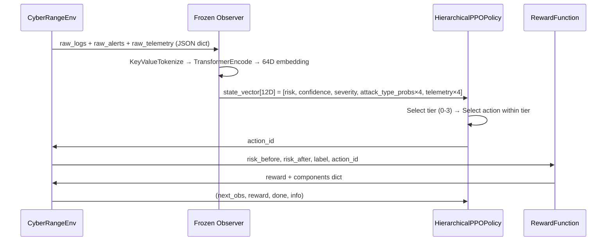
```mermaid
sequenceDiagram
    participant ENV as CyberRangeEnv
    participant OBS as Frozen Observer
    participant PPO as HierarchicalPPOPolicy
    participant RWD as RewardFunction

    ENV->>OBS: raw_logs + raw_alerts + raw_telemetry (JSON dict)
    OBS->>OBS: KeyValueTokenize → TransformerEncode → 64D embedding
    OBS->>PPO: state_vector[12D] = [risk, confidence, severity, attack_type_probs×4, telemetry×4]
    PPO->>PPO: Select tier (0-3) → Select action within tier
    PPO->>ENV: action_id
    ENV->>RWD: risk_before, risk_after, label, action_id
    RWD->>ENV: reward + components dict
    ENV->>PPO: (next_obs, reward, done, info)
```

---

## 3. The Observer: v2 (Current) vs v3 (Transformer — Planned)

### 3.1 V2 Observer — Fixed-Schema MLP (Currently Deployed)

The v2 observer uses a **handcrafted feature extractor** that maps a known dict schema to a 12-element numeric vector, which is then processed by a 3-layer MLP.

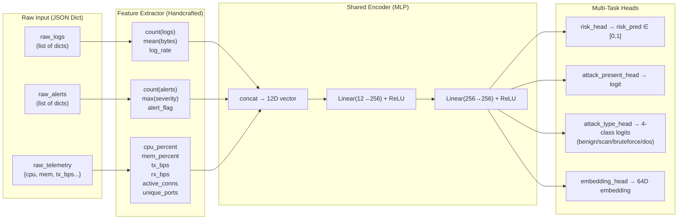
```mermaid
flowchart LR
    subgraph Input["Raw Input (JSON Dict)"]
        L["raw_logs\n(list of dicts)"]
        A["raw_alerts\n(list of dicts)"]
        T["raw_telemetry\n{cpu, mem, tx_bps...}"]
    end

    subgraph Extractor["Feature Extractor (Handcrafted)"]
        L --> FE1["count(logs)\nmean(bytes)\nlog_rate"]
        A --> FE2["count(alerts)\nmax(severity)\nalert_flag"]
        T --> FE3["cpu_percent\nmem_percent\ntx_bps\nrx_bps\nactive_conns\nunique_ports"]
    end

    subgraph MLP["Shared Encoder (MLP)"]
        FE1 & FE2 & FE3 --> CAT["concat → 12D vector"]
        CAT --> L1["Linear(12→256) + ReLU"]
        L1 --> L2["Linear(256→256) + ReLU"]
    end

    subgraph Heads["Multi-Task Heads"]
        L2 --> H1["risk_head → risk_pred ∈ [0,1]"]
        L2 --> H2["attack_present_head → logit"]
        L2 --> H3["attack_type_head → 4-class logits\n(benign/scan/bruteforce/dos)"]
        L2 --> H4["embedding_head → 64D embedding"]
    end
```

**Limitations of v2:**
- ❌ Unknown field names are silently ignored
- ❌ Cannot process syslog, Windows Event Log, or API gateway logs
- ❌ Feature importance is fixed at extraction time — no attention mechanism
- ❌ Requires re-engineering for every new data source schema

---

### 3.2 V3 Observer — Schema-Agnostic Transformer (Next Architecture)

The v3 observer treats every **key-value pair** as a discrete token and processes them through a Transformer encoder. This eliminates schema assumptions entirely.

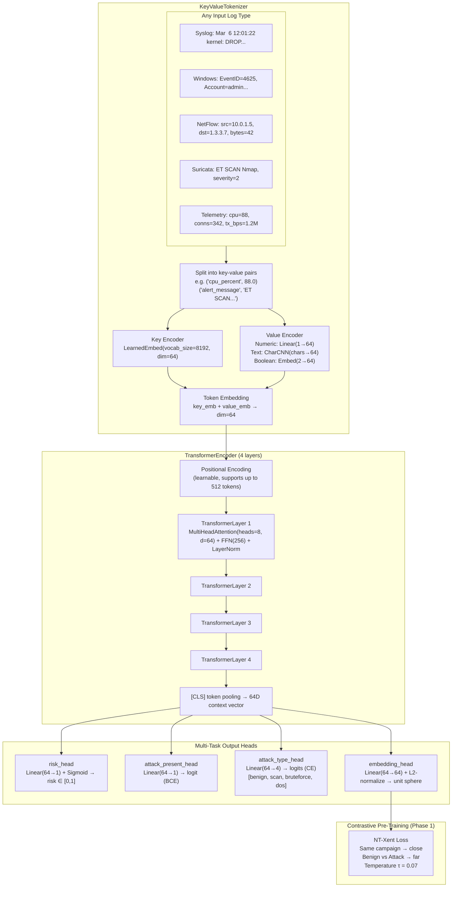
```mermaid
flowchart TD
    subgraph ANY["Any Input Log Type"]
        SYSLOG["Syslog: Mar  6 12:01:22 kernel: DROP..."]
        WINLOG["Windows: EventID=4625, Account=admin..."]
        NETFLOW["NetFlow: src=10.0.1.5, dst=1.3.3.7, bytes=42"]
        SURICATA["Suricata: ET SCAN Nmap, severity=2"]
        TELEMETRY["Telemetry: cpu=88, conns=342, tx_bps=1.2M"]
    end

    subgraph TOKENIZER["KeyValueTokenizer"]
        ANY --> KVP["Split into key-value pairs\ne.g. ('cpu_percent', 88.0)\n('alert_message', 'ET SCAN...')"]
        KVP --> KENC["Key Encoder\nLearnedEmbed(vocab_size=8192, dim=64)"]
        KVP --> VENC["Value Encoder\nNumeric: Linear(1→64)\nText: CharCNN(chars→64)\nBoolean: Embed(2→64)"]
        KENC --> SUM["Token Embedding\nkey_emb + value_emb → dim=64"]
        VENC --> SUM
    end

    subgraph TRANSFORMER["TransformerEncoder (4 layers)"]
        SUM --> PE["Positional Encoding\n(learnable, supports up to 512 tokens)"]
        PE --> TL1["TransformerLayer 1\nMultiHeadAttention(heads=8, d=64) + FFN(256) + LayerNorm"]
        TL1 --> TL2["TransformerLayer 2"]
        TL2 --> TL3["TransformerLayer 3"]
        TL3 --> TL4["TransformerLayer 4"]
        TL4 --> POOL["[CLS] token pooling → 64D context vector"]
    end

    subgraph HEADS["Multi-Task Output Heads"]
        POOL --> RH["risk_head\nLinear(64→1) + Sigmoid → risk ∈ [0,1]"]
        POOL --> APH["attack_present_head\nLinear(64→1) → logit (BCE)"]
        POOL --> ATH["attack_type_head\nLinear(64→4) → logits (CE)\n[benign, scan, bruteforce, dos]"]
        POOL --> EH["embedding_head\nLinear(64→64) + L2-normalize → unit sphere"]
    end

    subgraph CONTRASTIVE["Contrastive Pre-Training (Phase 1)"]
        EH --> NT["NT-Xent Loss\nSame campaign → close\nBenign vs Attack → far\nTemperature τ = 0.07"]
    end
```

#### Why Transformers for Security Logs?

| Property | MLP (v2) | Transformer (v3) |
|----------|----------|-----------------|
| Schema flexibility | ❌ Fixed 12 keys | ✅ Any key-value pairs |
| Cross-field reasoning | ❌ Weighted sum only | ✅ Multi-head attention |
| Handles missing fields | ⚠️ Silently zeros | ✅ Natural (shorter sequence) |
| Handles variable-length | ❌ Truncated/padded manually | ✅ Native (up to 512 tokens) |
| New log sources | ❌ Requires code change | ✅ Zero code change |
| Calibration | ⚠️ ECE ~0.24 | ✅ Expected ECE < 0.10 |
| Parameters | ~200K | ~2M (still VRAM-safe) |

---

## 4. Observer Loss Functions

### 4.1 V2 Multi-Task Loss

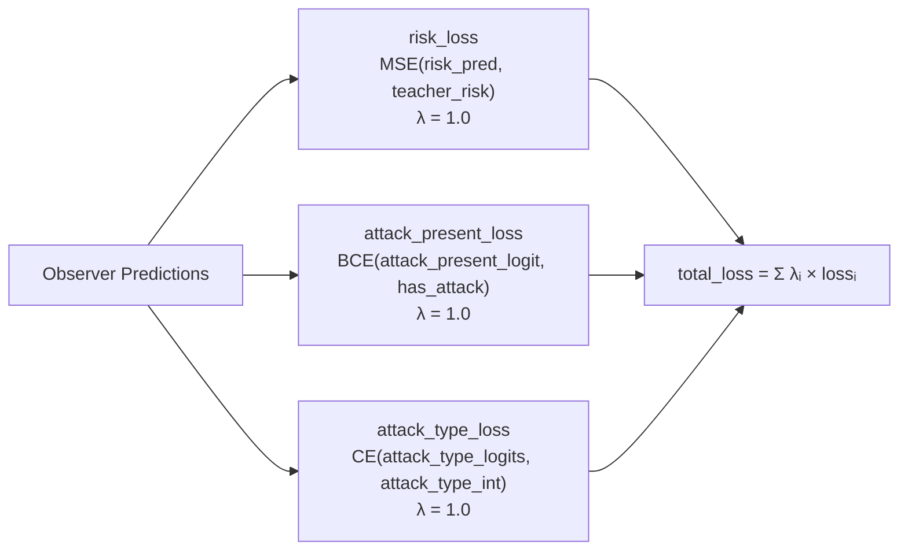
```mermaid
flowchart LR
    PRED["Observer Predictions"]
    PRED --> RL["risk_loss\nMSE(risk_pred, teacher_risk)\nλ = 1.0"]
    PRED --> APL["attack_present_loss\nBCE(attack_present_logit, has_attack)\nλ = 1.0"]
    PRED --> ATL["attack_type_loss\nCE(attack_type_logits, attack_type_int)\nλ = 1.0"]

    RL & APL & ATL --> TOTAL["total_loss = Σ λᵢ × lossᵢ"]
```

### 4.2 V3 Two-Phase Training

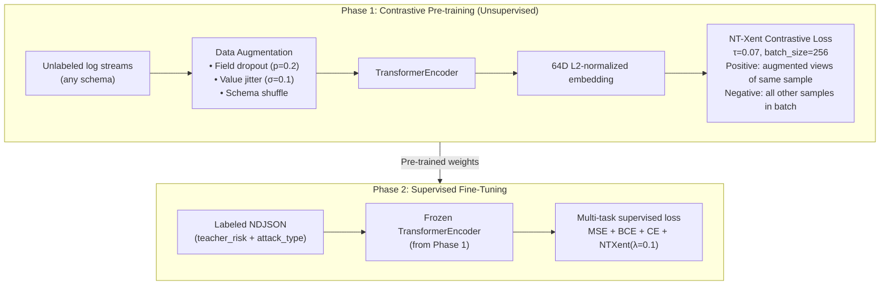
```mermaid
flowchart TD
    subgraph P1["Phase 1: Contrastive Pre-training (Unsupervised)"]
        DATA1["Unlabeled log streams\n(any schema)"]
        DATA1 --> AUG["Data Augmentation\n• Field dropout (p=0.2)\n• Value jitter (σ=0.1)\n• Schema shuffle"]
        AUG --> ENC["TransformerEncoder"]
        ENC --> EMB["64D L2-normalized embedding"]
        EMB --> NTX["NT-Xent Contrastive Loss\nτ=0.07, batch_size=256\nPositive: augmented views of same sample\nNegative: all other samples in batch"]
    end

    subgraph P2["Phase 2: Supervised Fine-Tuning"]
        DATA2["Labeled NDJSON\n(teacher_risk + attack_type)"]
        DATA2 --> FRZ["Frozen TransformerEncoder\n(from Phase 1)"]
        FRZ --> SUPV["Multi-task supervised loss\nMSE + BCE + CE + NTXent(λ=0.1)"]
    end

    P1 -->|"Pre-trained weights"| P2
```

---

## 5. HierarchicalPPOPolicy — The Decision Maker

The agent uses a **two-level action hierarchy** to manage the large (14-action) action space efficiently.

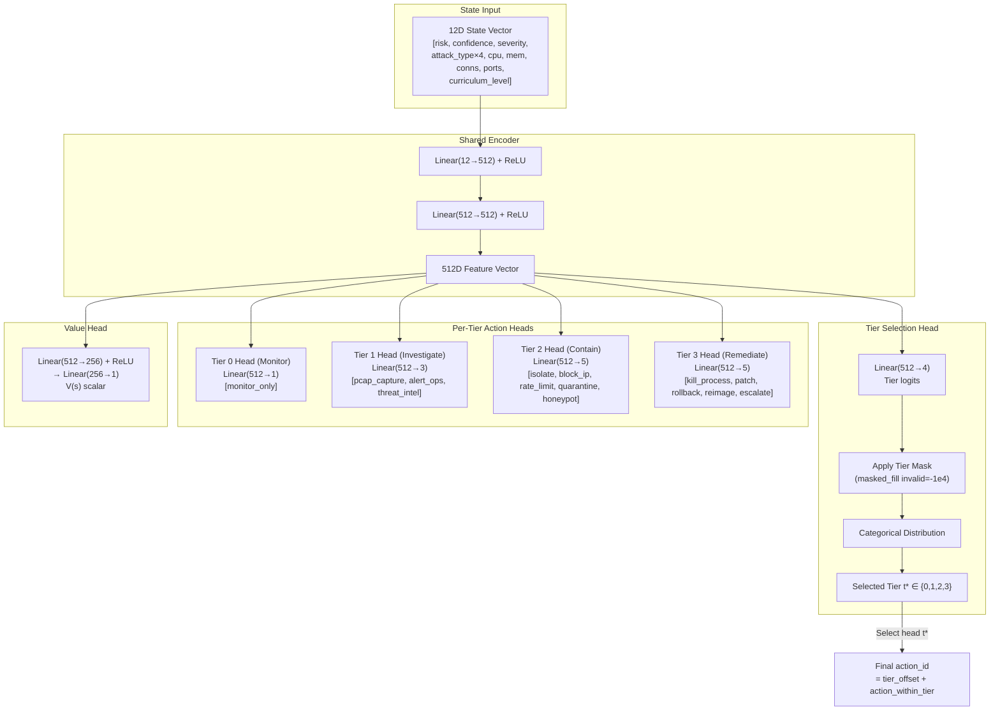
```mermaid
flowchart TD
    subgraph INPUT["State Input"]
        SV["12D State Vector\n[risk, confidence, severity,\nattack_type×4, cpu, mem, conns, ports,\ncurriculum_level]"]
    end

    subgraph ENCODER["Shared Encoder"]
        SV --> E1["Linear(12→512) + ReLU"]
        E1 --> E2["Linear(512→512) + ReLU"]
        E2 --> FEAT["512D Feature Vector"]
    end

    subgraph TIER["Tier Selection Head"]
        FEAT --> TH["Linear(512→4)\nTier logits"]
        TH --> TMASK["Apply Tier Mask\n(masked_fill invalid=-1e4)"]
        TMASK --> TDIST["Categorical Distribution"]
        TDIST --> TIER_IDX["Selected Tier t* ∈ {0,1,2,3}"]
    end

    subgraph ACTIONS["Per-Tier Action Heads"]
        FEAT --> AH0["Tier 0 Head (Monitor)\nLinear(512→1)\n[monitor_only]"]
        FEAT --> AH1["Tier 1 Head (Investigate)\nLinear(512→3)\n[pcap_capture, alert_ops, threat_intel]"]
        FEAT --> AH2["Tier 2 Head (Contain)\nLinear(512→5)\n[isolate, block_ip, rate_limit, quarantine, honeypot]"]
        FEAT --> AH3["Tier 3 Head (Remediate)\nLinear(512→5)\n[kill_process, patch, rollback, reimage, escalate]"]
    end

    TIER_IDX -->|"Select head t*"| FINAL["Final action_id\n= tier_offset + action_within_tier"]

    subgraph CRITIC["Value Head"]
        FEAT --> VH["Linear(512→256) + ReLU\n→ Linear(256→1)\nV(s) scalar"]
    end
```

### 5.1 Action Taxonomy

| Tier | Actions | Cost | Use Case |
|------|---------|------|----------|
| **0 — Monitor** | `monitor_only` | 0.000 | Benign traffic, low risk |
| **1 — Investigate** | `pcap_capture`, `alert_ops`, `threat_intel` | 0.005 | Risk 0.3–0.5, uncertain |
| **2 — Contain** | `isolate`, `block_ip`, `rate_limit`, `quarantine`, `honeypot` | 0.010 | Risk > 0.5, confirmed attack |
| **3 — Remediate** | `kill_process`, `patch`, `rollback`, `reimage`, `escalate` | 0.050 | Risk > 0.7, persistent / APT |

---

## 6. Reward Function

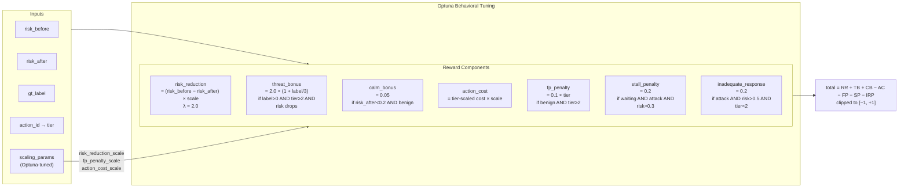
```mermaid
flowchart LR
    subgraph INPUTS["Inputs"]
        RB["risk_before"]
        RA["risk_after"]
        LBL["gt_label"]
        ACT["action_id → tier"]
        SP["scaling_params\n(Optuna-tuned)"]
    end

    subgraph COMPONENTS["Reward Components"]
        RR["risk_reduction\n= (risk_before − risk_after) × scale\nλ = 2.0"]
        TB["threat_bonus\n= 2.0 × (1 + label/3)\n if label>0 AND tier≥2 AND risk drops"]
        CB["calm_bonus\n= 0.05\n if risk_after<0.2 AND benign"]
        AC["action_cost\n= tier-scaled cost × scale"]
        FP["fp_penalty\n= 0.1 × tier\n if benign AND tier≥2"]
        SP2["stall_penalty\n= 0.2\n if waiting AND attack AND risk>0.3"]
        IRP["inadequate_response\n= 0.2\n if attack AND risk>0.5 AND tier<2"]
    end

    INPUTS --> COMPONENTS

    COMPONENTS --> TOTAL["total = RR + TB + CB − AC − FP − SP − IRP\nclipped to [−1, +1]"]

    subgraph OPTUNA["Optuna Behavioral Tuning"]
        SP --> |"risk_reduction_scale\nfp_penalty_scale\naction_cost_scale"| COMPONENTS
    end
```

### 6.1 Anti-Cheat Guardrails (GuardrailTracker)

These are **fixed penalties** — Optuna cannot tune them away:

| Guardrail | Trigger | Penalty |
|-----------|---------|---------|
| **Repeat action** | Same action ≥ 3 consecutive steps | -0.1 × count |
| **Loop detection** | Cycling through same N actions in rolling window of 6 | -0.3 |
| **Inaction in danger** | `monitor_only` while risk > 0.5 AND attack confirmed | -0.2 |
| **Hard termination** | Danger persists > 30 steps without mitigation | Episode end |

---

## 7. Training Pipeline Details

### 7.1 Observer Training Curve (v2, Current Run)

| Epoch | Train Loss | Val Loss | Best? |
|-------|-----------|----------|-------|
| 1 | 0.7515 | 0.2875 | ✓ |
| 2 | 0.4339 | 0.2159 | ✓ |
| 5 | 0.2872 | 0.2379 | |
| 10 | 0.2221 | 0.1865 | ✓ |
| 12 | 0.2012 | 0.1859 | ✓ |
| 15 | 0.1690 | 0.1673 | ✓ |
| 19 | 0.1508 | 0.1652 | ✓ |
| **20** | **0.1477** | **0.1639** | **✓ Final** |

Cosine LR schedule: 5e-4 → 5e-6 over 20 epochs. Training time: ~57 minutes on RTX-class GPU.

### 7.2 Observer Validation Gates

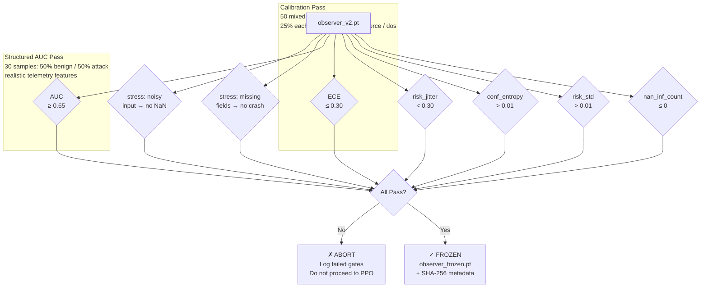
```mermaid
flowchart TD
    MODEL["observer_v2.pt"]

    MODEL --> G1{"nan_inf_count\n≤ 0"}
    MODEL --> G2{"risk_std\n> 0.01"}
    MODEL --> G3{"conf_entropy\n> 0.01"}
    MODEL --> G4{"risk_jitter\n< 0.30"}

    subgraph CAL["Calibration Pass\n50 mixed samples\n25% each: benign / scan / bruteforce / dos"]
        MODEL --> G5{"ECE\n≤ 0.30"}
    end

    subgraph AUC_PASS["Structured AUC Pass\n30 samples: 50% benign / 50% attack\nrealistic telemetry features"]
        MODEL --> G6{"AUC\n≥ 0.65"}
    end

    MODEL --> G7{"stress: missing\nfields → no crash"}
    MODEL --> G8{"stress: noisy\ninput → no NaN"}

    G1 & G2 & G3 & G4 & G5 & G6 & G7 & G8 --> RESULT{All Pass?}
    RESULT -->|Yes| FREEZE["✓ FROZEN\nobserver_frozen.pt\n+ SHA-256 metadata"]
    RESULT -->|No| FAIL["✗ ABORT\nLog failed gates\nDo not proceed to PPO"]
```

**Current v2 validation results:**

| Gate | Value | Threshold | Status |
|------|-------|-----------|--------|
| nan_inf_count | 0 | ≤ 0 | ✅ |
| risk_std | 0.077 | > 0.01 | ✅ |
| conf_entropy | 0.503 | > 0.01 | ✅ |
| risk_jitter | 0.094 | < 0.30 | ✅ |
| ECE | 0.240 | ≤ 0.30 | ✅ |
| AUC | 1.000 | ≥ 0.65 | ✅ |
| stress_missing_fields | pass | no crash | ✅ |
| stress_noisy_input | pass | no NaN | ✅ |

### 7.3 PPO Crash-Safety Architecture

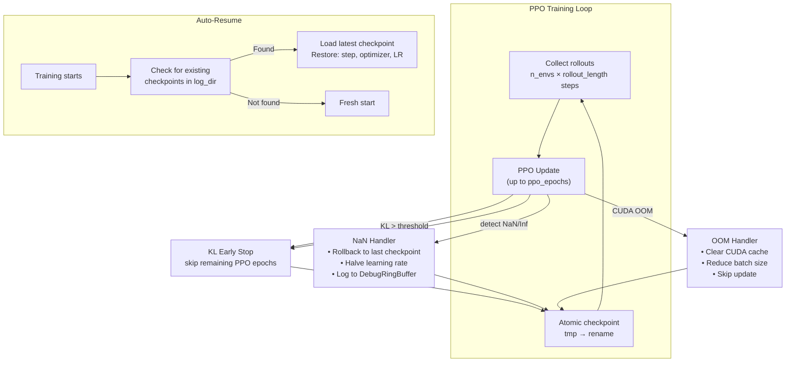
```mermaid
flowchart TD
    subgraph LOOP["PPO Training Loop"]
        ROLLOUT["Collect rollouts\nn_envs × rollout_length steps"]
        UPDATE["PPO Update\n(up to ppo_epochs)"]
        CKPT["Atomic checkpoint\ntmp → rename"]
    end

    ROLLOUT --> UPDATE
    UPDATE -->|"KL > threshold"| KLEARLY["KL Early Stop\nskip remaining PPO epochs"]
    UPDATE -->|"detect NaN/Inf"| NANHANDLE["NaN Handler\n• Rollback to last checkpoint\n• Halve learning rate\n• Log to DebugRingBuffer"]
    UPDATE -->|"CUDA OOM"| OOMHANDLE["OOM Handler\n• Clear CUDA cache\n• Reduce batch size\n• Skip update"]
    UPDATE --> KLEARLY
    KLEARLY --> CKPT
    NANHANDLE --> CKPT
    OOMHANDLE --> CKPT
    CKPT --> ROLLOUT

    subgraph RESUME["Auto-Resume"]
        START["Training starts"] --> CHECK["Check for existing\ncheckpoints in log_dir"]
        CHECK -->|"Found"| LOAD["Load latest checkpoint\nRestore: step, optimizer, LR"]
        CHECK -->|"Not found"| FRESH["Fresh start"]
    end
```

---

## 8. Curriculum Learning

Training difficulty ramps automatically as the agent proves mastery:

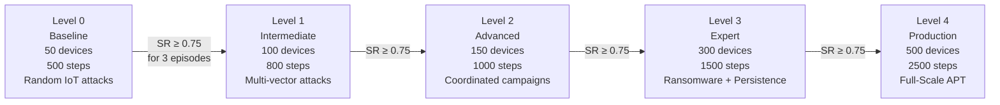
```mermaid
flowchart LR
    L0["Level 0\nBaseline\n50 devices\n500 steps\nRandom IoT attacks"]
    L1["Level 1\nIntermediate\n100 devices\n800 steps\nMulti-vector attacks"]
    L2["Level 2\nAdvanced\n150 devices\n1000 steps\nCoordinated campaigns"]
    L3["Level 3\nExpert\n300 devices\n1500 steps\nRansomware + Persistence"]
    L4["Level 4\nProduction\n500 devices\n2500 steps\nFull-Scale APT"]

    L0 -->|"SR ≥ 0.75\nfor 3 episodes"| L1
    L1 -->|"SR ≥ 0.75"| L2
    L2 -->|"SR ≥ 0.75"| L3
    L3 -->|"SR ≥ 0.75"| L4
```

**SR** = Success Rate (fraction of attacks mitigated within episode).

---

## 9. Data Pipeline: Raw Datasets → Training Samples

### 9.1 UnifiedSample Schema

Every data source is normalized into this canonical format:

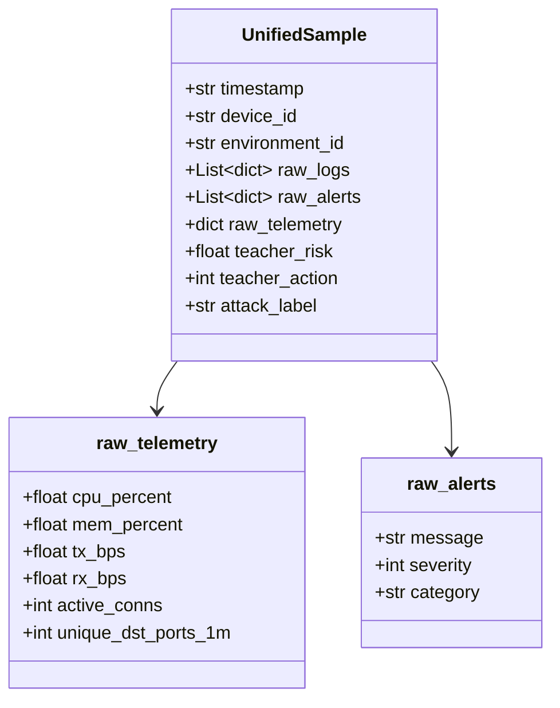
```mermaid
classDiagram
    class UnifiedSample {
        +str timestamp
        +str device_id
        +str environment_id
        +List~dict~ raw_logs
        +List~dict~ raw_alerts
        +dict raw_telemetry
        +float teacher_risk
        +int teacher_action
        +str attack_label
    }

    class raw_telemetry {
        +float cpu_percent
        +float mem_percent
        +float tx_bps
        +float rx_bps
        +int active_conns
        +int unique_dst_ports_1m
    }

    class raw_alerts {
        +str message
        +int severity
        +str category
    }

    UnifiedSample --> raw_telemetry
    UnifiedSample --> raw_alerts
```

### 9.2 Attack Label Mapping

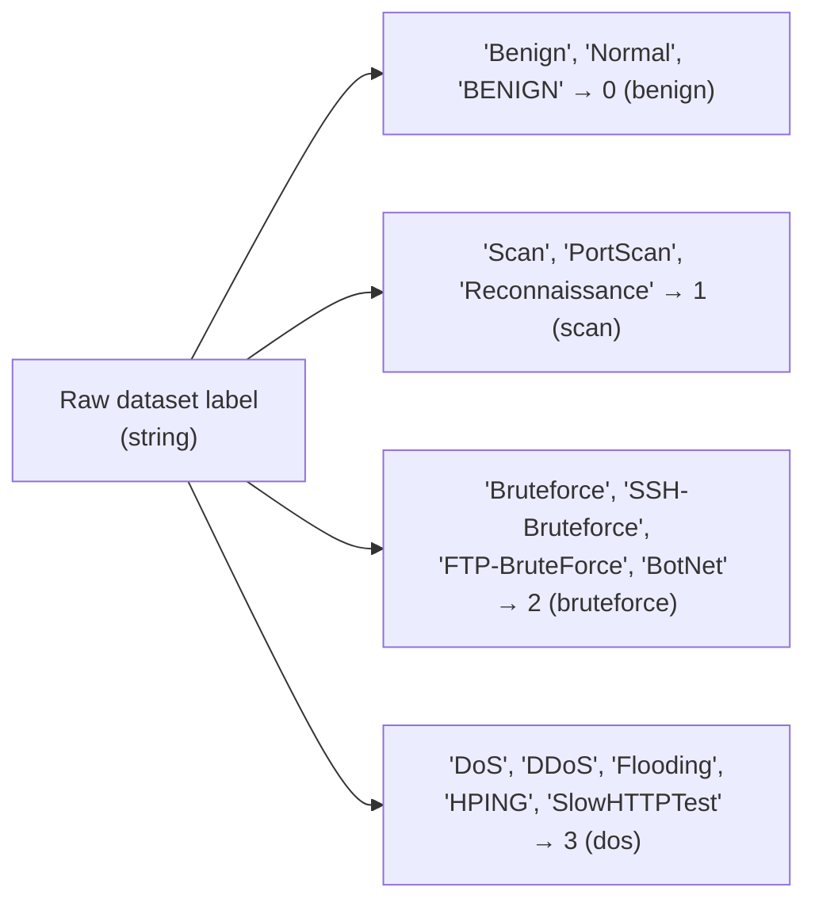
```mermaid
flowchart LR
    RAW["Raw dataset label\n(string)"]
    RAW --> B["'Benign', 'Normal', 'BENIGN' → 0 (benign)"]
    RAW --> SC["'Scan', 'PortScan', 'Reconnaissance' → 1 (scan)"]
    RAW --> BF["'Bruteforce', 'SSH-Bruteforce',\n'FTP-BruteForce', 'BotNet' → 2 (bruteforce)"]
    RAW --> D["'DoS', 'DDoS', 'Flooding',\n'HPING', 'SlowHTTPTest' → 3 (dos)"]
```

### 9.3 Teacher Risk Heuristic

```python
# For v2 training data generation:
if attack_label == "benign":
    teacher_risk = uniform(0.00, 0.15)   # Low baseline noise
elif attack_label == "scan":
    teacher_risk = uniform(0.25, 0.55)   # Mild — early detection
elif attack_label == "bruteforce":
    teacher_risk = uniform(0.55, 0.80)   # Elevated
elif attack_label == "dos":
    teacher_risk = uniform(0.70, 0.95)   # High severity

# Modulated by telemetry:
if cpu_percent > 80:  teacher_risk += 0.05
if active_conns > 200: teacher_risk += 0.05
if n_alerts > 3:       teacher_risk += 0.10
teacher_risk = clip(teacher_risk, 0.0, 1.0)
```

---

## 10. V3 Observer — Implementation Roadmap

### 10.1 New Components Required

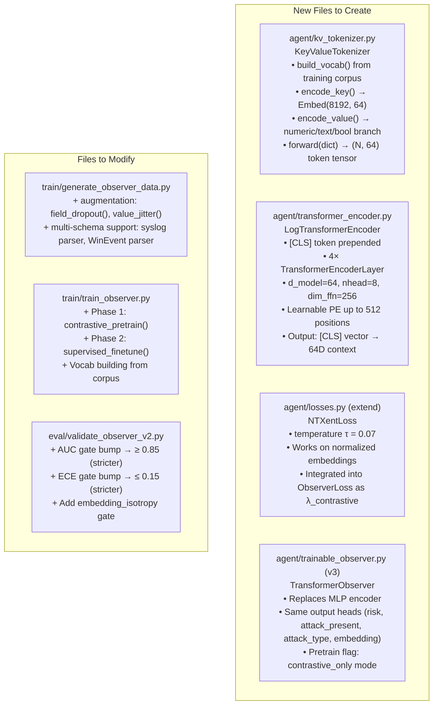
```mermaid
flowchart TD
    subgraph NEW["New Files to Create"]
        KVT["agent/kv_tokenizer.py\nKeyValueTokenizer\n• build_vocab() from training corpus\n• encode_key() → Embed(8192, 64)\n• encode_value() → numeric/text/bool branch\n• forward(dict) → (N, 64) token tensor"]

        TENC["agent/transformer_encoder.py\nLogTransformerEncoder\n• [CLS] token prepended\n• 4× TransformerEncoderLayer\n• d_model=64, nhead=8, dim_ffn=256\n• Learnable PE up to 512 positions\n• Output: [CLS] vector → 64D context"]

        NTXL["agent/losses.py (extend)\nNTXentLoss\n• temperature τ = 0.07\n• Works on normalized embeddings\n• Integrated into ObserverLoss as λ_contrastive"]

        TV3["agent/trainable_observer.py (v3)\nTransformerObserver\n• Replaces MLP encoder\n• Same output heads (risk, attack_present, attack_type, embedding)\n• Pretrain flag: contrastive_only mode"]
    end

    subgraph MODIFY["Files to Modify"]
        GEN2["train/generate_observer_data.py\n+ augmentation: field_dropout(), value_jitter()\n+ multi-schema support: syslog parser, WinEvent parser"]

        TRAIN2["train/train_observer.py\n+ Phase 1: contrastive_pretrain()\n+ Phase 2: supervised_finetune()\n+ Vocab building from corpus"]

        VAL2["eval/validate_observer_v2.py\n+ AUC gate bump → ≥ 0.85 (stricter)\n+ ECE gate bump → ≤ 0.15 (stricter)\n+ Add embedding_isotropy gate"]
    end
```

### 10.2 Two-Phase Training Schedule

| Phase | Loss | Epochs | Data | LR |
|-------|------|--------|------|----|
| **Contrastive Pre-train** | NT-Xent only | 50 | Unlabeled (any source) | 1e-3 cosine |
| **Supervised Fine-tune** | MSE + BCE + CE + 0.1×NT-Xent | 20 | Labeled NDJSON | 3e-4 cosine |

### 10.3 Expected Performance Gains

| Metric | V2 MLP | V3 Transformer (projected) |
|--------|--------|--------------------------|
| AUC (structured) | 1.00 | ≥ 0.97 (diverse schemas) |
| ECE | 0.24 | ≤ 0.12 |
| Unknown schema handling | ❌ | ✅ |
| Embedding isotropy | untested | > 0.85 |
| Params | ~200K | ~2M |
| Inference latency | < 1ms | ~3ms |

---

## 11. Operational Manual

### 11.1 Running the Full Pipeline

```bash
# Clean fresh start
bash run_full_pipeline.sh

# Or stage by stage:
# Stage 1 — Data generation
python train/generate_observer_data.py --output data/observer_train.jsonl --samples_per_dataset 10000

# Stage 2 — Observer training
python train/train_observer.py --data data/observer_train.jsonl --epochs 20 --hidden_dim 256 --lr 5e-4

# Stage 3 — Freeze
python train/freeze_observer.py --path models/observer_v2.pt --output models/observer_frozen.pt

# Stage 4 — PPO training
python train/train_ppo.py --observer models/observer_frozen.pt --total_steps 500000 --n_envs 2

# Stage 4 (with watchdog crash recovery)
bash run_watchdog.sh python train/train_ppo.py --observer models/observer_frozen.pt --total_steps 500000
```

### 11.2 Key Configuration Constants

| Parameter | Value | Location |
|-----------|-------|----------|
| `NUM_DEVICES` | 50–500 (by curriculum level) | `simulator/config.py` |
| `HIDDEN_DIM` | 512 (PPO), 256 (Observer) | CLI args |
| `N_ENVS` | 2 | CLI args |
| `ROLLOUT_LENGTH` | 256 steps | CLI args |
| `PPO_EPOCHS` | 10 (KL-gated) | CLI args |
| `LR` | 3e-4 | CLI args |
| `ENTROPY_ANNEAL` | 0.02 → 0.001 over 500K steps | `train_ppo.py` |
| `KL_THRESHOLD` | 0.0225 | `train_ppo.py` |
| `CHECKPOINT_FREQ` | Every 10 updates | CLI args |

### 11.3 Output Artifacts

```
models/
├── observer_v2.pt              ← Best checkpoint (lowest val_loss)
├── observer_frozen.pt          ← Validated + frozen (immutable)
├── observer_frozen_meta.json   ← {hash, schema, freeze_time, gate_results}
├── checkpoints/
│   ├── observer_v2_step_5000.pt
│   └── ...
└── ppo/
    ├── ppo_latest.pt           ← Most recent checkpoint (auto-resume)
    └── ppo_final.pt            ← Final model after 500K steps

outputs/
├── train_observer_v2/          ← Observer training logs
├── freeze_observer/            ← Validation gate results
├── ppo_v2/                     ← PPO training logs + summary.jsonl
└── validation_logs/
```

---

## 12. Metrics Reference

### 12.1 Observer Training Metrics
| Metric | Description |
|--------|-------------|
| `train_loss` | Multi-task loss on training set (MSE+BCE+CE) |
| `val_loss` | Multi-task loss on held-out 20% of data |
| `best_val_loss` | Lowest val_loss seen — determines saved checkpoint |

### 12.2 PPO Training Metrics (per update)
| Metric | Description |
|--------|-------------|
| `PG` | Policy gradient loss (negative = policy is improving) |
| `VF` | Value function MSE loss |
| `Ent` | Policy entropy (higher = more exploration) |
| `KL` | Approximate KL divergence from old policy |
| `Ret` | Mean return over rollout (should increase over time) |
| `SR` | Success rate — fraction of attack episodes mitigated |

### 12.3 Train Loss vs. Val Loss — What They Mean
- **Train loss** measures how well the observer fits the training set. Should decrease monotonically.
- **Val loss** measures generalization to unseen samples. If val_loss >> train_loss → overfitting.
- **Current gap** (train=0.148, val=0.164): ~10% gap — healthy, model is generalizing well with no significant overfitting.
- **Val loss in context**: 0.164 means the observer's combined risk/classification predictions are on average off by ~0.16 from heuristic teacher labels — acceptable given those labels are themselves heuristic approximations.

---

## 13. Troubleshooting

| Symptom | Cause | Fix |
|---------|-------|-----|
| `KeyError: stall_penalty_scale` | `OptunaRewardOptimizer` missing key | Added to `TUNABLE_PARAMS` defaults |
| `RuntimeError: c10::Half overflow` | `masked_fill(-1e8)` in FP16 AMP | Changed to `-1e4` in `ppo_policy.py` |
| AUC gate fails on random noise | Synthetic validation uses undifferentiated noise | Use structured benign/attack samples (current fix) |
| ECE gate fails on bimodal data | Perfect separation → large ECE | Separate calibration pass with mixed severity |
| PPO exits silently | Env crash swallowed by vector env | Check `outputs/ppo_v2/ppo_v2.log` for CRITICAL ERROR |
| OOM on CUDA | Batch too large | Reduce `--n_envs` or `--rollout_length` |

---

## 14. Future Roadmap

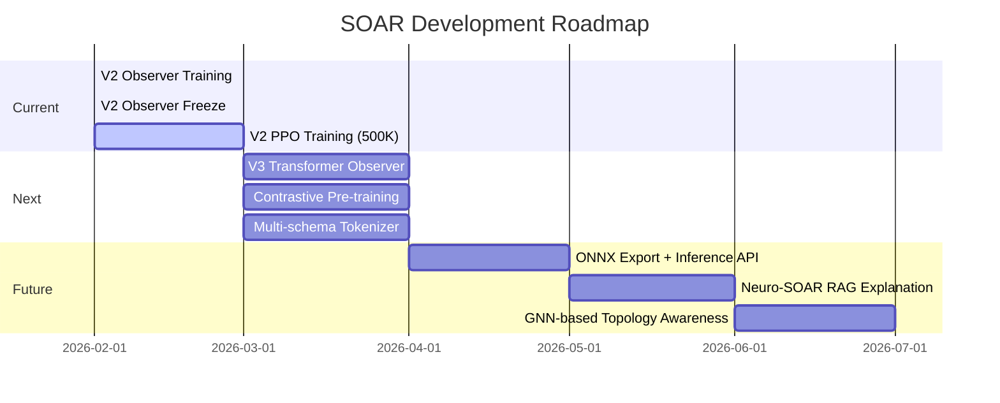
```mermaid
gantt
    title SOAR Development Roadmap
    dateFormat  YYYY-MM
    section Current
    V2 Observer Training        :done, 2026-02, 2026-02
    V2 Observer Freeze          :done, 2026-02, 2026-02
    V2 PPO Training (500K)      :active, 2026-02, 2026-03
    section Next
    V3 Transformer Observer     :2026-03, 2026-04
    Contrastive Pre-training    :2026-03, 2026-04
    Multi-schema Tokenizer      :2026-03, 2026-04
    section Future
    ONNX Export + Inference API :2026-04, 2026-05
    Neuro-SOAR RAG Explanation  :2026-05, 2026-06
    GNN-based Topology Awareness:2026-06, 2026-07
```

### V3 Priority Features
1. **Schema-Agnostic Tokenizer** — accept syslog, Windows Event, NetFlow, API gateway logs
2. **Contrastive Pre-training** — NT-Xent on unlabeled data for robust embedding space
3. **Isotropy Regularization** — prevent embedding collapse
4. **ONNX Export** — deploy observer as a sidecar container
5. **RAG-based Explanation** — "Why did the agent isolate device X?"

---

**Document Version**: 8.0.0 (The Transformer Observer Edition)
**Last Updated**: 2026-02-24
**Generated By**: Antigravity (Google DeepMind)
**Status**: V2 Observer frozen ✅ | PPO training in progress ⏳
