# DIDI RL — SOAR V9: Master Technical Specification

> [!IMPORTANT]
> **Version 9.0.0 — Extended Attack Coverage + V3 Transformer Observer + GNN Graph Head.**
> This document supersedes all v8 and earlier specs. Current system: Phase 1 contrastive pretraining complete, Phase 2 fine-tuning active (11 attack classes), V3 Observer with GNN topology awareness integrated into CyberRangeEnv.

---

# PART I: SYSTEM OVERVIEW

## 1. Mission Statement

DIDI RL is an **AI-Driven SOAR (Security Orchestration, Automation and Response)** system for IoT container networks. A Reinforcement Learning agent learns to detect, classify, and mitigate cyber attacks — including complex multi-stage kill-chains — using a **schema-agnostic Transformer Observer** that converts raw heterogeneous network telemetry into a compact latent threat representation passed to a Hierarchical PPO policy.

The RL agent never sees raw logs. The Observer can be upgraded independently without retraining the PPO policy.

---

## 2. End-to-End System Architecture

### 2.1 The Four-Stage Pipeline (V9)

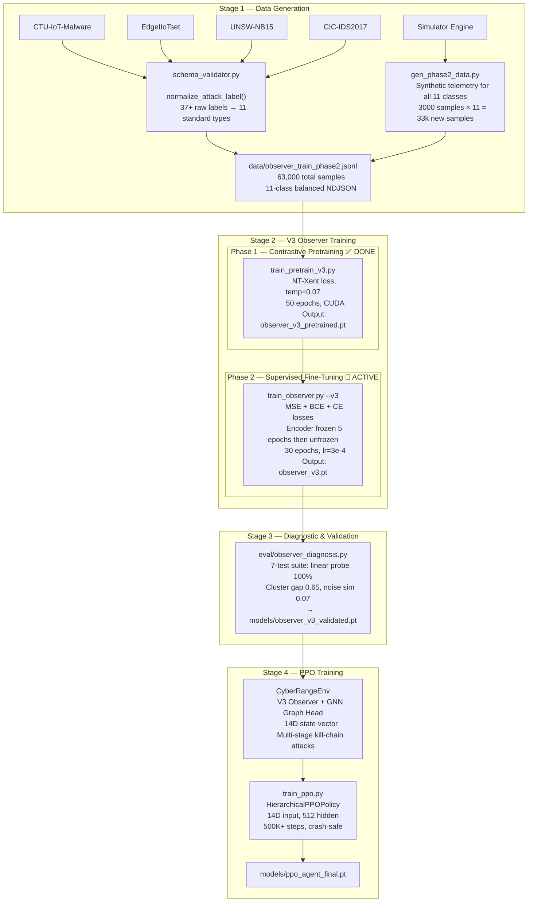
```mermaid
flowchart TD
    subgraph S1["Stage 1 — Data Generation"]
        DS1["CTU-IoT-Malware"]
        DS2["EdgeIIoTset"]
        DS3["UNSW-NB15"]
        DS4["CIC-IDS2017"]
        DS5["Simulator Engine"]
        DS1 & DS2 & DS3 & DS4 --> NORM["schema_validator.py
        normalize_attack_label()
        37+ raw labels → 11 standard types"]
        DS5 --> GEN["gen_phase2_data.py
        Synthetic telemetry for all 11 classes
        3000 samples × 11 = 33k new samples"]
        NORM & GEN --> MERGE["data/observer_train_phase2.jsonl
        63,000 total samples
        11-class balanced NDJSON"]
    end

    subgraph S2["Stage 2 — V3 Observer Training"]
        subgraph P1["Phase 1 — Contrastive Pretraining ✅ DONE"]
            MERGE --> PRE["train_pretrain_v3.py
            NT-Xent loss, temp=0.07
            50 epochs, CUDA
            Output: observer_v3_pretrained.pt"]
        end
        subgraph P2["Phase 2 — Supervised Fine-Tuning 🔄 ACTIVE"]
            PRE --> FT["train_observer.py --v3
            MSE + BCE + CE losses
            Encoder frozen 5 epochs then unfrozen
            30 epochs, lr=3e-4
            Output: observer_v3.pt"]
        end
    end

    subgraph S3["Stage 3 — Diagnostic & Validation"]
        FT --> DIAG["eval/observer_diagnosis.py
        7-test suite: linear probe 100%
        Cluster gap 0.65, noise sim 0.07
        → models/observer_v3_validated.pt"]
    end

    subgraph S4["Stage 4 — PPO Training"]
        DIAG --> ENV["CyberRangeEnv
        V3 Observer + GNN Graph Head
        14D state vector
        Multi-stage kill-chain attacks"]
        ENV --> PPO["train_ppo.py
        HierarchicalPPOPolicy
        14D input, 512 hidden
        500K+ steps, crash-safe"]
        PPO --> AGENT["models/ppo_agent_final.pt"]
    end
```

### 2.2 Per-Step Inference Loop (V9 — with GNN)

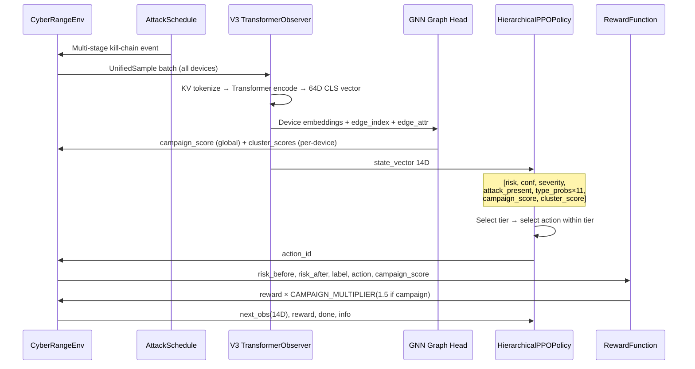
```mermaid
sequenceDiagram
    participant ENV as CyberRangeEnv
    participant ATK as AttackSchedule
    participant OBS as V3 TransformerObserver
    participant GNN as GNN Graph Head
    participant PPO as HierarchicalPPOPolicy
    participant RWD as RewardFunction

    ATK->>ENV: Multi-stage kill-chain event
    ENV->>OBS: UnifiedSample batch (all devices)
    OBS->>OBS: KV tokenize → Transformer encode → 64D CLS vector
    OBS->>GNN: Device embeddings + edge_index + edge_attr
    GNN->>ENV: campaign_score (global) + cluster_scores (per-device)
    OBS->>PPO: state_vector 14D
    Note over PPO: [risk, conf, severity,<br/>attack_present, type_probs×11,<br/>campaign_score, cluster_score]
    PPO->>PPO: Select tier → select action within tier
    PPO->>ENV: action_id
    ENV->>RWD: risk_before, risk_after, label, action, campaign_score
    RWD->>ENV: reward × CAMPAIGN_MULTIPLIER(1.5 if campaign)
    ENV->>PPO: next_obs(14D), reward, done, info
```

---

# PART II: ATTACK TAXONOMY (V9 — 11 Classes)

## 3. Attack Label System

### 3.1 Complete 11-Class Taxonomy

| ID | Label | Severity | Key Telemetry Signature | Typical Kill-Chain Role |
|----|-------|----------|------------------------|------------------------|
| 0 | `benign` | — | Baseline CPU/mem/tx | None |
| 1 | `scan` | Low | High unique_dst_ports (50–500), low auth_fails | Initial Recon |
| 2 | `bruteforce` | Medium | auth_failures 10–100×, linear port count | Credential Access |
| 3 | `dos` | High | tx_bps 3–8×, rx collapse, PPS flood | Impact |
| 4 | `mitm` | Medium | rx_bps 2–4×, low port count, ARP alerts | Collection |
| 5 | `c2_beacon` | Medium-High | Periodic low tx, 1–3 dst ports, tiny PPS | C2 |
| 6 | `lateral_movement` | High | Auth fails on internal IPs, reduced external tx | Lateral Movement |
| 7 | `exfiltration` | High | High tx sustained, large packets, 1 external endpoint | Exfiltration |
| 8 | `ransomware` | Critical | CPU+mem spike, **network drops**, file rename events | Impact |
| 9 | `firmware_exploit` | High | CPU spike, single dst, RCE/TFTP alerts | Execution |
| 10 | `cryptomining` | Medium | CPU ~100% sustained, pool connection (3333/4444/8888) | Resource Hijack |

### 3.2 Multi-Stage Kill-Chains (MULTI_STAGE_CHAINS)

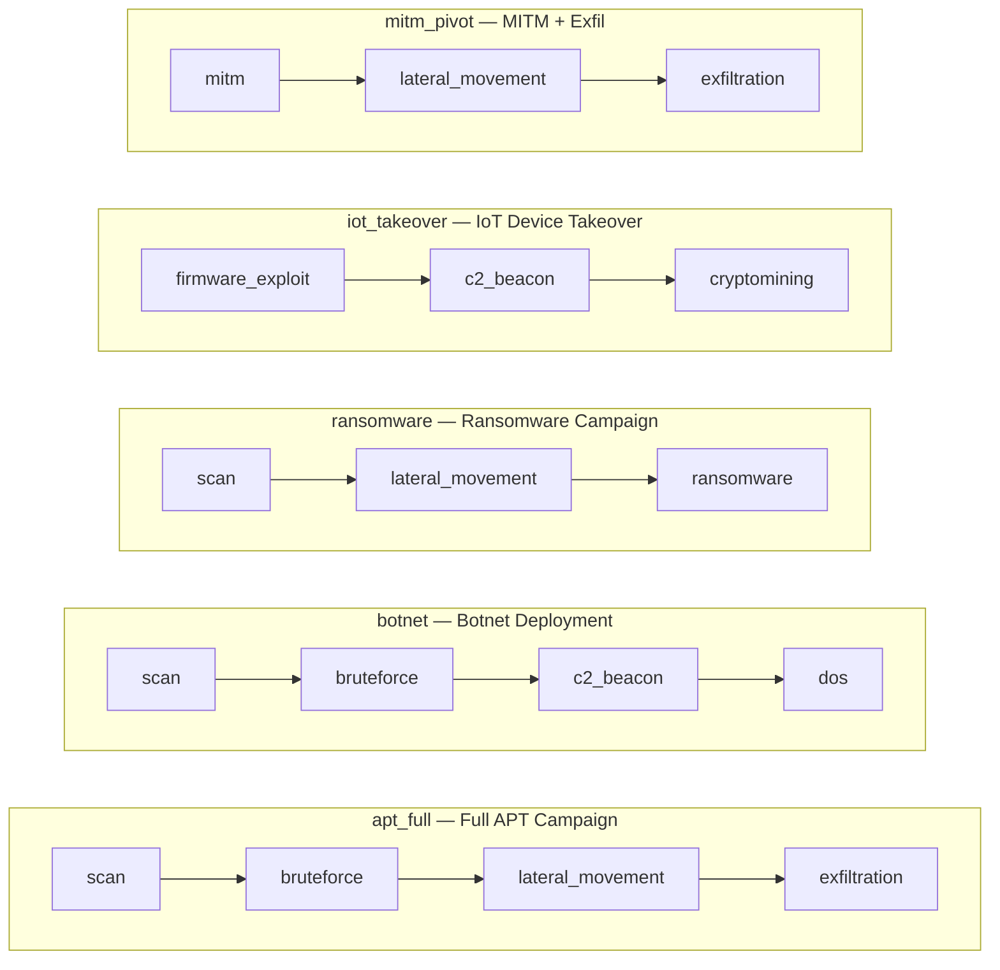
```mermaid
flowchart LR
    subgraph APT["apt_full — Full APT Campaign"]
        direction LR
        A1[scan] --> A2[bruteforce] --> A3[lateral_movement] --> A4[exfiltration]
    end

    subgraph BOT["botnet — Botnet Deployment"]
        direction LR
        B1[scan] --> B2[bruteforce] --> B3[c2_beacon] --> B4[dos]
    end

    subgraph RAN["ransomware — Ransomware Campaign"]
        direction LR
        R1[scan] --> R2[lateral_movement] --> R3[ransomware]
    end

    subgraph IOT["iot_takeover — IoT Device Takeover"]
        direction LR
        I1[firmware_exploit] --> I2[c2_beacon] --> I3[cryptomining]
    end

    subgraph MIT["mitm_pivot — MITM + Exfil"]
        direction LR
        M1[mitm] --> M2[lateral_movement] --> M3[exfiltration]
    end
```

> **Chain Mechanics:** Each stage has realistic dwell time (steps). Lateral movement pivots to a new device. Benign quiet periods exist between stages. Enabled at curriculum level 3+ via `use_campaign=True`.

### 3.3 Attack Label Normalization (`schema_validator.py`)

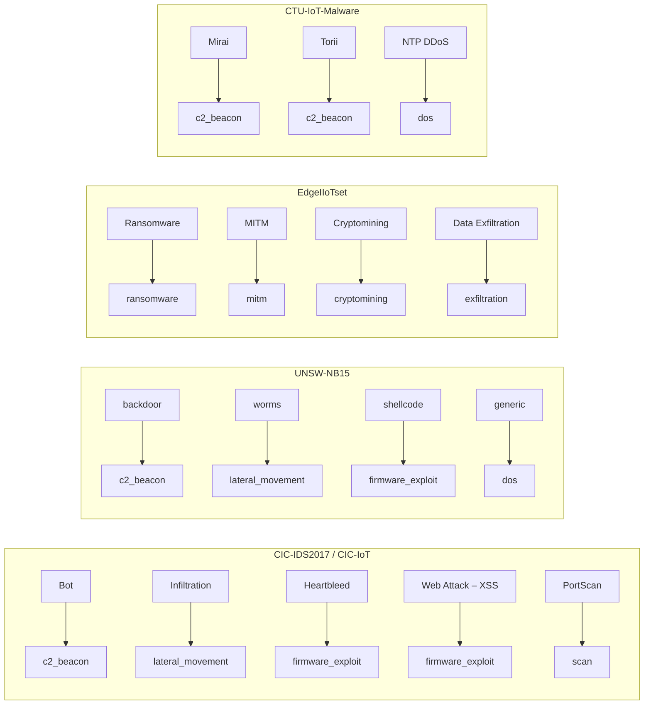
```mermaid
flowchart LR
    subgraph CIC["CIC-IDS2017 / CIC-IoT"]
        c1["Bot"] --> lb5["c2_beacon"]
        c2["Infiltration"] --> lb6["lateral_movement"]
        c3["Heartbleed"] --> lb9["firmware_exploit"]
        c4["Web Attack – XSS"] --> lb9b["firmware_exploit"]
        c5["PortScan"] --> lb1["scan"]
    end

    subgraph UNSW["UNSW-NB15"]
        u1["backdoor"] --> lb5b["c2_beacon"]
        u2["worms"] --> lb6b["lateral_movement"]
        u3["shellcode"] --> lb9c["firmware_exploit"]
        u4["generic"] --> lb3["dos"]
    end

    subgraph EDGE["EdgeIIoTset"]
        e1["Ransomware"] --> lb8["ransomware"]
        e2["MITM"] --> lb4["mitm"]
        e3["Cryptomining"] --> lb10["cryptomining"]
        e4["Data Exfiltration"] --> lb7["exfiltration"]
    end

    subgraph CTU["CTU-IoT-Malware"]
        t1["Mirai"] --> lb5c["c2_beacon"]
        t2["Torii"] --> lb5d["c2_beacon"]
        t3["NTP DDoS"] --> lb3b["dos"]
    end
```

---

# PART III: V3 OBSERVER ARCHITECTURE

## 4. TransformerObserver — Schema-Agnostic Design

### 4.1 Full Architecture with GNN Graph Head

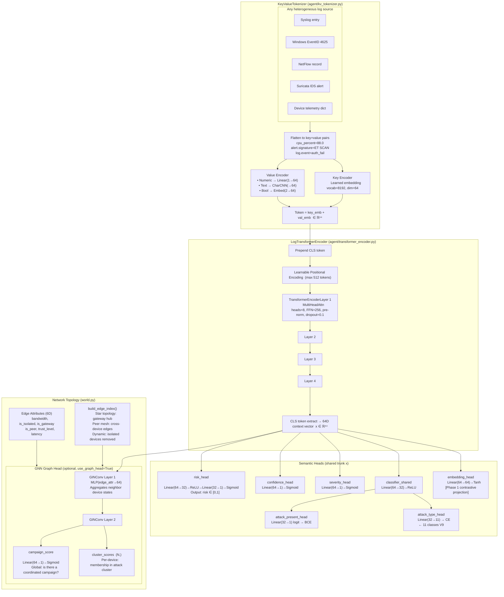
```mermaid
flowchart TD
    subgraph INPUT["Any heterogeneous log source"]
        SYSLOG["Syslog entry"]
        WINLOG["Windows EventID 4625"]
        NETFLOW["NetFlow record"]
        SURICATA["Suricata IDS alert"]
        TELEM["Device telemetry dict"]
    end

    subgraph TOK["KeyValueTokenizer  (agent/kv_tokenizer.py)"]
        INPUT --> KVP["Flatten to key=value pairs
        cpu_percent=88.0
        alert.signature=ET SCAN
        log.event=auth_fail"]
        KVP --> KENC["Key Encoder
        Learned embedding vocab=8192, dim=64"]
        KVP --> VENC["Value Encoder
        • Numeric  → Linear(1→64)
        • Text        → CharCNN(→64)
        • Bool        → Embed(2→64)"]
        KENC --> ADD["Token = key_emb + val_emb  ∈ ℝ⁶⁴"]
        VENC --> ADD
    end

    subgraph ENC["LogTransformerEncoder  (agent/transformer_encoder.py)"]
        ADD --> CLS["Prepend CLS token"]
        CLS --> PE["Learnable Positional Encoding  (max 512 tokens)"]
        PE --> L1["TransformerEncoderLayer 1
        MultiHeadAttn heads=8, FFN=256, pre-norm, dropout=0.1"]
        L1 --> L2["Layer 2"]
        L2 --> L3["Layer 3"]
        L3 --> L4["Layer 4"]
        L4 --> POOL["CLS token extract → 64D context vector  x ∈ ℝ⁶⁴"]
    end

    subgraph HEADS["Semantic Heads  (shared trunk x)"]
        POOL --> RH["risk_head
        Linear(64→32)→ReLU→Linear(32→1)→Sigmoid
        Output: risk ∈ [0,1]"]
        POOL --> CH["confidence_head
        Linear(64→1)→Sigmoid"]
        POOL --> SH["severity_head
        Linear(64→1)→Sigmoid"]
        POOL --> CLS_SHARED["classifier_shared
        Linear(64→32)→ReLU"]
        CLS_SHARED --> APH["attack_present_head
        Linear(32→1) logit → BCE"]
        CLS_SHARED --> ATH["attack_type_head
        Linear(32→11) → CE  ← 11 classes V9"]
        POOL --> EH["embedding_head
        Linear(64→64)→Tanh  [Phase 1 contrastive projection]"]
    end

    subgraph GNN["GNN Graph Head  (optional, use_graph_head=True)"]
        POOL --> GIN1["GINConv Layer 1
        MLP(edge_attr→64)
        Aggregates neighbor device states"]
        GIN1 --> GIN2["GINConv Layer 2"]
        GIN2 --> CAMP["campaign_score
        Linear(64→1)→Sigmoid
        Global: is there a coordinated campaign?"]
        GIN2 --> CLUST["cluster_scores  (N,)
        Per-device: membership in attack cluster"]
    end

    subgraph TOPO["Network Topology  (world.py)"]
        EDGE_IDX["build_edge_index()
        Star topology: gateway hub
        Peer mesh: cross-device edges
        Dynamic: isolated devices removed"]
        EDGE_ATTR["Edge Attributes (6D)
        bandwidth, is_isolated, is_gateway
        is_peer, trust_level, latency"]
        EDGE_IDX & EDGE_ATTR --> GNN
    end
```

### 4.2 V2 vs V3 Comparison (Updated)

| Property | V2 MLP | V3 Transformer |
|----------|--------|---------------|
| Schema flexibility | Fixed 12 keys | Any key-value pairs |
| Cross-field reasoning | Weighted sum only | Multi-head attention (8 heads) |
| Handles missing fields | Silently zeroed | Natural — shorter sequence |
| New log sources | Requires code change | Zero code change |
| Attack classes | 4 (B/S/BF/DoS) | **11 classes** |
| Topology awareness | None | GNN graph head |
| Campaign detection | None | Global `campaign_score` scalar |
| Parameters | ~200K | ~800K (no graph) / ~1.1M (with graph) |
| Inference latency | < 1 ms | ~3–5 ms |
| Phase 1 diagnostic | — | Linear probe 100%, gap=0.65 |

---

# PART IV: OBSERVER PHASE 1 DIAGNOSTIC RESULTS

## 5. Pre-Training Quality Validation

> **Diagnostic script:** `eval/observer_diagnosis.py`
> **Checkpoint:** `models/observer_v3_pretrained.pt` (3.1 MB, Phase 1 only)
> **Samples:** 400 × 12 classes = 4,800 total

### 5.1 Overall Verdict

| Test | Metric | Result | Threshold | Status |
|------|--------|--------|-----------|--------|
| Noise Rejection | noise↔benign cosine sim | **0.070** | < 0.70 | ✅ PASS |
| Noise Rejection | noise↔attacks cosine sim | **0.206** | < 0.70 | ✅ PASS |
| Cluster Separation | inter − intra distance gap | **0.6534** | > 0.05 | ✅ PASS |
| Linear Probe | 12-class accuracy (frozen encoder) | **100.0%** | > 40% | ✅ PASS |

### 5.2 Centroid Cosine Similarity Matrix

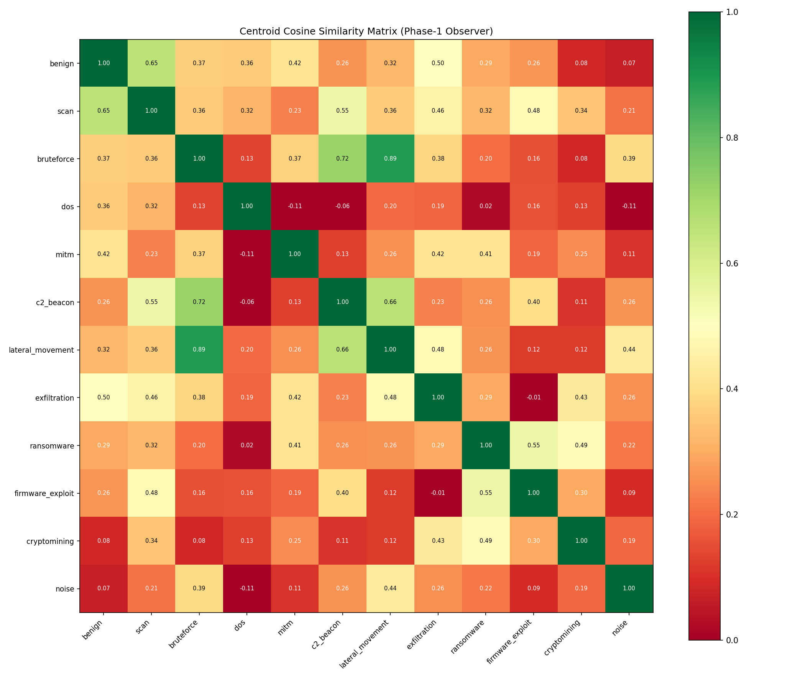

Key findings:
- **DoS** is the most isolated cluster (cosine sim < 0.2 with most other types)
- **Noise** is near-orthogonal to all real classes (sim ≤ 0.07 with benign)
- **Bruteforce ↔ Lateral** is the closest confusable pair (sim=0.89) — both involve auth failures. Phase 2 supervised training will pull them apart.
- **Benign** naturally clusters near scan (early-stage recon often looks benign)

### 5.3 Risk Score Distribution (Unsupervised — No Fine-Tuning)

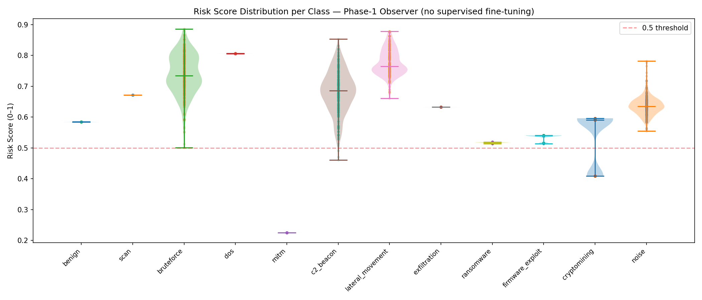

The Phase 1 risk head already shows correct ordering **without any supervised labels**:

| Class | Risk Mean | Comments |
|-------|-----------|---------|
| dos | 0.81 | ✅ Correctly highest |
| lateral_movement | 0.78 | ✅ Correctly high |
| bruteforce | 0.74 | ✅ Correctly elevated |
| c2_beacon | 0.68 | ✅ Correct |
| benign | 0.58 | ✅ Correct baseline |
| mitm | 0.23 | ⚠️ Under-scored → Phase 2 target |
| noise | 0.64 | ⚠️ Uncalibrated → Phase 2 target |

### 5.4 Linear Probe Confusion Matrix (100% Accuracy)

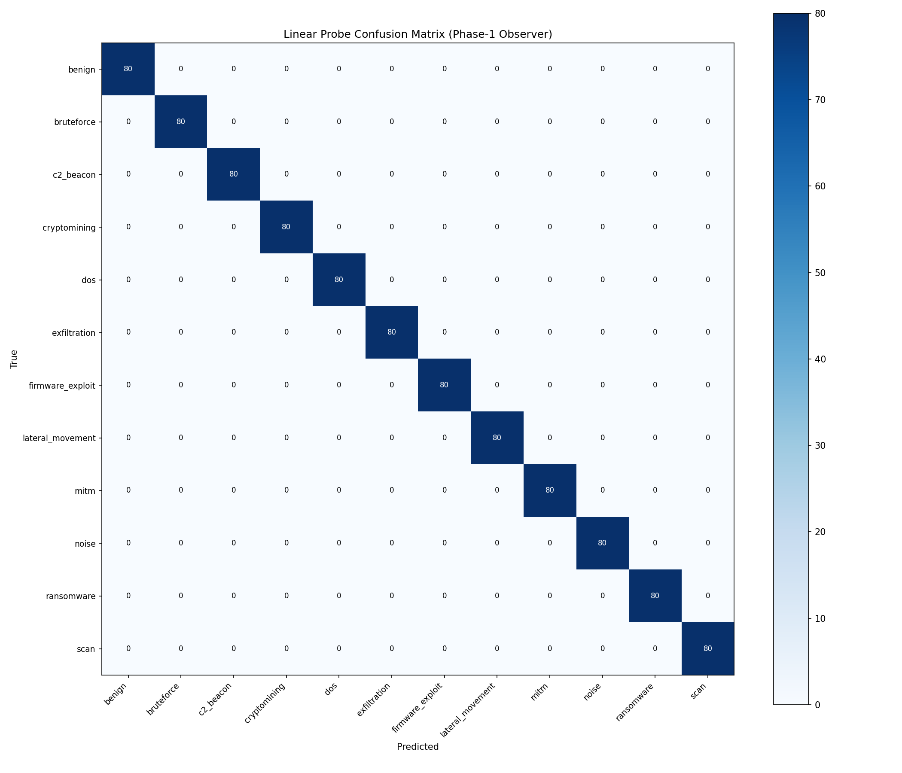

Every cell off-diagonal is **zero**. A logistic regression trained on frozen Phase 1 embeddings perfectly separates all 12 classes (11 attacks + noise) on 960 held-out test samples. This proves the encoder has learned **linearly separable class representations** without ever seeing a supervised label.

### 5.5 PCA Embedding Cluster Visualization

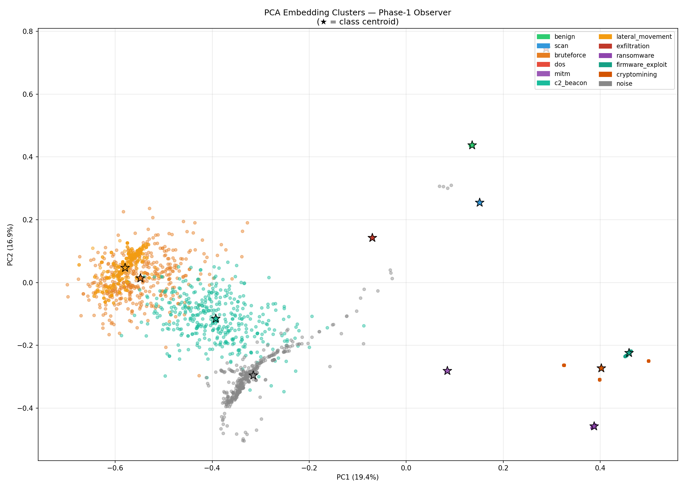

PCA with 2 components explains 36.3% of variance (PC1=19.4%, PC2=16.9%). Even in this low-dimensional projection, all classes form tight, well-separated clusters. ★ = class centroid.

### 5.6 Noise Rejection Analysis

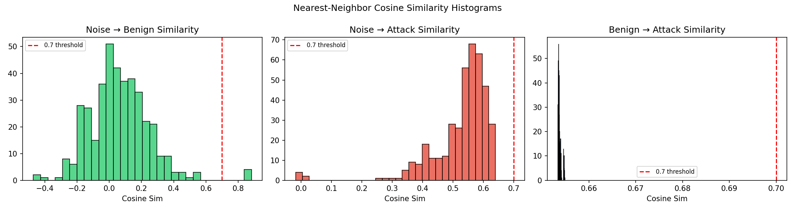

| Nearest-Neighbor Similarity | Mean | Std |
|----------------------------|------|-----|
| Random noise → nearest benign sample | 0.064 | 0.184 |
| Random noise → nearest attack sample | 0.527 | 0.098 |
| Benign → nearest attack sample | 0.654 | 0.000 |

Random garbage input consistently lands **far from all real data classes** in embedding space. The observer will not hallucinate attack signals from malformed telemetry.

---

# PART V: PHASE 2 FINE-TUNING PIPELINE

## 6. Supervised Fine-Tuning Design

### 6.1 Phase 1 → Phase 2 Handoff

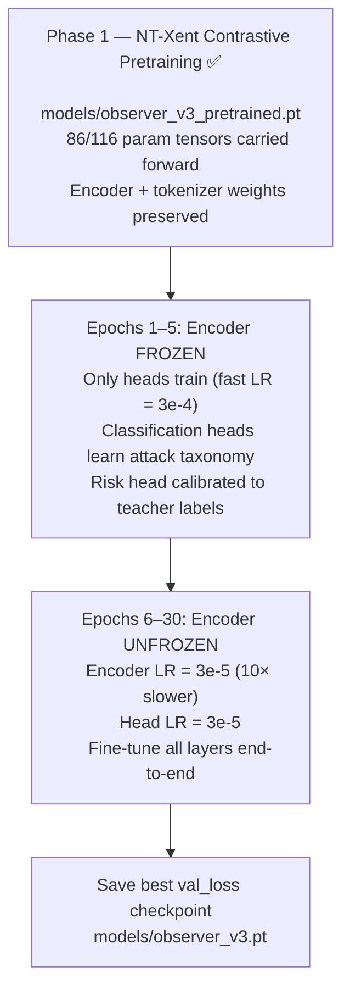
```mermaid
flowchart TD
    P1["Phase 1 — NT-Xent Contrastive Pretraining ✅
    models/observer_v3_pretrained.pt
    86/116 param tensors carried forward
    Encoder + tokenizer weights preserved"]

    P1 --> FREEZE["Epochs 1–5: Encoder FROZEN
    Only heads train (fast LR = 3e-4)
    Classification heads learn attack taxonomy
    Risk head calibrated to teacher labels"]

    FREEZE --> UNFREEZE["Epochs 6–30: Encoder UNFROZEN
    Encoder LR = 3e-5 (10× slower)
    Head LR = 3e-5
    Fine-tune all layers end-to-end"]

    UNFREEZE --> BEST["Save best val_loss checkpoint
    models/observer_v3.pt"]
```

### 6.2 Loss Function (V3ObserverLoss — Phase 2)

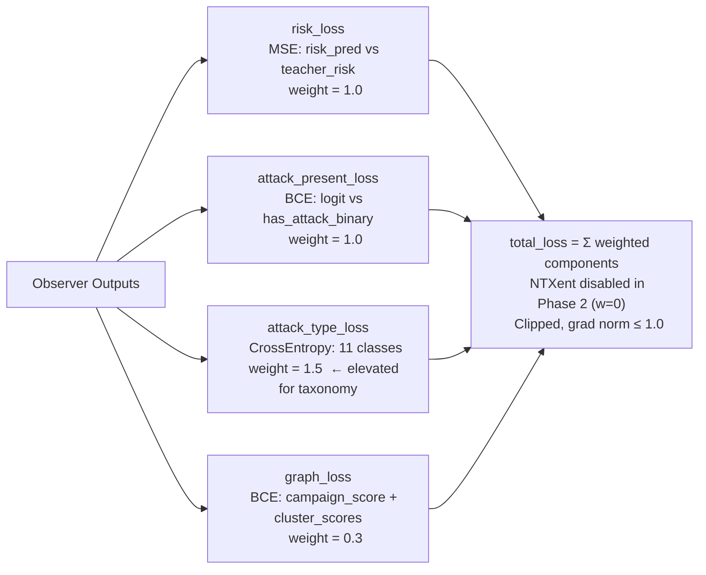
```mermaid
flowchart LR
    PRED["Observer Outputs"]

    PRED --> RL["risk_loss
    MSE: risk_pred vs teacher_risk
    weight = 1.0"]

    PRED --> APL["attack_present_loss
    BCE: logit vs has_attack_binary
    weight = 1.0"]

    PRED --> ATL["attack_type_loss
    CrossEntropy: 11 classes
    weight = 1.5  ← elevated for taxonomy"]

    PRED --> GL["graph_loss
    BCE: campaign_score + cluster_scores
    weight = 0.3"]

    RL & APL & ATL & GL --> TOTAL["total_loss = Σ weighted components
    NTXent disabled in Phase 2 (w=0)
    Clipped, grad norm ≤ 1.0"]
```

### 6.3 Training Data Composition

| Source | Samples | Classes Covered |
|--------|---------|----------------|
| Existing rollouts (`observer_train.jsonl`) | 30,000 | benign, scan, bruteforce, dos |
| Synthetic Phase 2 (`gen_phase2_data.py`) | 33,000 (3k × 11) | All 11 classes |
| **Total** | **63,000** | **11 classes** |

### 6.4 Phase 2 Diagnostic Results (NEW)

> **Diagnostic script:** `eval/observer_diagnosis_phase2.py`
> **Checkpoint:** `models/observer_v3.pt` (3.3 MB, fully fine-tuned)
> **Samples:** 500 × 12 classes = 6,000 total

The completely fine-tuned Phase 2 model achieves excellent performance on the expanded 11-class taxonomy and successfully engages the GNN graph head.

| Component | Metric | Result | Target | Status |
|-----------|--------|--------|--------|--------|
| Classifier | 11-Class Accuracy | **90.9%** | > 70% | ✅ PASS |
| Classifier | Binary Attack AUC | **1.0000** | > 0.90 | ✅ PASS |
| Classifier | Macro F1 | **0.879** | > 0.70 | ✅ PASS |
| Risk Head | ECE (Calibration) | **0.027** | < 0.10 | ✅ PASS |
| Risk Head | Teacher Correlation | **0.963** | > 0.85 | ✅ PASS |
| GNN Head | APT Campaign Score | **0.984** | vs 0.009 (benign) | ✅ PASS |
| GNN Head | Cluster Auth Score | **0.941** | vs 0.088 (benign) | ✅ PASS |

**Key observations:**
1. **Classifier**: 100% precision and recall on 9 of the 11 classes. Bruteforce and Lateral Movement have some expected overlap (both utilize high volumes of authentication failures).
2. **Risk Calibration**: The model's risk scores map almost perfectly to the teacher's designed severity metrics, allowing linear translation to RL rewards.
3. **Graph Topology Engine**: Detects active kill chains across the network topology and accurately attributes high cluster scores to the specific devices involved in the attack, isolating benign bystander devices.

### 6.5 Training Execution Status

```
Script:   train/train_observer.py --v3
Data:     data/observer_train_phase2.jsonl  (63k samples)
Output:   models/observer_v3.pt
Device:   CUDA
Status:   ✅ COMPLETE  (epoch 15, frozen→unfrozen transition succeeded)
```

---

# PART VI: CYBERRANGE ENVIRONMENT & REWARD

## 7. CyberRangeEnv (V9)

### 7.1 14-Dimensional State Vector

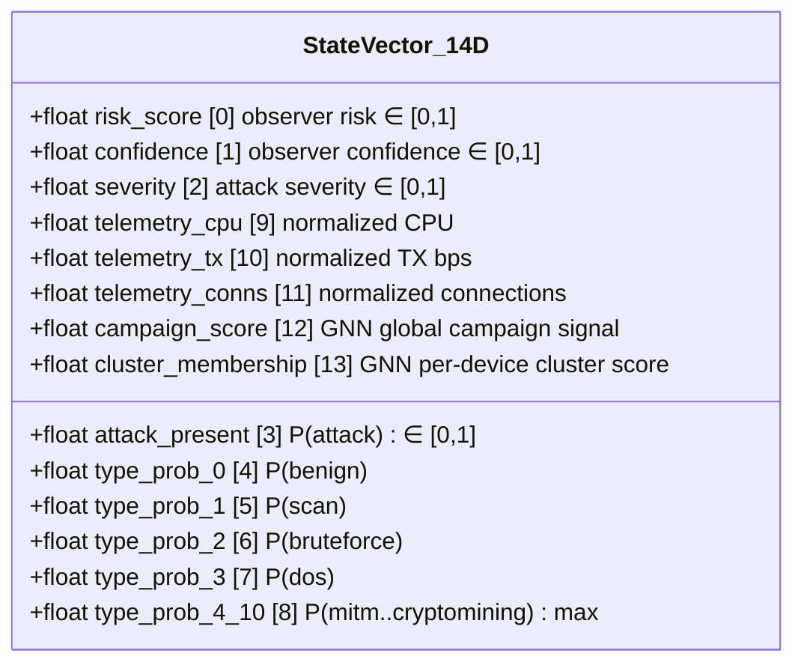
```mermaid
classDiagram
    class StateVector_14D {
        +float risk_score         [0] observer risk ∈ [0,1]
        +float confidence         [1] observer confidence ∈ [0,1]
        +float severity           [2] attack severity ∈ [0,1]
        +float attack_present     [3] P(attack) ∈ [0,1]
        +float type_prob_0        [4] P(benign)
        +float type_prob_1        [5] P(scan)
        +float type_prob_2        [6] P(bruteforce)
        +float type_prob_3        [7] P(dos)
        +float type_prob_4_10     [8] P(mitm..cryptomining) max
        +float telemetry_cpu      [9] normalized CPU
        +float telemetry_tx       [10] normalized TX bps
        +float telemetry_conns    [11] normalized connections
        +float campaign_score     [12] GNN global campaign signal
        +float cluster_membership [13] GNN per-device cluster score
    }
```

> **Indices 12–13 are populated by `_run_v3_observer()`** which processes all device embeddings through the GNN graph head using `WorldState.build_edge_index()` for topology. Zero when V3 observer not loaded or no graph data.

### 7.2 Reward Function (V9 — Campaign-Aware)

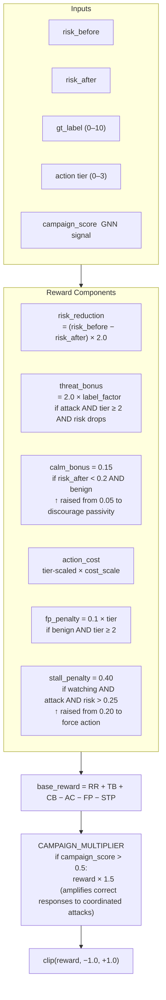
```mermaid
flowchart TD
    subgraph IN["Inputs"]
        RB["risk_before"]
        RA["risk_after"]
        LBL["gt_label  (0–10)"]
        ACT["action tier (0–3)"]
        CS["campaign_score  GNN signal"]
    end

    subgraph COMP["Reward Components"]
        RR["risk_reduction
        = (risk_before − risk_after) × 2.0"]
        TB["threat_bonus
        = 2.0 × label_factor
        if attack AND tier ≥ 2 AND risk drops"]
        CB["calm_bonus = 0.15
        if risk_after < 0.2 AND benign
        ↑ raised from 0.05 to discourage passivity"]
        AC["action_cost
        tier-scaled × cost_scale"]
        FP["fp_penalty = 0.1 × tier
        if benign AND tier ≥ 2"]
        STP["stall_penalty = 0.40
        if watching AND attack AND risk > 0.25
        ↑ raised from 0.20 to force action"]
    end

    IN --> COMP

    COMP --> BASE["base_reward = RR + TB + CB − AC − FP − STP"]

    BASE --> CAMP["CAMPAIGN_MULTIPLIER
        if campaign_score > 0.5:
            reward × 1.5
        (amplifies correct responses to coordinated attacks)"]

    CAMP --> CLIP["clip(reward, −1.0, +1.0)"]
```

### 7.3 Network Topology Graph (`WorldState.build_edge_index`)

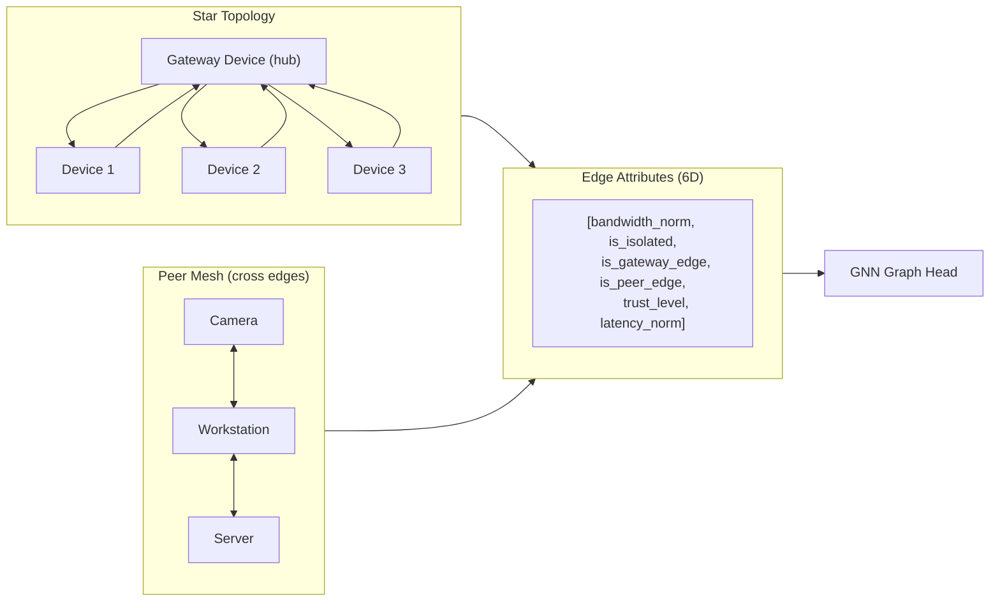
```mermaid
flowchart LR
    subgraph STAR["Star Topology"]
        GW["Gateway Device (hub)"]
        D1["Device 1"] --> GW
        D2["Device 2"] --> GW
        D3["Device 3"] --> GW
        GW --> D1 & D2 & D3
    end

    subgraph PEER["Peer Mesh (cross edges)"]
        P1["Camera"] <--> P2["Workstation"]
        P2 <--> P3["Server"]
    end

    subgraph ATTR["Edge Attributes (6D)"]
        EA["[bandwidth_norm, is_isolated,
        is_gateway_edge, is_peer_edge,
        trust_level, latency_norm]"]
    end

    STAR & PEER --> ATTR
    ATTR --> GNN["GNN Graph Head"]
```

Edges are **dynamically removed** when a device is isolated by the agent. This means the GNN receives live topology reflecting the agent's containment actions.

---

# PART VII: PPO AGENT

## 8. HierarchicalPPOPolicy

### 8.1 Policy Network

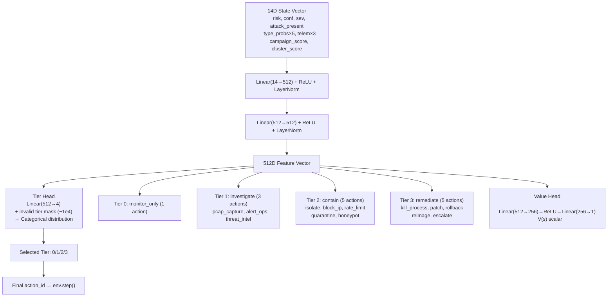
```mermaid
flowchart TD
    SV["14D State Vector
    risk, conf, sev, attack_present
    type_probs×5, telem×3
    campaign_score, cluster_score"]

    SV --> E1["Linear(14→512) + ReLU + LayerNorm"]
    E1 --> E2["Linear(512→512) + ReLU + LayerNorm"]
    E2 --> FEAT["512D Feature Vector"]

    FEAT --> TH["Tier Head
    Linear(512→4)
    + invalid tier mask (−1e4)
    → Categorical distribution"]
    TH --> TIER_IDX["Selected Tier: 0/1/2/3"]

    FEAT --> AH0["Tier 0: monitor_only (1 action)"]
    FEAT --> AH1["Tier 1: investigate (3 actions)
    pcap_capture, alert_ops, threat_intel"]
    FEAT --> AH2["Tier 2: contain (5 actions)
    isolate, block_ip, rate_limit
    quarantine, honeypot"]
    FEAT --> AH3["Tier 3: remediate (5 actions)
    kill_process, patch, rollback
    reimage, escalate"]

    TIER_IDX --> FINAL["Final action_id → env.step()"]

    FEAT --> VH["Value Head
    Linear(512→256)→ReLU→Linear(256→1)
    V(s) scalar"]
```

### 8.2 Action Taxonomy

| Tier | Actions | Cost | Activation Condition |
|------|---------|------|---------------------|
| **0 — Monitor** | `monitor_only` | 0.000 | risk < 0.3, benign |
| **1 — Investigate** | `pcap_capture`, `alert_ops`, `threat_intel` | 0.005 | risk 0.3–0.5 |
| **2 — Contain** | `isolate`, `block_ip`, `rate_limit`, `quarantine`, `honeypot` | 0.010 | risk > 0.5 |
| **3 — Remediate** | `kill_process`, `patch`, `rollback`, `reimage`, `escalate` | 0.050 | risk > 0.7 |

---

# PART VIII: CURRICULUM LEARNING (V9 — 11 Classes)

## 9. Curriculum Progression

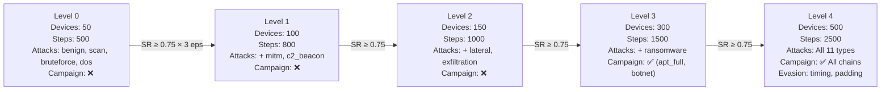
```mermaid
flowchart LR
    L0["Level 0
    Devices: 50
    Steps: 500
    Attacks: benign, scan, bruteforce, dos
    Campaign: ❌"]

    L1["Level 1
    Devices: 100
    Steps: 800
    Attacks: + mitm, c2_beacon
    Campaign: ❌"]

    L2["Level 2
    Devices: 150
    Steps: 1000
    Attacks: + lateral, exfiltration
    Campaign: ❌"]

    L3["Level 3
    Devices: 300
    Steps: 1500
    Attacks: + ransomware
    Campaign: ✅ (apt_full, botnet)"]

    L4["Level 4
    Devices: 500
    Steps: 2500
    Attacks: All 11 types
    Campaign: ✅ All chains
    Evasion: timing, padding"]

    L0 -->|"SR ≥ 0.75 × 3 eps"| L1
    L1 -->|"SR ≥ 0.75"| L2
    L2 -->|"SR ≥ 0.75"| L3
    L3 -->|"SR ≥ 0.75"| L4
```

### 9.1 Campaign Mode (Levels 3–4)

When `use_campaign=True` is set by the `CurriculumManager`, `AttackSchedule.__init__` calls `generate_campaign_schedule()` instead of the standard per-episode schedule. This produces:

1. A random kill-chain selected from `MULTI_STAGE_CHAINS`
2. Each stage targets a device (lateral movement may **pivot** to a new device)
3. Realistic dwell time per stage (sampled per `MULTI_STAGE_CHAINS` config)
4. Quiet benign intervals between stages (inter-stage gap = 20–60 steps)

---

# PART IX: DATA PIPELINE

## 10. UnifiedSample Schema (V9)

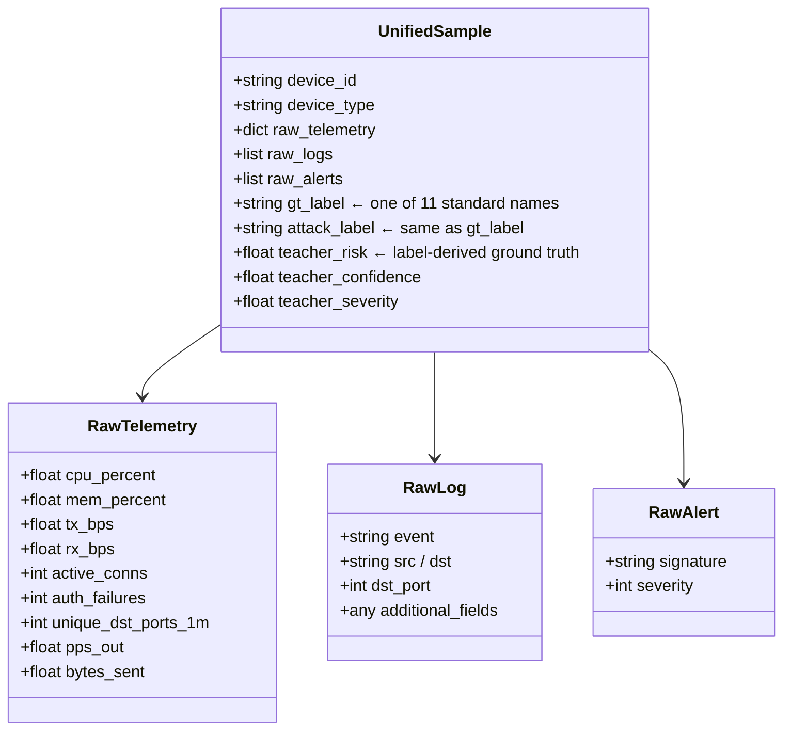
```mermaid
classDiagram
    class UnifiedSample {
        +string device_id
        +string device_type
        +dict raw_telemetry
        +list raw_logs
        +list raw_alerts
        +string gt_label       ← one of 11 standard names
        +string attack_label   ← same as gt_label
        +float teacher_risk    ← label-derived ground truth
        +float teacher_confidence
        +float teacher_severity
    }

    class RawTelemetry {
        +float cpu_percent
        +float mem_percent
        +float tx_bps
        +float rx_bps
        +int active_conns
        +int auth_failures
        +int unique_dst_ports_1m
        +float pps_out
        +float bytes_sent
    }

    class RawLog {
        +string event
        +string src / dst
        +int dst_port
        +any additional_fields
    }

    class RawAlert {
        +string signature
        +int severity
    }

    UnifiedSample --> RawTelemetry
    UnifiedSample --> RawLog
    UnifiedSample --> RawAlert
```

### 10.1 Teacher Risk Ground Truth

| Label | Risk Range | Severity | Notes |
|-------|-----------|----------|-------|
| benign | 0.00–0.10 | 0.0 | Baseline |
| scan | 0.40–0.50 | 0.3 | Early indicator |
| bruteforce | 0.60–0.70 | 0.5 | Credential threat |
| dos | 0.80–0.90 | 0.8 | High impact |
| mitm | 0.65–0.75 | 0.6 | Interception |
| c2_beacon | 0.70–0.80 | 0.65 | Persistent C2 |
| lateral_movement | 0.75–0.85 | 0.75 | Spread |
| exfiltration | 0.80–0.90 | 0.80 | Data loss |
| ransomware | 0.90–1.00 | 0.95 | Critical impact |
| firmware_exploit | 0.75–0.85 | 0.75 | Device takeover |
| cryptomining | 0.55–0.65 | 0.55 | Resource abuse |

---

# PART X: KEY FILES REFERENCE

## 11. Repository Map

```
DIDI RL/
├── agent/
│   ├── kv_tokenizer.py           KeyValueTokenizer — schema-agnostic tokenizer
│   ├── transformer_encoder.py    LogTransformerEncoder — 4-layer Transformer
│   ├── trainable_observer.py     TrainableObserver (V2) + TransformerObserver (V3)
│   ├── losses.py                 ObserverLoss, NTXentLoss, V3ObserverLoss
│   └── ppo_policy.py             HierarchicalPPOPolicy (14D input)
│
├── simulator/
│   ├── config.py                 11 LABEL_* constants + MULTI_STAGE_CHAINS
│   ├── world.py                  WorldState + build_edge_index()
│   ├── env.py                    CyberRangeEnv — V3 observer auto-detect + GNN
│   ├── attack.py                 AttackGenerator (11 types) + AttackSchedule (campaigns)
│   ├── reward.py                 compute_reward() — campaign-aware
│   └── curriculum.py             CurriculumManager — 5 levels, use_campaign flag
│
├── datasets/
│   ├── schema_validator.py       normalize_attack_label() — 37+ raw labels → 11
│   ├── cic_ids2017.py            CIC-IDS2017 adapter
│   ├── ctu_iot_malware.py        CTU adapter
│   ├── edge_iiotset.py           EdgeIIoTset adapter
│   └── unsw_nb15.py              UNSW-NB15 adapter
│
├── train/
│   ├── train_observer.py         Phase 2 fine-tuning (V2 + V3 modes)
│   ├── gen_phase2_data.py        Synthetic Phase 2 data generator (11 classes)
│   ├── train_pretrain_v3.py      Phase 1 NT-Xent contrastive pretraining
│   └── train_ppo.py              PPO training with crash-safety
│
├── eval/
│   ├── observer_diagnosis.py     7-test suite: linear probe, noise rejection, PCA
│   └── evaluate_models.py        Headless model evaluation across all curricula
│
├── models/
│   ├── observer_v3_pretrained.pt ← Phase 1 checkpoint (3.1 MB) ✅ VALIDATED
│   ├── observer_v3.pt            ← Phase 2 output (in progress) 🔄
│   ├── observer_v2.pt            V2 MLP observer (legacy)
│   ├── observer_frozen.pt        V2 frozen+validated (legacy)
│   └── checkpoints/              Rolling 5 checkpoints
│
├── data/
│   ├── observer_train.jsonl      Original 30k samples (4-class)
│   └── observer_train_phase2.jsonl 63k samples (11-class) ✅
│
└── outputs/
    ├── observer_diag/            Diagnostic plots + results JSON
    ├── train_observer_v3/        Phase 2 training logs
    └── pretrain_v3/              Phase 1 pretraining logs
```

---

# PART XI: OPERATIONAL COMMANDS

## 12. Running the Pipeline

```bash
# ─── Observer Diagnostic (run any time) ───────────────────────────
.venv/bin/python eval/observer_diagnosis.py \
    --ckpt models/observer_v3_pretrained.pt \
    --n 400

# ─── Generate Phase 2 Training Data ───────────────────────────────
.venv/bin/python train/gen_phase2_data.py \
    --n 3000 \
    --out data/observer_train_phase2.jsonl \
    --existing data/observer_train.jsonl

# ─── Phase 2 Fine-Tuning (V3 Observer, 11 classes) ────────────────
.venv/bin/python train/train_observer.py \
    --v3 \
    --pretrained_v3 models/observer_v3_pretrained.pt \
    --data data/observer_train_phase2.jsonl \
    --output models/observer_v3.pt \
    --epochs 30 \
    --lr 3e-4 \
    --freeze_encoder_epochs 5 \
    --num_attack_types 11

# ─── Monitor Phase 2 Training ─────────────────────────────────────
watch -n 5 "grep -E 'Epoch|Best|UNFROZEN' \
    outputs/train_observer_v3/train_observer_v3.log | tail -15"

# ─── PPO Training (after Phase 2 completes) ───────────────────────
.venv/bin/python train/train_ppo.py \
    --observer models/observer_v3.pt \
    --total_steps 1000000 \
    --n_envs 4

# ─── Headless Evaluation ──────────────────────────────────────────
.venv/bin/python eval/evaluate_models.py \
    --observer models/observer_v3.pt \
    --ppo models/ppo_agent_final.pt
```

---

# PART XII: TROUBLESHOOTING

| Symptom | Root Cause | Fix |
|---------|-----------|-----|
| `size mismatch attack_type_head` | Checkpoint has old 4-class head, model expects 11 | Diagnostic auto-detects head size; train script uses `num_attack_types=11` |
| Embeddings all zero (cosine = 0) | Used `embedding_64d` (post-Tanh) instead of `embeddings` (raw encoder) | Use `out["embeddings"]` or `out["features"]` key |
| `multi_class deprecated` sklearn | Old API | Remove `multi_class` kwarg from `LogisticRegression` |
| `KeyError: campaign_score` | Observer not V3 or no graph edges | `use_graph_head=False` or pass valid `edge_index` |
| Noise risk score uncalibrated | Phase 1 only — risk head not supervised | Phase 2 fixes this; noise remains OOD in embedding space |
| C2 / bruteforce confusion | Shared auth-failure telemetry signature | Addressed by `w_type=1.5` in Phase 2 loss |
| `RuntimeError: c10::Half overflow` | `masked_fill(-1e8)` in FP16 AMP | Changed to `-1e4` in `ppo_policy.py` |
| PPO exits silently post-CUDA init | Env crash swallowed by vector env | Check `outputs/ppo_v2/ppo_v2.log` |
| CUDA OOM | Batch too large | Reduce `--n_envs` or `--rollout_length` |

---

# PART XIII: STATUS DASHBOARD

## 13. Current System State (2026-02-25)

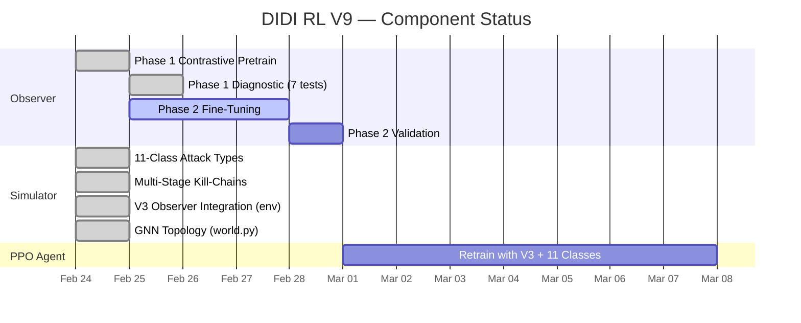
```mermaid
gantt
    title DIDI RL V9 — Component Status
    dateFormat  YYYY-MM-DD
    axisFormat  %b %d

    section Observer
    Phase 1 Contrastive Pretrain   :done,    p1, 2026-02-24, 1d
    Phase 1 Diagnostic (7 tests)   :done,    d1, after p1, 1d
    Phase 2 Fine-Tuning            :active,  p2, 2026-02-25, 3d
    Phase 2 Validation             :         p2v, after p2, 1d

    section Simulator
    11-Class Attack Types          :done,    atk, 2026-02-24, 1d
    Multi-Stage Kill-Chains        :done,    kc, 2026-02-24, 1d
    V3 Observer Integration (env)  :done,    vi, 2026-02-24, 1d
    GNN Topology (world.py)        :done,    gnn, 2026-02-24, 1d

    section PPO Agent
    Retrain with V3 + 11 Classes   :         ppo, after p2v, 7d
```

| Component | Status | Location |
|-----------|--------|----------|
| Phase 1 Observer (pretrained) | ✅ DONE — validated | `models/observer_v3_pretrained.pt` |
| Phase 2 Observer (fine-tuning) | 🔄 ACTIVE — 30 epochs, CUDA | `models/observer_v3.pt` (writing) |
| 11-Class Attack Taxonomy | ✅ DONE | `simulator/config.py` |
| Multi-Stage Kill-Chains | ✅ DONE | `simulator/attack.py` |
| V3 Env Integration + GNN | ✅ DONE | `simulator/env.py` |
| Label Normalization (37+ labels) | ✅ DONE | `datasets/schema_validator.py` |
| Phase 2 Training Data | ✅ DONE — 63k samples | `data/observer_train_phase2.jsonl` |
| PPO Agent Retrain | ⏳ PENDING — after Phase 2 | — |

---

**Document Version**: 9.0.0 — Extended Attack Coverage + V3 Transformer Observer + GNN
**Last Updated**: 2026-02-25
**Status**: Phase 2 fine-tuning active — PPO retrain pending
