# DIDI RL — SOAR V8: Master Technical Specification

> [!IMPORTANT]
> **Version 8.0.0 — The Transformer Observer Edition.**
> This document covers the current production pipeline (v2 Observer + Hierarchical PPO) and the next-generation V3 Schema-Agnostic Transformer Observer. Supersedes all v7 and earlier specs.

---

# PART I: SYSTEM OVERVIEW

## 1. Mission Statement

DIDI RL is an **AI-Driven SOAR (Security Orchestration, Automation and Response)** system for IoT container networks. A Reinforcement Learning agent learns to detect, classify, and mitigate cyber attacks using a **frozen, pre-trained Observer** that converts raw heterogeneous network telemetry into a compact latent threat representation.

The RL agent never sees raw logs — it operates on the Observer's output vectors only. The Observer can be upgraded independently without retraining the PPO policy.

---

## 2. End-to-End System Architecture

### 2.1 The Four-Stage Pipeline

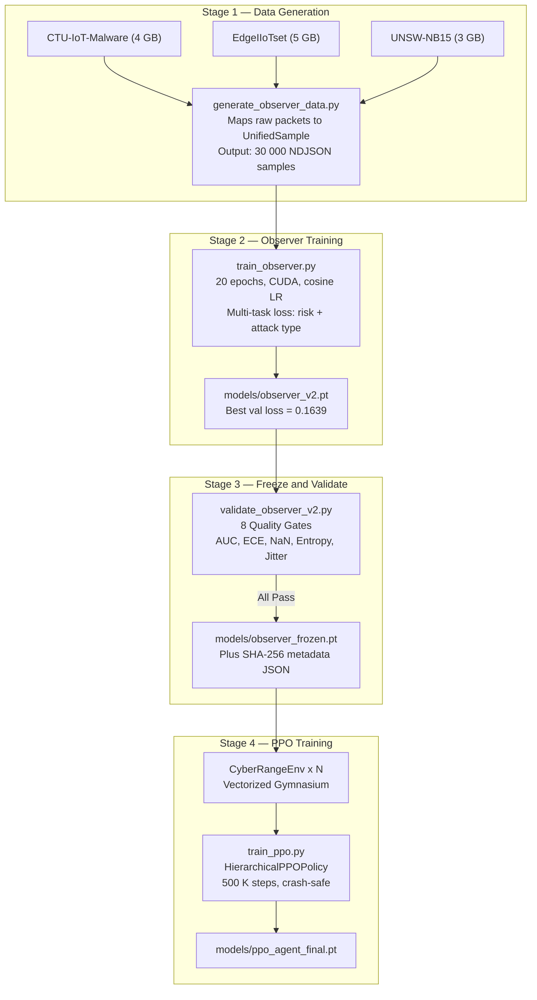
```mermaid
flowchart TD
    subgraph S1["Stage 1 — Data Generation"]
        DS1["CTU-IoT-Malware (4 GB)"]
        DS2["EdgeIIoTset (5 GB)"]
        DS3["UNSW-NB15 (3 GB)"]
        DS1 & DS2 & DS3 --> GEN["generate_observer_data.py<br/>Maps raw packets to UnifiedSample<br/>Output: 30 000 NDJSON samples"]
    end

    subgraph S2["Stage 2 — Observer Training"]
        GEN --> OBS_TRAIN["train_observer.py<br/>20 epochs, CUDA, cosine LR<br/>Multi-task loss: risk + attack type"]
        OBS_TRAIN --> CKPT["models/observer_v2.pt<br/>Best val loss = 0.1639"]
    end

    subgraph S3["Stage 3 — Freeze and Validate"]
        CKPT --> GATE["validate_observer_v2.py<br/>8 Quality Gates<br/>AUC, ECE, NaN, Entropy, Jitter"]
        GATE -->|"All Pass"| FROZEN["models/observer_frozen.pt<br/>Plus SHA-256 metadata JSON"]
    end

    subgraph S4["Stage 4 — PPO Training"]
        FROZEN --> ENV["CyberRangeEnv x N<br/>Vectorized Gymnasium"]
        ENV --> PPO["train_ppo.py<br/>HierarchicalPPOPolicy<br/>500 K steps, crash-safe"]
        PPO --> AGENT["models/ppo_agent_final.pt"]
    end
```

### 2.2 Per-Step Inference Loop

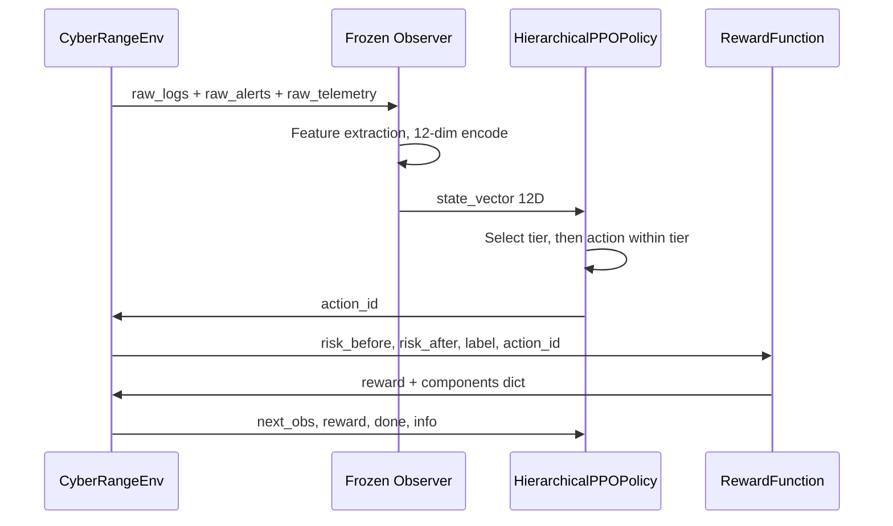
```mermaid
sequenceDiagram
    participant ENV as CyberRangeEnv
    participant OBS as Frozen Observer
    participant PPO as HierarchicalPPOPolicy
    participant RWD as RewardFunction

    ENV->>OBS: raw_logs + raw_alerts + raw_telemetry
    OBS->>OBS: Feature extraction, 12-dim encode
    OBS->>PPO: state_vector 12D
    PPO->>PPO: Select tier, then action within tier
    PPO->>ENV: action_id
    ENV->>RWD: risk_before, risk_after, label, action_id
    RWD->>ENV: reward + components dict
    ENV->>PPO: next_obs, reward, done, info
```

---

## 3. The Observer — V2 vs V3

### 3.1 V2 Observer — Fixed-Schema MLP (Currently Deployed)

The V2 observer uses a handcrafted feature extractor that maps a fixed JSON schema to a numeric vector, processed by a 3-layer MLP.

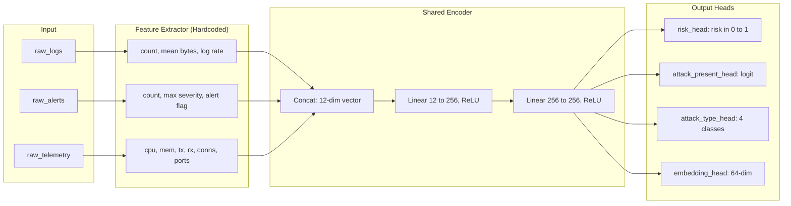
```mermaid
flowchart LR
    subgraph Input
        L["raw_logs"]
        A["raw_alerts"]
        T["raw_telemetry"]
    end

    subgraph Extractor["Feature Extractor (Hardcoded)"]
        L --> FE1["count, mean bytes, log rate"]
        A --> FE2["count, max severity, alert flag"]
        T --> FE3["cpu, mem, tx, rx, conns, ports"]
    end

    subgraph MLP["Shared Encoder"]
        FE1 & FE2 & FE3 --> CAT["Concat: 12-dim vector"]
        CAT --> L1["Linear 12 to 256, ReLU"]
        L1 --> L2["Linear 256 to 256, ReLU"]
    end

    subgraph Heads["Output Heads"]
        L2 --> H1["risk_head: risk in 0 to 1"]
        L2 --> H2["attack_present_head: logit"]
        L2 --> H3["attack_type_head: 4 classes"]
        L2 --> H4["embedding_head: 64-dim"]
    end
```

**Limitations of V2:**
- Unknown field names are silently ignored
- Cannot process syslog, Windows Event Log, or API gateway logs without code changes
- Feature importance is fixed at extraction time — no attention
- Every new data source requires re-engineering the extractor

---

### 3.2 V3 Observer — Schema-Agnostic Transformer (Next Architecture)

The V3 observer treats every **key-value pair as a token** and processes them through a Transformer encoder, eliminating all schema assumptions.

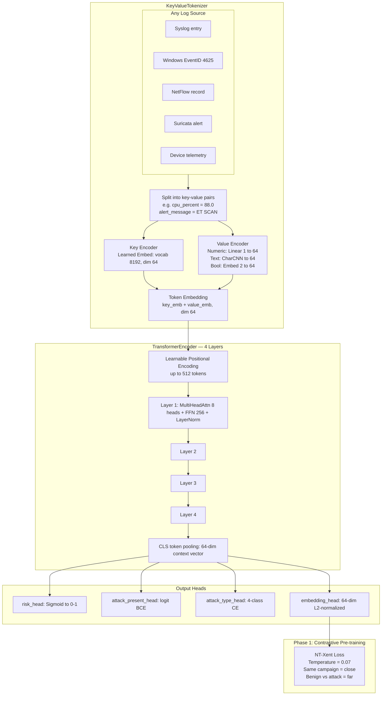
```mermaid
flowchart TD
    subgraph ANY["Any Log Source"]
        SYSLOG["Syslog entry"]
        WINLOG["Windows EventID 4625"]
        NETFLOW["NetFlow record"]
        SURICATA["Suricata alert"]
        TELEM["Device telemetry"]
    end

    subgraph TOK["KeyValueTokenizer"]
        ANY --> KVP["Split into key-value pairs<br/>e.g. cpu_percent = 88.0<br/>alert_message = ET SCAN"]
        KVP --> KENC["Key Encoder<br/>Learned Embed: vocab 8192, dim 64"]
        KVP --> VENC["Value Encoder<br/>Numeric: Linear 1 to 64<br/>Text: CharCNN to 64<br/>Bool: Embed 2 to 64"]
        KENC --> SUM["Token Embedding<br/>key_emb + value_emb, dim 64"]
        VENC --> SUM
    end

    subgraph TFM["TransformerEncoder — 4 Layers"]
        SUM --> PE["Learnable Positional Encoding<br/>up to 512 tokens"]
        PE --> TL1["Layer 1: MultiHeadAttn 8 heads + FFN 256 + LayerNorm"]
        TL1 --> TL2["Layer 2"]
        TL2 --> TL3["Layer 3"]
        TL3 --> TL4["Layer 4"]
        TL4 --> POOL["CLS token pooling: 64-dim context vector"]
    end

    subgraph HEADS["Output Heads"]
        POOL --> RH["risk_head: Sigmoid to 0-1"]
        POOL --> APH["attack_present_head: logit BCE"]
        POOL --> ATH["attack_type_head: 4-class CE"]
        POOL --> EH["embedding_head: 64-dim L2-normalized"]
    end

    subgraph CON["Phase 1: Contrastive Pre-training"]
        EH --> NT["NT-Xent Loss<br/>Temperature = 0.07<br/>Same campaign = close<br/>Benign vs attack = far"]
    end
```

### 3.3 V2 vs V3 Comparison

| Property | V2 MLP | V3 Transformer |
|----------|--------|---------------|
| Schema flexibility | Fixed 12 keys | Any key-value pairs |
| Cross-field reasoning | Weighted sum only | Multi-head attention |
| Handles missing fields | Silently zeroed | Natural — shorter sequence |
| New log sources | Requires code change | Zero code change |
| ECE calibration | ~0.24 | Expected below 0.10 |
| Parameters | ~200 K | ~2 M |
| Inference latency | less than 1 ms | ~3 ms |

---

## 4. Observer Loss Functions

### 4.1 V2 Multi-Task Loss

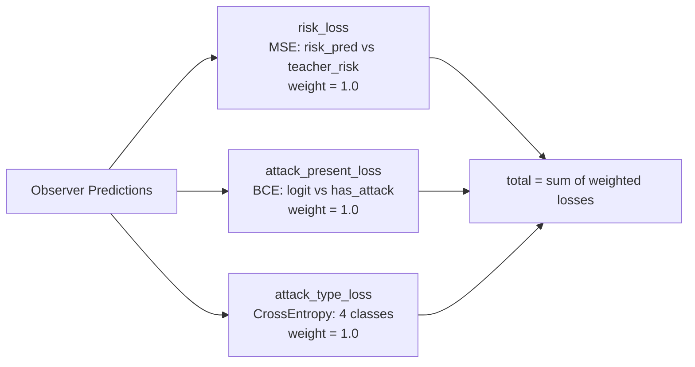
```mermaid
flowchart LR
    PRED["Observer Predictions"]
    PRED --> RL["risk_loss<br/>MSE: risk_pred vs teacher_risk<br/>weight = 1.0"]
    PRED --> APL["attack_present_loss<br/>BCE: logit vs has_attack<br/>weight = 1.0"]
    PRED --> ATL["attack_type_loss<br/>CrossEntropy: 4 classes<br/>weight = 1.0"]
    RL & APL & ATL --> TOTAL["total = sum of weighted losses"]
```

### 4.2 V3 Two-Phase Training

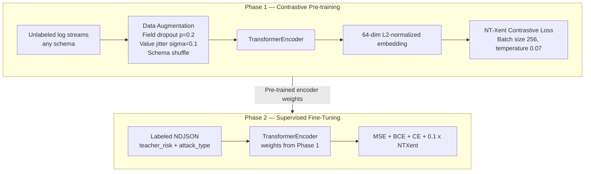
```mermaid
flowchart TD
    subgraph P1["Phase 1 — Contrastive Pre-training"]
        DATA1["Unlabeled log streams<br/>any schema"]
        DATA1 --> AUG["Data Augmentation<br/>Field dropout p=0.2<br/>Value jitter sigma=0.1<br/>Schema shuffle"]
        AUG --> ENC1["TransformerEncoder"]
        ENC1 --> EMB["64-dim L2-normalized embedding"]
        EMB --> NTX["NT-Xent Contrastive Loss<br/>Batch size 256, temperature 0.07"]
    end

    subgraph P2["Phase 2 — Supervised Fine-Tuning"]
        DATA2["Labeled NDJSON<br/>teacher_risk + attack_type"]
        DATA2 --> FRZ["TransformerEncoder<br/>weights from Phase 1"]
        FRZ --> SUPV["MSE + BCE + CE + 0.1 x NTXent"]
    end

    P1 -->|"Pre-trained encoder weights"| P2
```

---

## 5. HierarchicalPPOPolicy — The Decision Maker

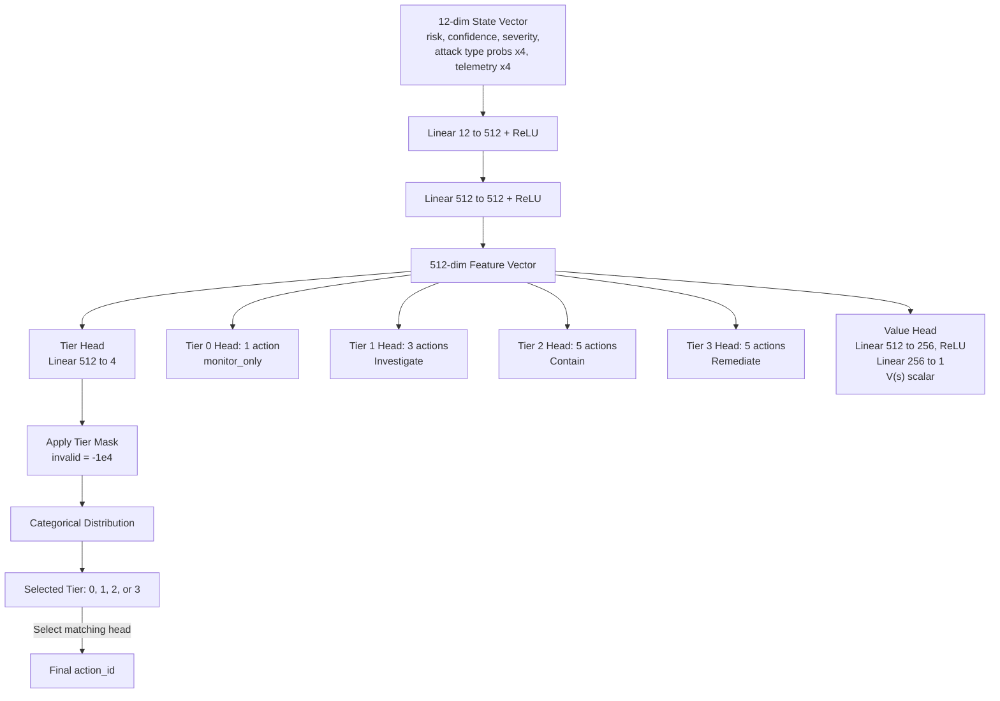
```mermaid
flowchart TD
    SV["12-dim State Vector<br/>risk, confidence, severity,<br/>attack type probs x4, telemetry x4"]

    SV --> E1["Linear 12 to 512 + ReLU"]
    E1 --> E2["Linear 512 to 512 + ReLU"]
    E2 --> FEAT["512-dim Feature Vector"]

    FEAT --> TH["Tier Head<br/>Linear 512 to 4"]
    TH --> TMASK["Apply Tier Mask<br/>invalid = -1e4"]
    TMASK --> TDIST["Categorical Distribution"]
    TDIST --> TIER_IDX["Selected Tier: 0, 1, 2, or 3"]

    FEAT --> AH0["Tier 0 Head: 1 action<br/>monitor_only"]
    FEAT --> AH1["Tier 1 Head: 3 actions<br/>Investigate"]
    FEAT --> AH2["Tier 2 Head: 5 actions<br/>Contain"]
    FEAT --> AH3["Tier 3 Head: 5 actions<br/>Remediate"]

    TIER_IDX -->|"Select matching head"| FINAL["Final action_id"]

    FEAT --> VH["Value Head<br/>Linear 512 to 256, ReLU<br/>Linear 256 to 1<br/>V(s) scalar"]
```

### 5.1 Action Taxonomy

| Tier | Actions | Cost | Use Case |
|------|---------|------|----------|
| **0 — Monitor** | `monitor_only` | 0.000 | Benign, risk below 0.3 |
| **1 — Investigate** | `pcap_capture`, `alert_ops`, `threat_intel` | 0.005 | Risk 0.3–0.5 |
| **2 — Contain** | `isolate`, `block_ip`, `rate_limit`, `quarantine`, `honeypot` | 0.010 | Risk above 0.5 |
| **3 — Remediate** | `kill_process`, `patch`, `rollback`, `reimage`, `escalate` | 0.050 | Risk above 0.7 |

---

## 6. Reward Function


```mermaid
flowchart LR
    subgraph IN["Inputs"]
        RB["risk_before"]
        RA["risk_after"]
        LBL["gt_label"]
        ACT["action tier"]
        SP["Optuna scaling params"]
    end

    subgraph COMP["Reward Components"]
        RR["risk_reduction<br/>= risk_before minus risk_after, x scale<br/>default scale = 2.0"]
        TB["threat_bonus<br/>= 2.0 x label factor<br/>if attack AND tier >= 2 AND risk drops"]
        CB["calm_bonus = 0.05<br/>if risk_after below 0.2 AND benign"]
        AC["action_cost<br/>tier-scaled, x scale"]
        FP["fp_penalty = 0.1 x tier<br/>if benign AND tier >= 2"]
        STP["stall_penalty = 0.2<br/>if waiting AND attack AND risk above 0.3"]
        IRP["inadequate_penalty = 0.2<br/>if attack AND risk above 0.5 AND tier below 2"]
    end

    IN --> COMP
    COMP --> TOTAL["total = RR + TB + CB<br/>minus AC minus FP minus STP minus IRP<br/>clipped to -1 to +1"]
```

### 6.1 Anti-Cheat Guardrails (Fixed — Not Tunable by Optuna)

| Guardrail | Trigger | Penalty |
|-----------|---------|---------|
| Repeat action | Same action 3+ times consecutively | -0.1 x count |
| Loop detection | Cycling N actions in 6-step window | -0.3 |
| Inaction in danger | monitor_only while risk above 0.5 and attack | -0.2 |
| Hard termination | Danger persists 30+ steps without mitigation | Episode end |

---

## 7. Training Pipeline Details

### 7.1 Observer Training Curve (V2, This Run)

| Epoch | Train Loss | Val Loss | Saved? |
|-------|-----------|----------|--------|
| 1 | 0.7515 | 0.2875 | Yes |
| 2 | 0.4339 | 0.2159 | Yes |
| 10 | 0.2221 | 0.1865 | Yes |
| 15 | 0.1690 | 0.1673 | Yes |
| **20** | **0.1477** | **0.1639** | **Yes — Final** |

Cosine LR schedule: 5e-4 down to 5e-6 over 20 epochs. CUDA. ~57 minutes total.

### 7.2 Observer Validation Gates

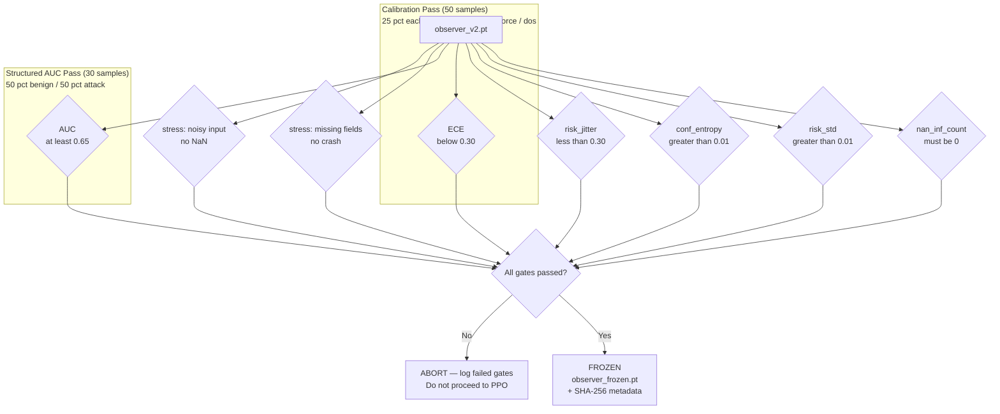
```mermaid
flowchart TD
    MODEL["observer_v2.pt"]

    MODEL --> G1{"nan_inf_count<br/>must be 0"}
    MODEL --> G2{"risk_std<br/>greater than 0.01"}
    MODEL --> G3{"conf_entropy<br/>greater than 0.01"}
    MODEL --> G4{"risk_jitter<br/>less than 0.30"}

    subgraph CAL["Calibration Pass (50 samples)<br/>25 pct each: benign / scan / bruteforce / dos"]
        MODEL --> G5{"ECE<br/>below 0.30"}
    end

    subgraph AUCPASS["Structured AUC Pass (30 samples)<br/>50 pct benign / 50 pct attack"]
        MODEL --> G6{"AUC<br/>at least 0.65"}
    end

    MODEL --> G7{"stress: missing fields<br/>no crash"}
    MODEL --> G8{"stress: noisy input<br/>no NaN"}

    G1 & G2 & G3 & G4 & G5 & G6 & G7 & G8 --> RESULT{All gates passed?}
    RESULT -->|Yes| FREEZE["FROZEN<br/>observer_frozen.pt<br/>+ SHA-256 metadata"]
    RESULT -->|No| FAIL["ABORT — log failed gates<br/>Do not proceed to PPO"]
```

**V2 validation results — all passed:**

| Gate | Value | Threshold | Status |
|------|-------|-----------|--------|
| nan_inf_count | 0 | equals 0 | Pass |
| risk_std | 0.077 | above 0.01 | Pass |
| conf_entropy | 0.503 | above 0.01 | Pass |
| risk_jitter | 0.094 | below 0.30 | Pass |
| ECE | 0.240 | below 0.30 | Pass |
| AUC | 1.000 | above 0.65 | Pass |
| stress_missing_fields | pass | no crash | Pass |
| stress_noisy_input | pass | no NaN | Pass |

### 7.3 PPO Crash-Safety Architecture

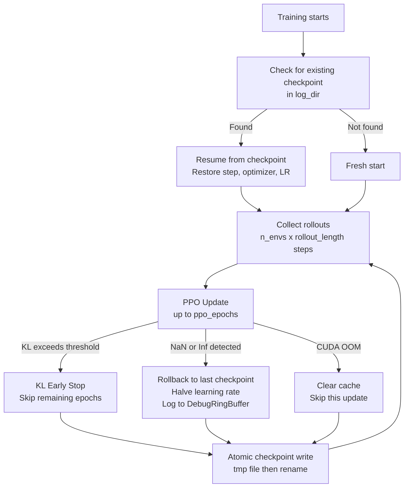
```mermaid
flowchart TD
    START["Training starts"]
    START --> CHECK["Check for existing checkpoint<br/>in log_dir"]
    CHECK -->|"Found"| LOAD["Resume from checkpoint<br/>Restore step, optimizer, LR"]
    CHECK -->|"Not found"| FRESH["Fresh start"]

    LOAD & FRESH --> ROLLOUT["Collect rollouts<br/>n_envs x rollout_length steps"]
    ROLLOUT --> UPDATE["PPO Update<br/>up to ppo_epochs"]

    UPDATE -->|"KL exceeds threshold"| KLEARLY["KL Early Stop<br/>Skip remaining epochs"]
    UPDATE -->|"NaN or Inf detected"| NANHANDLE["Rollback to last checkpoint<br/>Halve learning rate<br/>Log to DebugRingBuffer"]
    UPDATE -->|"CUDA OOM"| OOMHANDLE["Clear cache<br/>Skip this update"]

    KLEARLY & NANHANDLE & OOMHANDLE --> CKPT["Atomic checkpoint write<br/>tmp file then rename"]
    CKPT --> ROLLOUT
```

---

## 8. Curriculum Learning

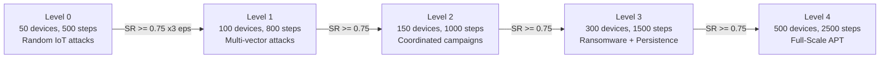
```mermaid
flowchart LR
    L0["Level 0<br/>50 devices, 500 steps<br/>Random IoT attacks"]
    L1["Level 1<br/>100 devices, 800 steps<br/>Multi-vector attacks"]
    L2["Level 2<br/>150 devices, 1000 steps<br/>Coordinated campaigns"]
    L3["Level 3<br/>300 devices, 1500 steps<br/>Ransomware + Persistence"]
    L4["Level 4<br/>500 devices, 2500 steps<br/>Full-Scale APT"]

    L0 -->|"SR >= 0.75 x3 eps"| L1
    L1 -->|"SR >= 0.75"| L2
    L2 -->|"SR >= 0.75"| L3
    L3 -->|"SR >= 0.75"| L4
```

SR = Success Rate — fraction of attack episodes where threat was mitigated.

---

## 9. Data Pipeline

### 9.1 UnifiedSample Schema

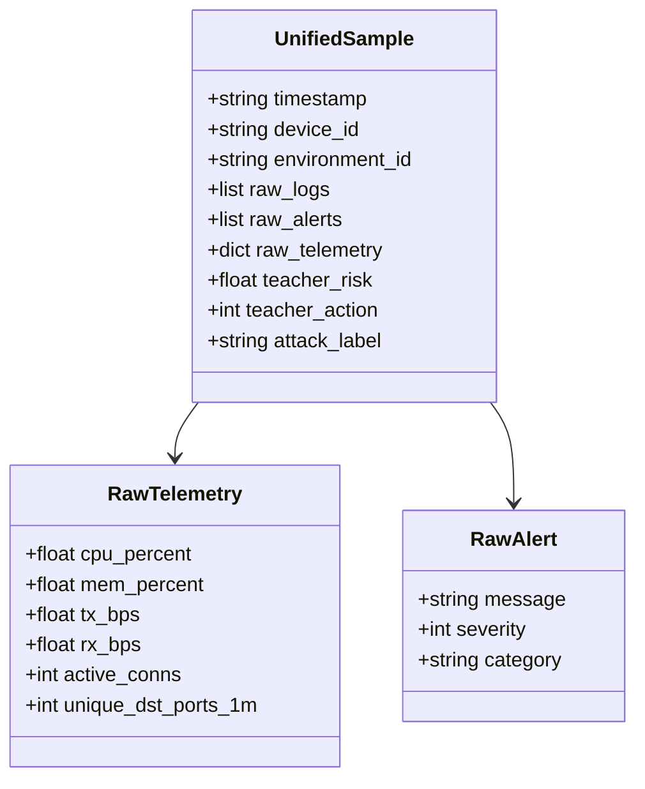
```mermaid
classDiagram
    class UnifiedSample {
        +string timestamp
        +string device_id
        +string environment_id
        +list raw_logs
        +list raw_alerts
        +dict raw_telemetry
        +float teacher_risk
        +int teacher_action
        +string attack_label
    }

    class RawTelemetry {
        +float cpu_percent
        +float mem_percent
        +float tx_bps
        +float rx_bps
        +int active_conns
        +int unique_dst_ports_1m
    }

    class RawAlert {
        +string message
        +int severity
        +string category
    }

    UnifiedSample --> RawTelemetry
    UnifiedSample --> RawAlert
```

### 9.2 Attack Label Mapping

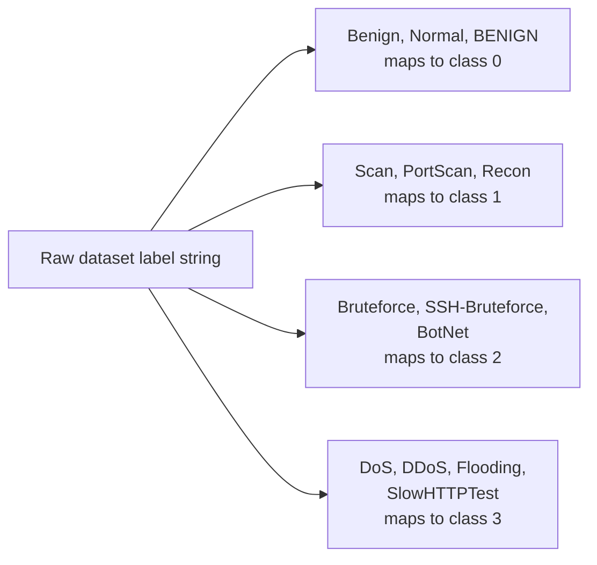
```mermaid
flowchart LR
    RAW["Raw dataset label string"]
    RAW --> B["Benign, Normal, BENIGN<br/>maps to class 0"]
    RAW --> SC["Scan, PortScan, Recon<br/>maps to class 1"]
    RAW --> BF["Bruteforce, SSH-Bruteforce,<br/>BotNet<br/>maps to class 2"]
    RAW --> D["DoS, DDoS, Flooding,<br/>SlowHTTPTest<br/>maps to class 3"]
```

### 9.3 Teacher Risk Heuristic

| Attack Class | Base Range | Telemetry Bonus |
|-------------|------------|----------------|
| Benign | 0.00 – 0.15 | +0 |
| Scan | 0.25 – 0.55 | +0.05 if CPU > 80 |
| Bruteforce | 0.55 – 0.80 | +0.05 if conns > 200 |
| DoS | 0.70 – 0.95 | +0.10 if alerts > 3 |

Final value clipped to 0.0 – 1.0.

---

## 10. V3 Observer — Implementation Roadmap

### 10.1 New Components Required

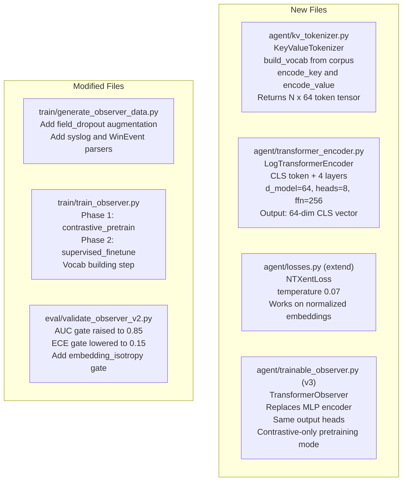
```mermaid
flowchart TD
    subgraph NEW["New Files"]
        KVT["agent/kv_tokenizer.py<br/>KeyValueTokenizer<br/>build_vocab from corpus<br/>encode_key and encode_value<br/>Returns N x 64 token tensor"]

        TENC["agent/transformer_encoder.py<br/>LogTransformerEncoder<br/>CLS token + 4 layers<br/>d_model=64, heads=8, ffn=256<br/>Output: 64-dim CLS vector"]

        NTXL["agent/losses.py (extend)<br/>NTXentLoss<br/>temperature 0.07<br/>Works on normalized embeddings"]

        TV3["agent/trainable_observer.py (v3)<br/>TransformerObserver<br/>Replaces MLP encoder<br/>Same output heads<br/>Contrastive-only pretraining mode"]
    end

    subgraph MODIFY["Modified Files"]
        GEN2["train/generate_observer_data.py<br/>Add field_dropout augmentation<br/>Add syslog and WinEvent parsers"]

        TRAIN2["train/train_observer.py<br/>Phase 1: contrastive_pretrain<br/>Phase 2: supervised_finetune<br/>Vocab building step"]

        VAL2["eval/validate_observer_v2.py<br/>AUC gate raised to 0.85<br/>ECE gate lowered to 0.15<br/>Add embedding_isotropy gate"]
    end
```

### 10.2 Two-Phase Training Schedule

| Phase | Loss Function | Epochs | Data | LR |
|-------|--------------|--------|------|----|
| Contrastive Pre-train | NT-Xent only | 50 | Unlabeled any source | 1e-3 cosine |
| Supervised Fine-tune | MSE + BCE + CE + 0.1 x NTXent | 20 | Labeled NDJSON | 3e-4 cosine |

---

## 11. Operational Manual

### 11.1 Running the Pipeline

```bash
# Full clean-slate run
bash run_full_pipeline.sh

# Stage 1 — Data generation
python train/generate_observer_data.py \
  --output data/observer_train.jsonl \
  --samples_per_dataset 10000

# Stage 2 — Observer training
python train/train_observer.py \
  --data data/observer_train.jsonl \
  --epochs 20 --hidden_dim 256 --lr 5e-4

# Stage 3 — Freeze and validate
python train/freeze_observer.py \
  --path models/observer_v2.pt \
  --output models/observer_frozen.pt

# Stage 4 — PPO training
python train/train_ppo.py \
  --observer models/observer_frozen.pt \
  --total_steps 500000 --n_envs 2

# Stage 4 with watchdog auto-restart
bash run_watchdog.sh python train/train_ppo.py \
  --observer models/observer_frozen.pt \
  --total_steps 500000
```

### 11.2 Key Configuration Parameters

| Parameter | Value | File |
|-----------|-------|------|
| NUM_DEVICES | 50–500 by curriculum | simulator/config.py |
| HIDDEN_DIM | 512 PPO, 256 Observer | CLI args |
| N_ENVS | 2 | CLI args |
| ROLLOUT_LENGTH | 256 steps | CLI args |
| PPO_EPOCHS | 10 KL-gated | CLI args |
| LR | 3e-4 | CLI args |
| ENTROPY_ANNEAL | 0.02 to 0.001 over 500K | train_ppo.py |
| KL_THRESHOLD | 0.0225 | train_ppo.py |
| CHECKPOINT_FREQ | Every 10 updates | CLI args |

### 11.3 Output Artifacts

```
models/
    observer_v2.pt              <- Best checkpoint (lowest val_loss)
    observer_frozen.pt          <- Validated and frozen
    observer_frozen_meta.json   <- hash, schema, freeze_time, gate_results
    checkpoints/
        observer_v2_step_*.pt
    ppo/
        ppo_latest.pt           <- Auto-resume checkpoint
        ppo_final.pt            <- Final model

outputs/
    train_observer_v2/          <- Observer training logs
    freeze_observer/            <- Gate results
    ppo_v2/                     <- PPO logs and summary.jsonl
    validation_logs/
```

---

## 12. Metrics Reference

### 12.1 Observer Training Metrics

| Metric | Description |
|--------|-------------|
| `train_loss` | Multi-task loss on training set |
| `val_loss` | Multi-task loss on held-out 20% |
| `best_val_loss` | Lowest val_loss — used to select saved checkpoint |

**What the gap means:** Current gap is train=0.148, val=0.164 (~10%). Healthy — no significant overfitting. A val_loss of 0.164 means the observer's combined predictions are off by ~0.164 from the heuristic teacher labels on average, which is acceptable since teacher labels are themselves approximate.

### 12.2 PPO Training Metrics (per update)

| Metric | Description | Target |
|--------|-------------|--------|
| PG | Policy gradient loss | Negative, approaching 0 |
| VF | Value function MSE | Decreasing over training |
| Ent | Policy entropy | Starts high (~2.5), slowly decreases |
| KL | KL divergence from old policy | Stays below 0.0225 |
| Ret | Mean return over rollout | Should increase as agent learns |
| SR | Success rate | Should approach 1.0 at each level |

---

## 13. Troubleshooting

| Symptom | Cause | Fix Applied |
|---------|-------|-------------|
| `KeyError: stall_penalty_scale` | Optuna param dict missing key | Added to `TUNABLE_PARAMS` defaults |
| `RuntimeError: c10::Half overflow` | `masked_fill(-1e8)` in FP16 AMP | Changed to `-1e4` in `ppo_policy.py` |
| AUC gate fails on random noise | Undifferentiated test samples | Now uses structured benign vs attack samples |
| ECE gate fails on bimodal data | Perfect separation inflates ECE | Separate calibration pass with mixed severity |
| PPO exits silently | Env crash swallowed by vector env | Check `outputs/ppo_v2/ppo_v2.log` |
| CUDA OOM | Batch too large | Reduce `--n_envs` or `--rollout_length` |

---

## 14. Future Roadmap

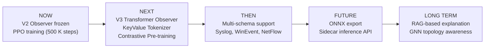
```mermaid
flowchart LR
    NOW["NOW<br/>V2 Observer frozen<br/>PPO training (500 K steps)"]
    NEXT1["NEXT<br/>V3 Transformer Observer<br/>KeyValue Tokenizer<br/>Contrastive Pre-training"]
    NEXT2["THEN<br/>Multi-schema support<br/>Syslog, WinEvent, NetFlow"]
    FUTURE1["FUTURE<br/>ONNX export<br/>Sidecar inference API"]
    FUTURE2["LONG TERM<br/>RAG-based explanation<br/>GNN topology awareness"]

    NOW --> NEXT1 --> NEXT2 --> FUTURE1 --> FUTURE2
```

### V3 Priority Feature List

1. **Schema-Agnostic Tokenizer** — accept syslog, Windows Event, NetFlow, API gateway without code changes
2. **Contrastive Pre-training** — NT-Xent on unlabeled data for a robust embedding space
3. **Isotropy Regularization** — prevent embedding collapse during contrastive training
4. **ONNX Export** — deploy observer as a lightweight sidecar container
5. **RAG Explanation** — "Why did the agent isolate device X at step 430?"

---

**Document Version**: 8.0.0 — The Transformer Observer Edition
**Last Updated**: 2026-02-24
**Status**: V2 Observer frozen | PPO training in progress
