# DIDI RL SOAR: The Visual Master Plan 🛡️🧠📊

> [!IMPORTANT]
> **This is the Single Source of Truth.**
> It documents the entire project: The Philosophy, The Architecture, The Training, and The Future.
> **Every section includes a Diagram.**

---

## 1. The Philosophy: "The Infinite Game" ♾️

We moved from **Static Scripts** to **Dynamic Interaction**.

### Concept Diagram

```mermaid
graph LR
    subgraph "Old Way (Static)"
        Alert["Alert: Brute Force"] -->|If/Else| Block["Script: Block IP"]
        NewAttack["Alert: Zero Day"] -->|No Rule| Failure["❌ Breach"]
    end

    subgraph "New Way (Dynamic)"
        Sim["Simulator (Attacks)"] <-->|Interaction| Agent["AI Agent (Defense)"]
        Interaction["Unique Timeline"] -->|Teaches| Observer["Observer (Eyes)"]
        Observer -->|Upgrades| Agent
        Agent -->|Adapts to| AnyAttack["✅ Any Attack"]
    end
```


---

## 2. The Architecture (What We Built) 🏗️

The system has three main components working in a loop.

### System Diagram


---

## 3. Component Deep Dive 🔬

### A. The Observer (Vision System)
How it turns "Noise" into "Signal" using a Hybrid Autoencoder.


### B. The Agent (Decision System)
How it learns Strategy using Actor-Critic PPO.


---

## 4. The Training Pipeline (Status: Running) 🏃‍♂️

We use a **Transfer Learning** approach to build the brain.

### The Learning Flow


*   **Phase 1 (Done)**: Initial knowledge.
*   **Phase 2 (Current)**: "Pro Mode" Training (5M Steps).
*   **Phase 3 (Next)**: Intensive Iterative Refinement.

---

## 5. Deployment Strategy (The Active Flywheel) 🎡

How the system gets smarter *after* deployment.

### The Flywheel Diagram
```mermaid
graph TD
    Deploy["Agent v1.0 Live"] -->|High Confidence (>90%)| Auto["Auto-Mitigate"]
    Deploy -->|Low Confidence (<90%)| Review["Human Review Queue"]
    
    Review -->|Human Label| Data["New Training Data"]
    Data -->|Sunday Retrain| Tune["Fine-Tune Model"]
    Tune -->|Sunday Deploy| Upgrade["Agent v2.0 Live"]
    
    Upgrade -->|Better Handling| Deploy
```

---

## 6. Future Roadmap (What Comes Next) 🔮

The concrete steps to clear "Level 5+".

### The Mastery Timeline


---

## 7. Operational Commands 💻

### A. Check Status (Current Run)
```bash
tail -f training_full_speed.log
```

### B. Start Phase 1 (Fine-Tuning)
*Whan current run finishes:*
```bash
python3 train/train_iterative.py --iterations 50
```

### C. Evaluate (Visualize)
```bash
python3 eval/animate_eval.py --scenarios all
```
