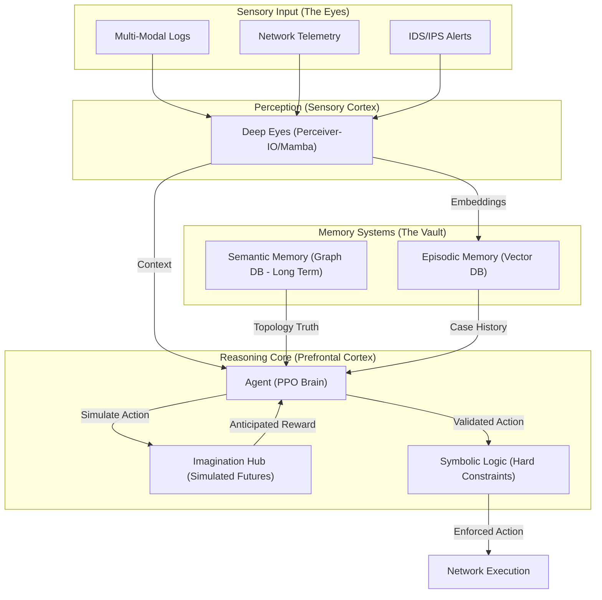
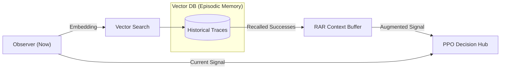
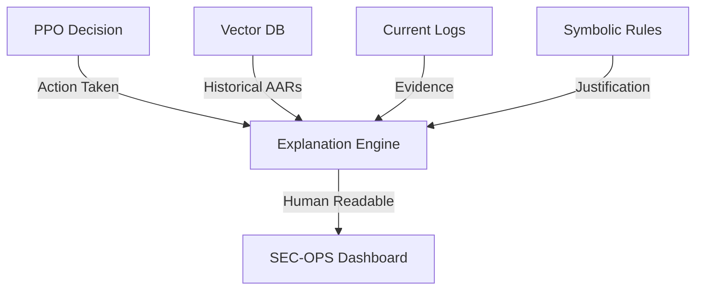
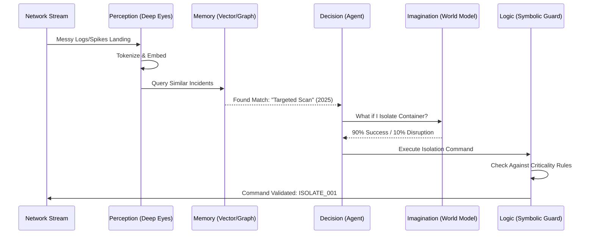

# Neuro-SOAR: The Cognitive Cyber-Defense Blueprint 🧠🛡️

## 1. Problem Statement: The Semantic Gap 🚩
Modern Security Operations Centers (SOCs) are overwhelmed by **"High-Entropy Noise."** Traditional automated systems (SOAR) and pure neural models face three critical failure points:
*   **Contextual Blindness**: Standard AI sees a pattern but doesn't understand the "business logic" (e.g., distinguishing a critical server from a guest IoT device).
*   **The Black Box Dilemma**: Automated actions often lack explainability, making them radioactive for Production environments where an incorrect block causes downtime.
*   **The Static Playbook Trap**: Human-coded scripts (YARA, Sigflow) cannot adapt to novel "zero-day" lateral movements that haven't been seen before.

## 2. The Neuro-SOAR Solution: Cognitive Synergy 🛡️
Our approach provides a **Biomimetic Defense System** that solves these issues by layering three pillars:
1.  **Neural Intuition**: High-speed, multi-modal perception that digests "messy" logs.
2.  **Symbolic Logic**: A hard-coded logic layer that ensures business continuity and policy compliance.
3.  **Universal Inductive Memory**: Allowing the system to "remember" and "reason" across any network topology or technology stack.

---

## 3. Executive Summary
**Neuro-SOAR** is a next-generation security orchestration architecture that bridges the gap between **Neural Intuition** (Pattern Recognition) and **Symbolic Logic** (Strict Rules). Unlike traditional SOARs that rely on static playbooks, Neuro-SOAR mimics the human brain's modularity to provide adaptive, explainable, and autonomous network defense.

---

## 2. System Architecture: The Modular Brain
The architecture is divided into specialized modules that map directly to cognitive functions.

---

## 3. Component Specifications

### 🧠 A. Perception: The Sensory Cortex
*   **Module**: `TrainableObserver` (Standard) or `MambaPerceiver` (Advanced).
*   **Function**: Ingests high-entropy "messy" data (raw strings, binary flags).
*   **Goal**: Compresses billions of logs into 12-32 "Neural Tokens" that the decision engine can understand.

### 🏛️ B. Memory: The Vault

#### B.1 Retrieval-Augmented Reasoning (RAR)
While traditional RAG produces text, **RAR produces Contextual Grounding for Actions.**

**How it works:**
1.  **Semantic Retrieval**: The "Deep Eyes" generate a 12D Embedding of the current threat. The system searches the **Vector DB** for the top $K$ most similar historical episodes.
2.  **Reasoning Augmentation**: Instead of just choosing an action based on the "Now," the PPO Agent receives a concatenated input: `[Current_State + Historical_Success_Context]`.
3.  **Experience-Driven Policy**: The model weighs "What worked last time" against the "Present Reality."

*   **Episodic Memory (Vector DB)**: Stores short-term experiences. If an IP behaves weirdly once, then hides, and comes back 10 minutes later, the Vector DB anchors the memory to prevent "short-term blindness."
*   **Semantic Memory (Knowledge Graph)**: Stores the "Laws of the World." It knows which devices are critical (Hospital Ventilator vs. Guest Wi-Fi) and the topology of the office.

#### B.2 The Explanation Engine (Standard RAG)
While RAR focuses on the *decision*, the Explanation Engine focuses on the *audit trail*.

*   **Mechanism**: The system fetches historical "After-Action Reports" (AARs) from the Vector DB that match the current anomaly. 
*   **Generation**: It uses an LLM-Agent to synthesize the current logs, the historical precedents, and the symbolic rules into a natural language report.
*   **Output**: *"I isolated the device because [Current Log Pattern] matches [Historical Attack #421], and [Security Policy #1] allows for non-destructive containment on this asset class."*

### 🎭 C. Imagination: The World Model
*   **Technology**: DreamerV3 / State-Space Predictors.
*   **Function**: Allows the brain to "dream" of the next step. Before blocking a port, it simulates: *"If I block this, does the core database go offline?"* It optimizes for **Business Continuity**.

### ⚖️ D. Logic: The Symbolic Guard
*   **Technology**: Open Policy Agent (Rego) / Logic Tensor Networks.
*   **Function**: Acts as the ultimate moral/legal compass. It enforces "Hard Rules" (e.g., "Never disconnect the Main UPS") that the Neural Brain cannot override.

---

## 4. Operational Flow: Life of an Incident

---

## 5. Universal Deployment Strategy: "Inductive Scaling"
To ensure Neuro-SOAR works in ANY network regardless of technology:

1.  **Inductive GNNs**: The model learns "Social Rules" of packets rather than individual IP addresses.
2.  **Mamba Encoders**: Linear-time complexity for log parsing allows it to run on the Edge (Gateways) without high-end GPUs.
3.  **Cross-Platform ONNX**: The brain is compiled into a single binary that runs on Linux, ARM, or Windows with no dependencies.
4.  **Few-Shot Alignment**: When first deployed, the system observes "Benign" traffic for 24 hours to align its "Internal Ground Truth" to the specific network baseline.

---

> [!TIP]
> **Why Neuro-SOAR?**
> Standard SOARs are fast but blind. Generic AI is smart but explainable. Neuro-SOAR is **Adaptive**, **Explainable**, and **Inductive**.
